# Rescue Robot — Architecture Diagrams

Diagram-first companion to [`SOFTWARE_ARCHITECTURE.md`](./SOFTWARE_ARCHITECTURE.md), which
contains the full prose rationale. This document renders every major view as a
diagram — system context, containers, components, runtime sequences, state
machines, data model, and deployment — with only enough text to label what
each diagram shows. Source of truth for field names, ports, and constants is
`pi/common/protocol.py`.

---

## 1. System Context

Who and what the system talks to, and what's outside its boundary.

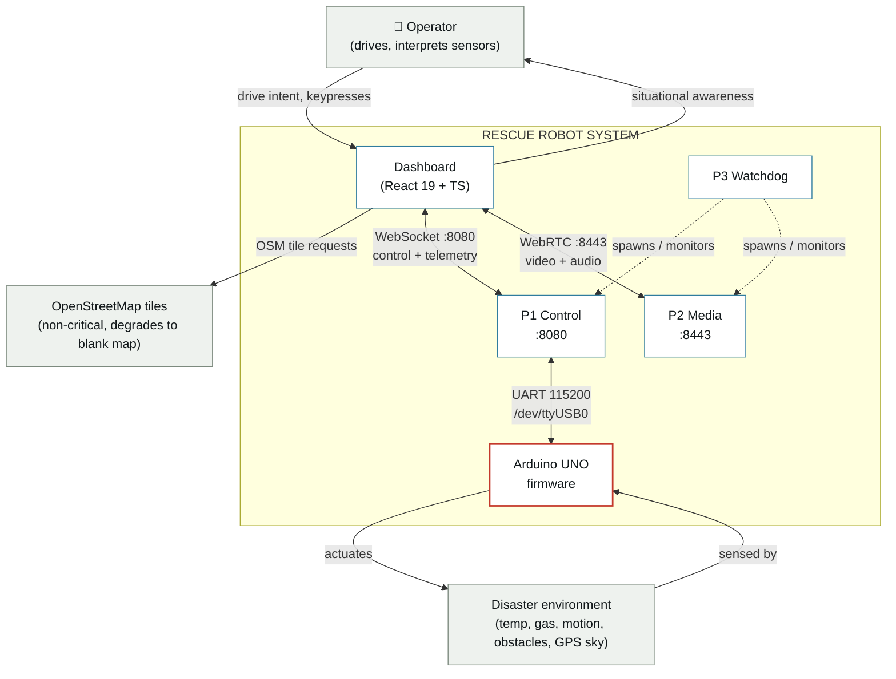

Only two transports cross the mission boundary: **WebSocket :8080** (control +
telemetry) and **WebRTC :8443** (video + audio). They fail independently — a
camera failure never touches the control path. The only outbound internet
dependency is OSM map tiles, and it is not mission-critical.

---

## 2. Container View

Six independently deployable units, and — the most important column — who
restarts each one when it fails.

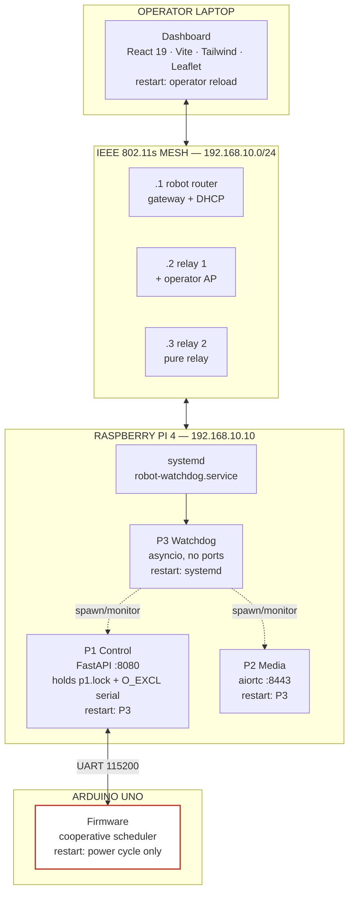

| Container | Runtime | Port / Device | Restart authority |
|---|---|---|---|
| Arduino firmware | AVR bare metal | UART 115200 | **None** — power cycle only |
| P1 control server | Python 3 / FastAPI | TCP 8080, `/dev/ttyUSB0`, `/dev/serial0` | P3 watchdog |
| P2 media server | Python 3 / aiortc | TCP 8443, `/dev/video0` | P3 watchdog |
| P3 watchdog | Python 3 / asyncio | — | systemd (`Restart=on-failure`) |
| Dashboard | Browser / React 19 | — | Operator reload |
| Mesh fabric | OpenWrt / 802.11s | 192.168.10.0/24 | Manual (physical nodes) |

**Only P3 is a systemd unit.** P1 and P2 are its children, because systemd can
only see a process exit — it can't detect a process that's alive but wedged
on a blocking serial read. P3 catches that with an HTTP health poll.

---

## 3. Component View — P1 Control Server

P1 is the system's centre of gravity: sole UART owner, telemetry fan-out,
command validation.

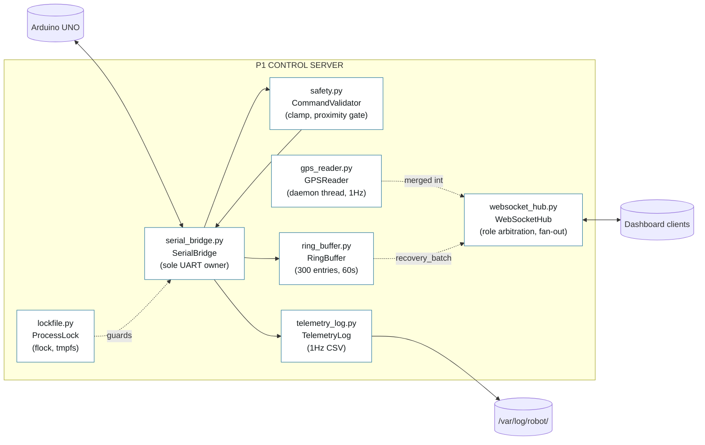

| Module | Type | Responsibility |
|---|---|---|
| `serial_bridge.py` | `SerialBridge` | Sole UART owner; handshake, frame ingest, command egress |
| `websocket_hub.py` | `WebSocketHub`, `Client` | Client registry, role arbitration, concurrent broadcast |
| `gps_reader.py` | `GPSReader` | Threaded NMEA parsing, track accumulation, GeoJSON export |
| `ring_buffer.py` | `RingBuffer` | 300-entry history; `since()` / `gap_ms()` for replay |
| `safety.py` | `CommandValidator` | Server-side clamp, proximity gate, sequence monotonicity |
| `telemetry_log.py` | `TelemetryLog` | 1 Hz, 21-column CSV with packed alert bitfield |
| `lockfile.py` | `ProcessLock` | Advisory `flock` enforcing the single-writer invariant |

---

## 4. Firmware Scheduler — Cooperative, Priority-Tiered

No RTOS, no threads. Three categories share one `loop()`, ordered so nothing
can starve the safety path.

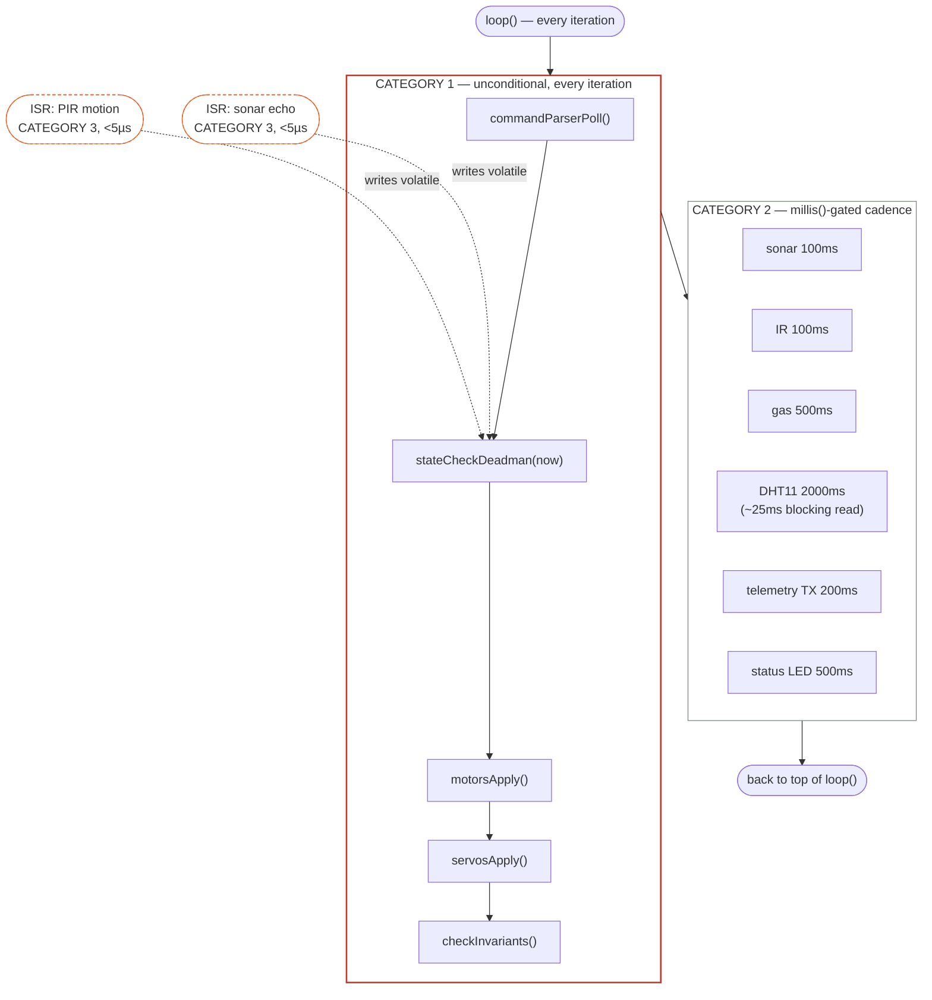

The DHT11's 2000 ms cadence is set specifically because its ~25 ms blocking
read must stay far below the 2000 ms dead-man window — Category 2 work bounds
the worst case latency of Category 1's safety check.

---

## 5. Firmware State Machine

Three states. `STOPPED` is a one-way trap door — reachable only through a
panic, and cleared only by a hardware reset.

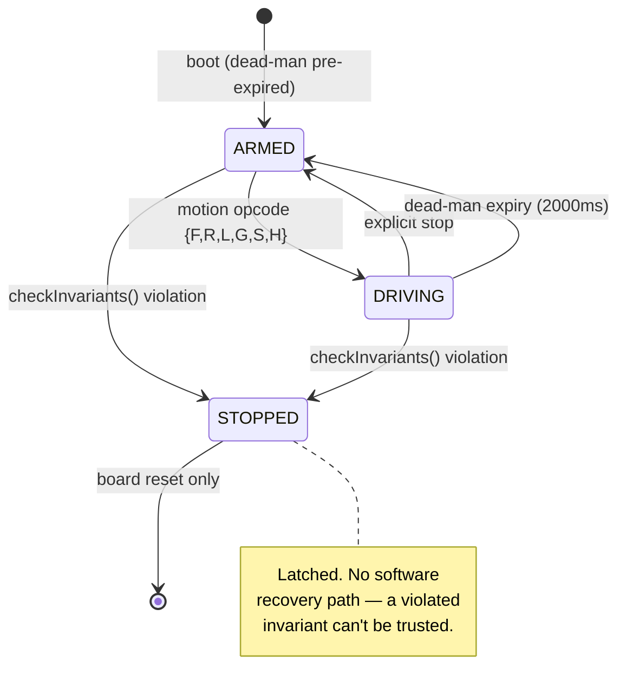

---

## 6. Mission State (Operator-Visible)

Derived identically on the dashboard and by convention on P1 — a pure
function of current inputs, evaluated as first-match rules.

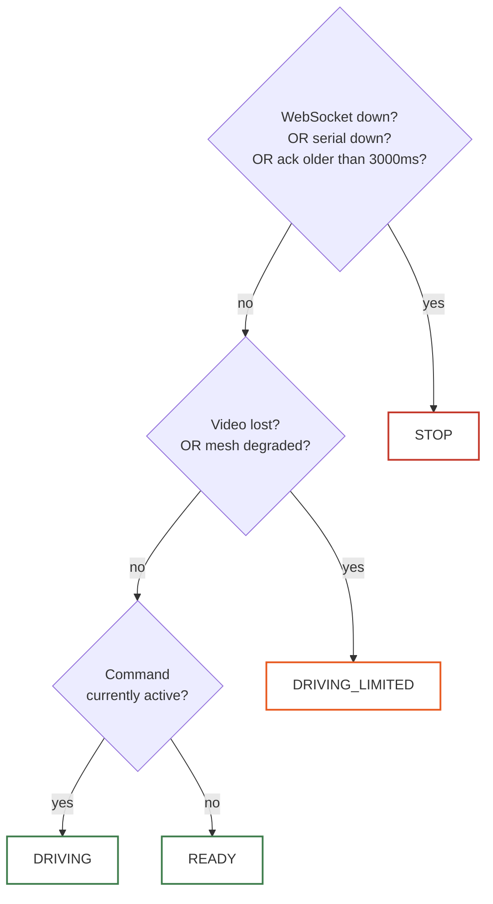

---

## 7. Sequence — Startup Handshake

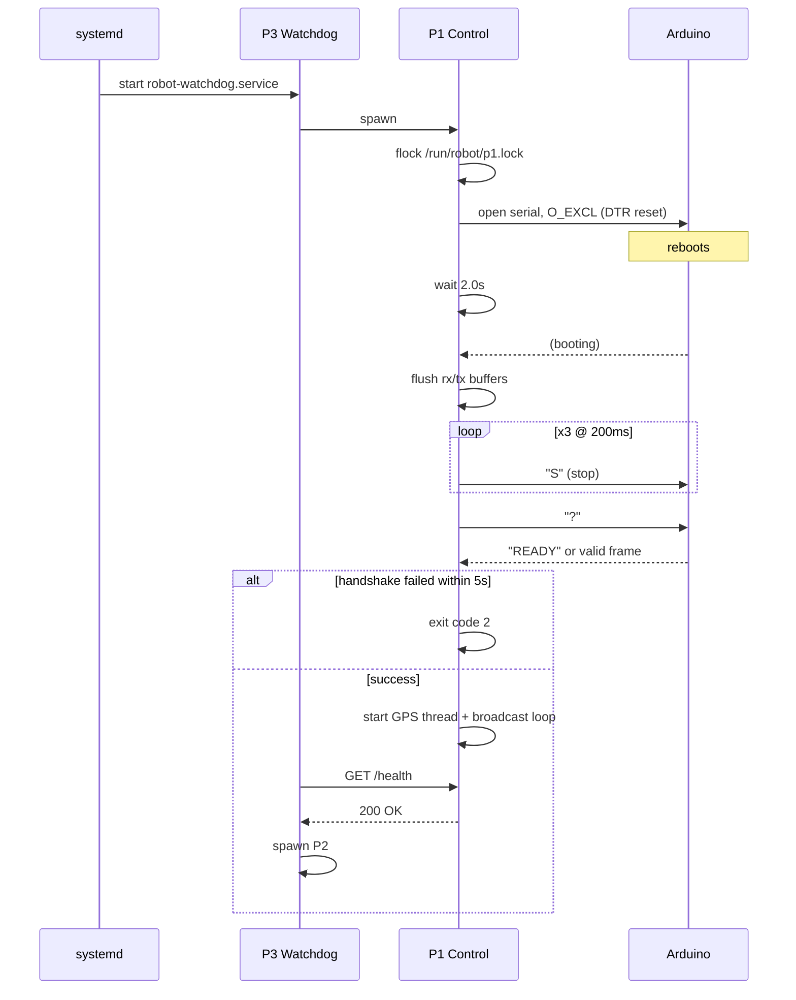

The triple stop exists because if P1 crashed mid-drive, a single command
could be lost to a partially-flushed buffer during reset — three tries at
200 ms intervals close that gap even though the dead-man would also catch it.

---

## 8. Sequence — 200ms Telemetry Cycle

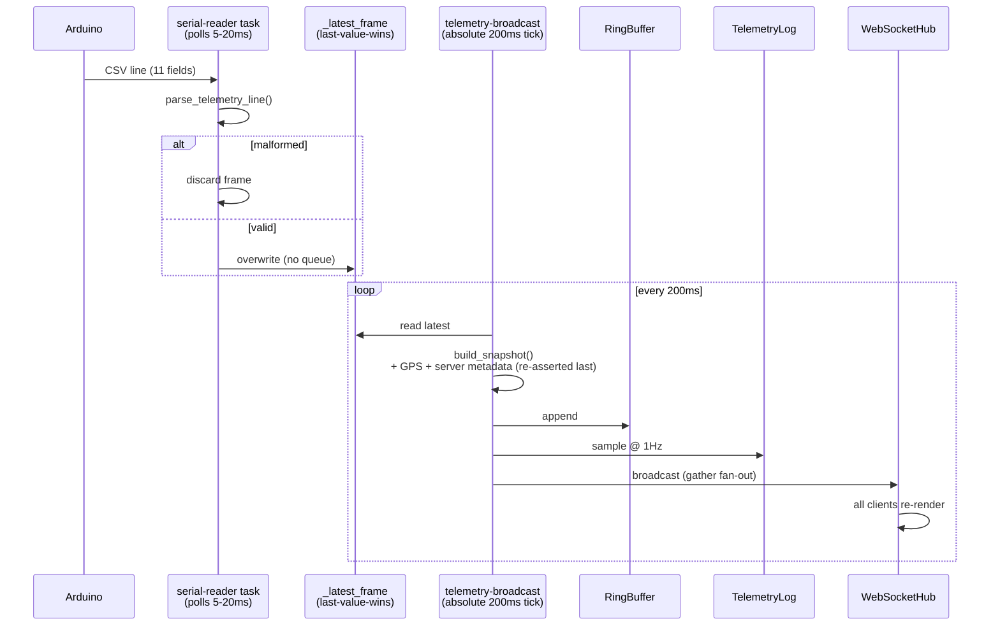

The reader and broadcaster share only a single last-value-wins slot — no
queue — which is what decouples the two rates: a serial stall can't block
the broadcast, and a slow broadcast can't back up the UART.

---

## 9. Sequence — Motor Command, Dual Validation

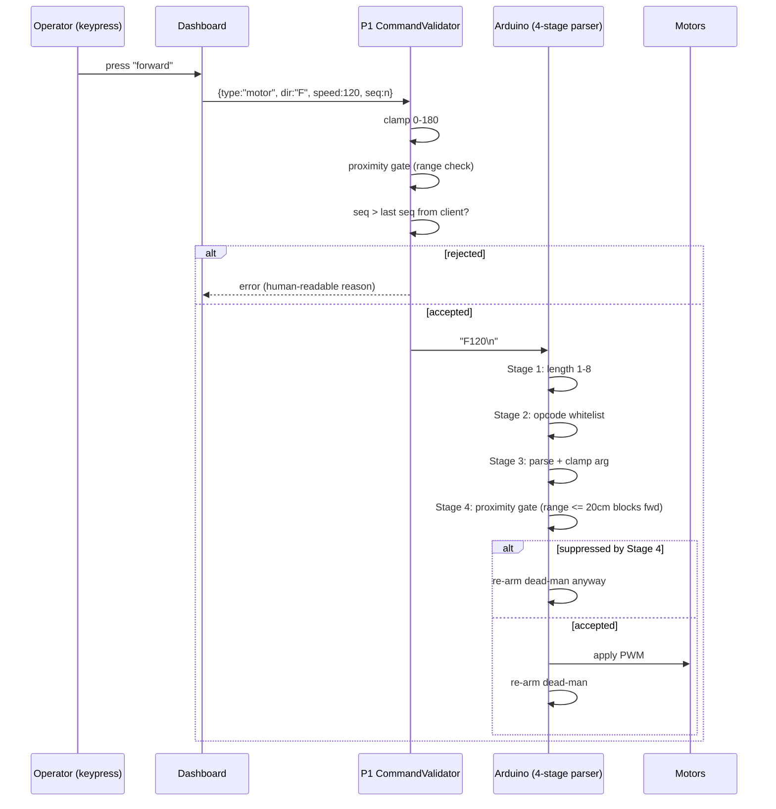

`stop_all` bypasses the sequence check entirely — a stop must never be
dropped for arriving "out of order."

---

## 10. Data Model — Protocol Contract

The wire protocol is the *only* real coupling between the four tiers. Defined
canonically in `pi/common/protocol.py`, hand-mirrored into `protocol.h` and
`protocol.ts`.

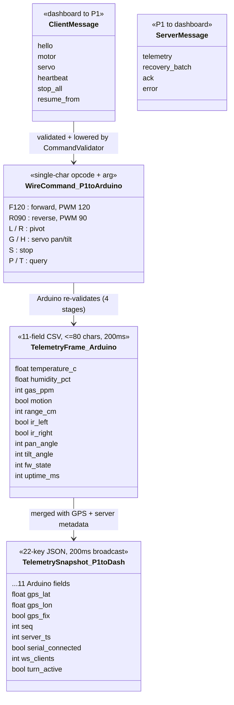

**Discard-don't-retransmit** is the data architecture's defining rule: there
is no ACK, no sequence numbering, and no retry on the UART link. A corrupt
frame is dropped; the next one arrives within 200 ms.

| Store | Medium | Retention | Purpose |
|---|---|---|---|
| Ring buffer | Memory, 300 entries | 60 s @ 200 ms | `resume_from` replay after reconnect |
| `telemetry.log` | Disk CSV, 21 columns | Daily rotation, 7 kept | Post-mission analysis @ 1 Hz |
| `p{1,2,3}_events.log` | Disk, structured text | Weekly rotation, 8 kept | Fault diagnosis, audit |
| GeoJSON track | Disk, per session | 90 days (cron) | Mission path reconstruction |

---

## 11. Failure Modes → Detection → Recovery

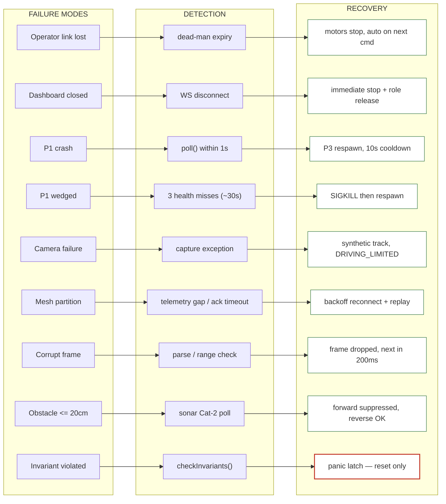

Every fault recovers automatically except a panic latch — deliberately, since
automatic recovery from a falsified invariant can't be trusted.

---

## 12. Deployment Layout

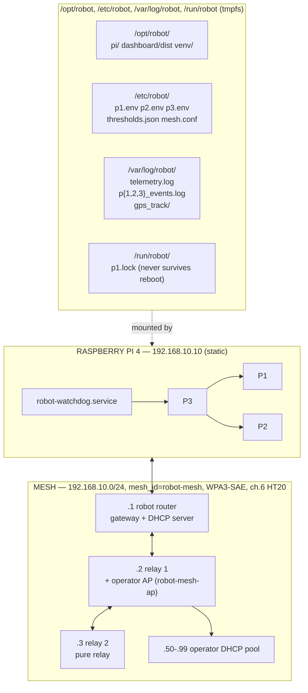

`install.sh` is an idempotent eight-stage script: install packages → create
`robot` user (`dialout`, `video`, `audio` groups) → rsync code → build
venv → copy config templates *only where absent* → register systemd unit +
logrotate → print manual steps (GPS UART enable, static IP, verify serial
device).

---

## 13. Resolved Specification Contradictions

Where the two source methodology documents disagreed, the build picked one
default and made it configurable.

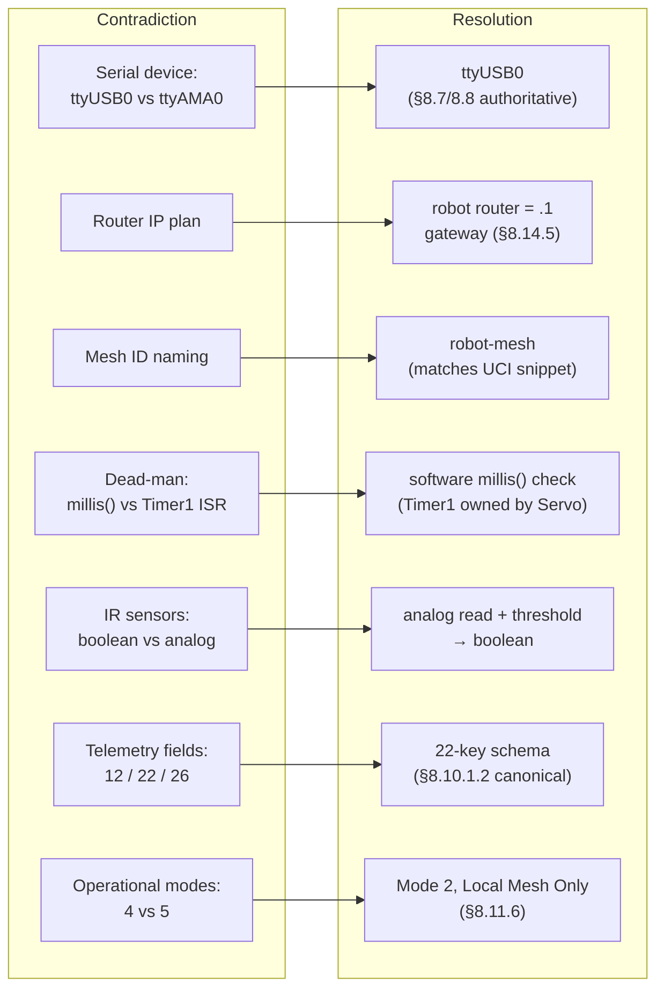

| Contradiction | Resolution | Configurable at |
|---|---|---|
| Serial device `ttyUSB0` vs `ttyAMA0` | `ttyUSB0` (§8.7/8.8 authoritative) | `p1.env: SERIAL_PORT` |
| Router IP plan | Robot router `.1` as gateway (§8.14.5) | Mesh UCI scripts |
| Mesh ID naming | `robot-mesh` (matches UCI snippet) | Mesh script variable |
| Dead-man: `millis()` vs Timer1 ISR | Software check — Timer1 owned by Servo lib | `DEADMAN_MS` |
| IR sensors: boolean vs analog | Analog read + threshold → boolean | Firmware threshold |
| Telemetry field count (12/22/26) | 22-key schema of §8.10.1.2 | `pi/common/protocol.py` |
| Operational mode count | Mode 2, Local Mesh Only (§8.11.6) | `p3.env: ENABLE_OVERLAY=0` |

---

*For the full architectural rationale — drivers, quality attributes, known
limitations — see [`SOFTWARE_ARCHITECTURE.md`](./SOFTWARE_ARCHITECTURE.md).
This document is diagram-first and intentionally omits prose already covered
there.*
