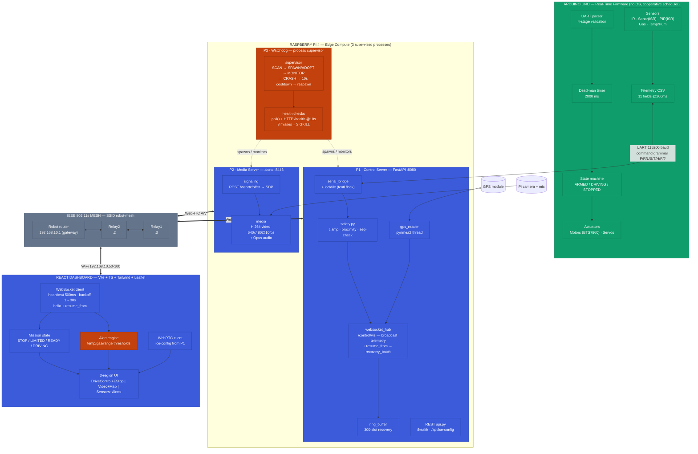

# Autonomous Rescue Robot — High-Level Software Architecture

*One diagram, full stack: firmware → edge compute → mesh network → operator dashboard.*

## Legend

| Color | Layer |
|---|---|
| 🟩 Green | Arduino real-time firmware |
| 🟦 Indigo | Application services (control, media, dashboard) |
| 🟧 Rust | Safety & supervision (watchdog, dead-man, alerts) |
| ⬜ Grey | Mesh network infrastructure |

**Data path:** Sensors/commands ↔ Arduino ↔ UART ↔ P1 (Pi) ↔ WebSocket/WebRTC ↔ Mesh ↔ Dashboard. P3 supervises P1/P2 independently of the data path.

**Source:** `CAPSTONE_METHODOLOGY_FINAL.md` §8.7–8.15.
