# Methodology Diagrams - Teleoperated Rescue Robot

Figures for the **Methodology** section of the research paper. Each figure is
written in Mermaid, so it renders directly on GitHub, in VS Code (Markdown
Preview Mermaid Support), Obsidian, Typora, or at <https://mermaid.live>
(paste the code there and export PNG/SVG for Word or LaTeX).

All values are taken from the project's firmware, Pi services and design
documents (`docs/CAPSTONE_METHODOLOGY_FINAL.md`).

| Figure | Suggested place in the methodology |
|---|---|
| 1. Research workflow | Start of methodology (research approach) |
| 2. Overall system architecture | System design / overview |
| 3. Hardware interconnection and power | Hardware design |
| 4. Pi software architecture (+ 4a dashboard) | Software design |
| 5. Command and telemetry sequence | Communication protocol |
| 6. Two-stage command validation | Safety design |
| 7. Firmware state machine | Embedded firmware design |
| 8. Firmware cooperative scheduler | Embedded firmware design |
| 9. Two-way media path | Video / audio communication |
| 10. Layered fault tolerance | Reliability and safety |
| 11. Testing methodology | Testing and evaluation |
| 12. Hardware diagram (+ detailed 12a, simplified 12b) | Hardware design |
| 13. Arduino UNO pin diagram | Hardware design / embedded controller |
| Tables 1-3. Pin map, Pi connections, components | Hardware design |
| Table 4. Software stack | Software design |
| 14-18. Photos and screenshots | Implementation / results |

---

## Figure 1 - Research and development workflow

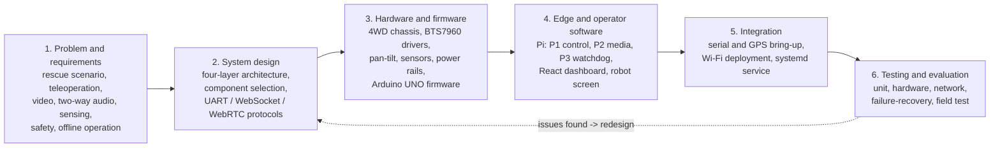

*Figure 1. Iterative research and development workflow followed in this work.*

---

## Figure 2 - Overall system architecture

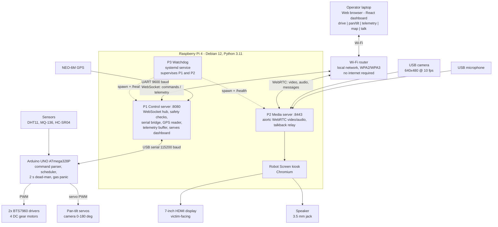

*Figure 2. Overall architecture: operator station, local Wi-Fi network, Raspberry Pi edge computer and Arduino real-time controller.*

---

## Figure 3 - Hardware interconnection and power distribution

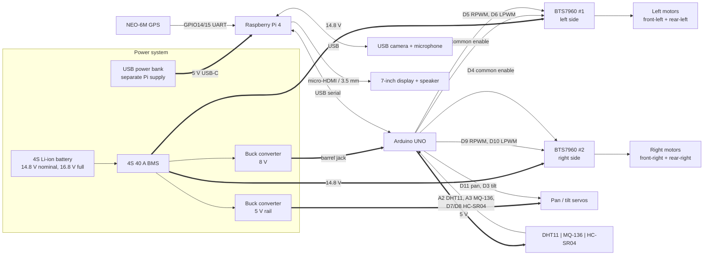

*Figure 3. Hardware interconnection. Thick arrows are power, thin arrows are signals. The Pi has its own power bank so motor current surges cannot brown it out.*

---

## Figure 4 - Raspberry Pi software architecture and process supervision

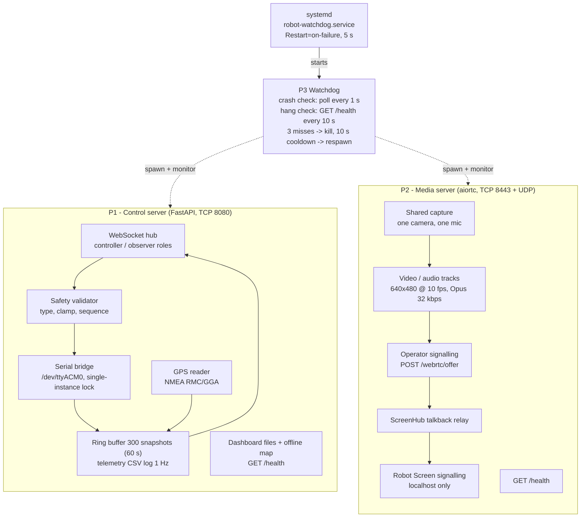

*Figure 4. Three isolated Python processes on the Pi. P1 and P2 share no memory, so driving keeps working if the media server fails.*

---

## Figure 4a - Operator dashboard software architecture

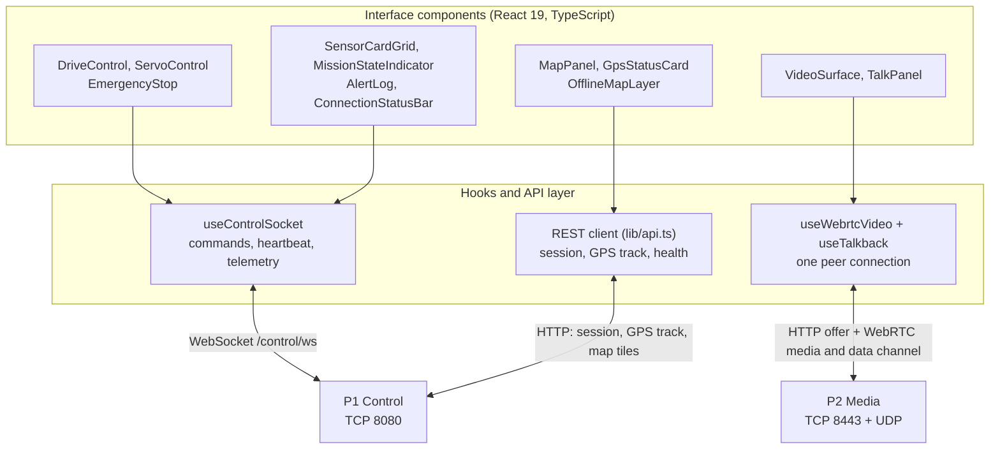

*Figure 4a. The dashboard is a single-page React app served by P1. Components hold no network code; each hook owns one connection to one server, so losing the media connection leaves driving and telemetry working.*

## Table 4 - Software stack

| Layer | Runs on | Language | Main frameworks | Main modules |
|---|---|---|---|---|
| Firmware | Arduino UNO | C++ | Arduino core, no RTOS | scheduler, command_parser, motors, servos, sensors, telemetry |
| Backend | Raspberry Pi 4 | Python 3, asyncio | FastAPI and uvicorn (P1, P2), aiortc and PyAV (P2), aiohttp (P3) | serial_bridge, safety, websocket_hub, gps_reader, signaling, talkback, supervisor |
| Frontend | Operator browser | TypeScript | React 19, Vite, Tailwind CSS, Leaflet with PMTiles | useControlSocket, useWebrtcVideo, useTalkback, DriveControl, EmergencyStop, MapPanel |

The three layers share no code and talk only through the serial command protocol (firmware to P1), the control WebSocket (dashboard to P1) and WebRTC (dashboard to P2).

---

## Figure 5 - Command and telemetry message sequence

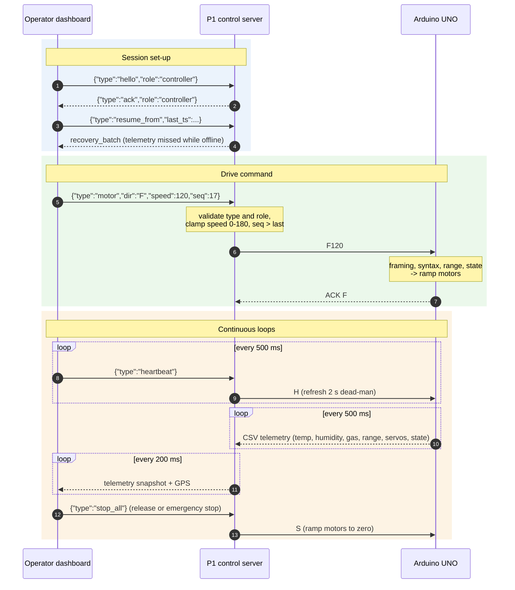

*Figure 5. Message flow between the operator dashboard, the P1 control server and the Arduino.*

---

## Figure 6 - Two-stage command validation

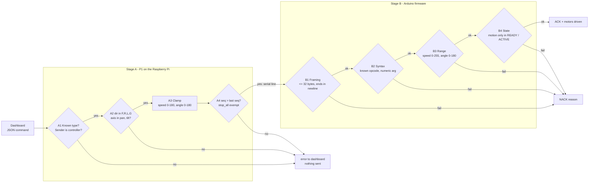

*Figure 6. Every command is checked twice - once on the Pi and again in the firmware - before it can move a motor.*

---

## Figure 7 - Firmware operating-mode state machine

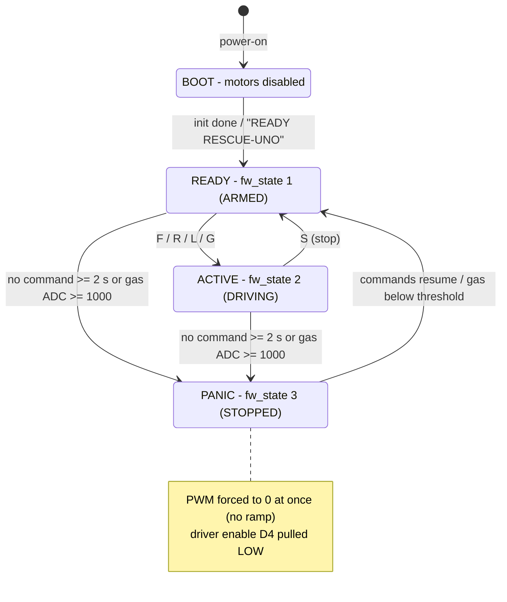

*Figure 7. Firmware modes. PANIC is entered by the dead-man timeout or the gas alarm and clears automatically.*

---

## Figure 8 - Firmware cooperative scheduler

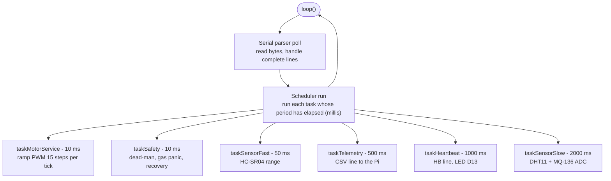

*Figure 8. The firmware runs without an RTOS and without `delay()`; periodic tasks are dispatched by a `millis()`-based cooperative scheduler.*

---

## Figure 9 - Two-way media path (WebRTC)

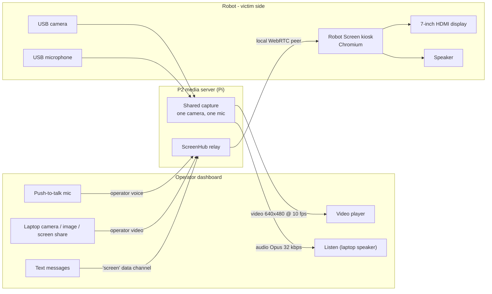

*Figure 9. Two-way communication between operator and victim. Signalling uses HTTP POST on TCP 8443; media travels over UDP on the local network.*

---

## Figure 10 - Layered fault tolerance

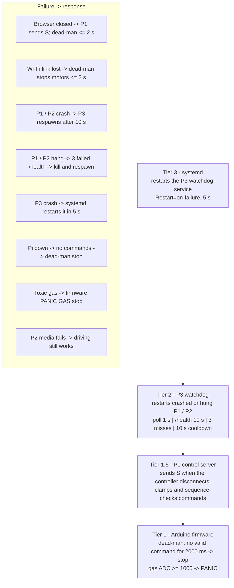

*Figure 10. Safety is layered; the lowest tier (firmware dead-man) stops the robot without depending on the network, the Pi or any tier above it.*

---

## Figure 11 - Testing methodology

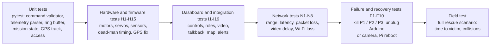

*Figure 11. Bottom-up testing strategy, from isolated software units to a full field scenario (see `docs/TEST_REPORT.md`).*

---

# Hardware figures and tables

## Figure 12 - Hardware diagram (existing)

Use the project's hardware diagram, which already shows the full wiring:

*Figure 12. Hardware wiring of the rescue robot. Source: `hardware diagram.drawio.xml`; open it at <https://app.diagrams.net> to edit or export it.*

## Figure 12a - Detailed hardware wiring diagram

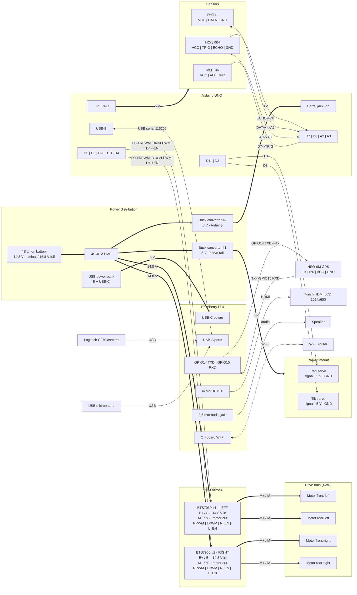

*Figure 12a. Detailed hardware wiring. Thick arrows carry power, thin arrows carry signals. All grounds (battery, buck converters, BTS7960, Arduino, sensors, servos) are tied to a common ground; the Pi is fed from a separate power bank and shares ground with the Arduino through the USB cable.*

If that figure is too detailed for a journal page, use this simplified
component diagram instead:

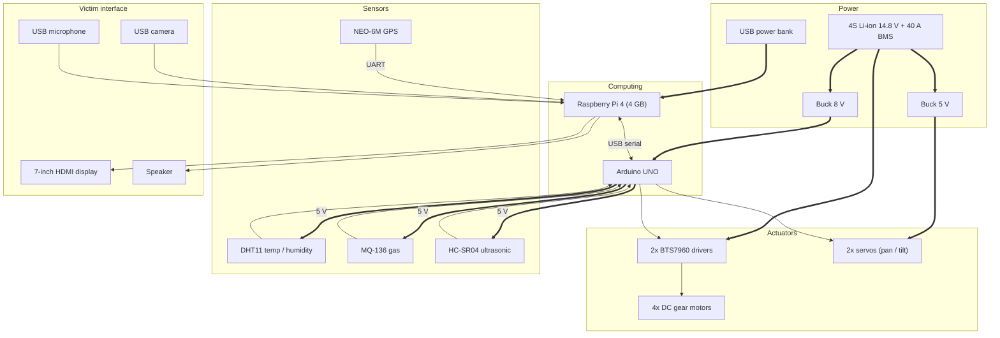

*Figure 12b. Simplified hardware component diagram (thick arrows are power, thin arrows are signals).*

---

## Figure 13 - Arduino UNO pin diagram

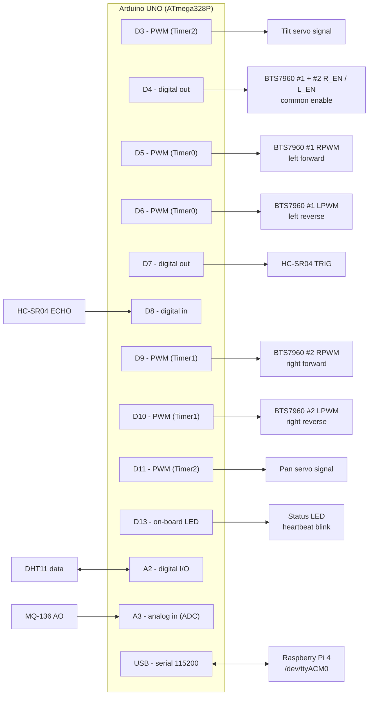

*Figure 13. Arduino UNO pin assignment. Servos run on Timer2 (ServoTimer2Plus) so that Timer1 stays free for right-motor PWM on D9/D10.*

---

## Table 1 - Arduino UNO pin map

| Pin | Connected to | Signal | Notes |
|---|---|---|---|
| D5 | BTS7960 #1 RPWM | PWM out | Left motors forward (Timer0) |
| D6 | BTS7960 #1 LPWM | PWM out | Left motors reverse (Timer0) |
| D9 | BTS7960 #2 RPWM | PWM out | Right motors forward (Timer1) |
| D10 | BTS7960 #2 LPWM | PWM out | Right motors reverse (Timer1) |
| D4 | Both BTS7960 enables | Digital out | LOW on emergency stop |
| D11 | Pan servo | Servo PWM | ServoTimer2Plus (Timer2), home 90 deg |
| D3 | Tilt servo | Servo PWM | ServoTimer2Plus (Timer2), home 90 deg |
| D7 | HC-SR04 TRIG | Digital out | 10 us trigger pulse |
| D8 | HC-SR04 ECHO | Digital in | `pulseIn`, 25 ms timeout (~ 4 m) |
| A2 | DHT11 data | Single-wire digital | Read every 2 s |
| A3 | MQ-136 analog out | ADC 0-1023 | Read every 2 s; panic at >= 1000 |
| D13 | On-board LED | Digital out | Toggles every 1 s (heartbeat) |
| USB | Raspberry Pi 4 | Serial | 115200 baud, 8-N-1 |

## Table 2 - Raspberry Pi 4 connections

| Pi port | Connected to | Purpose |
|---|---|---|
| USB | Arduino UNO (`/dev/ttyACM0`) | Commands and telemetry, 115200 baud |
| USB | Logitech C270 camera (`/dev/video0`) | Video 640x480 @ 10 fps |
| USB | USB microphone | Victim audio to operator |
| GPIO14 (TXD) / GPIO15 (RXD) | NEO-6M GPS RX / TX (`/dev/serial0`) | NMEA position, 9600 baud |
| micro-HDMI | 7-inch HDMI display (1024x600) | Robot Screen for the victim |
| 3.5 mm jack | Speaker | Operator voice to the victim |
| USB-C | USB power bank | Separate Pi supply |
| On-board Wi-Fi | Wi-Fi router | Link to the operator laptop |

## Table 3 - Hardware components

| Component | Model / rating | Qty | Function |
|---|---|---|---|
| Single-board computer | Raspberry Pi 4 Model B, 4 GB | 1 | Edge processing, network, media |
| Microcontroller | Arduino UNO (ATmega328P, 16 MHz) | 1 | Real-time motor control and safety |
| Chassis | 4WD ground platform | 1 | Mobility |
| DC motors | DC gear motors | 4 | Propulsion (left/right pairs) |
| Motor driver | BTS7960, 43 A dual half-bridge | 2 | One per side |
| Servos | Hobby servo, 0-180 deg | 2 | Camera pan and tilt |
| Temperature / humidity | DHT11 | 1 | Environment monitoring |
| Gas sensor | MQ-136 (H2S-sensitive) | 1 | Hazardous gas detection |
| Ultrasonic sensor | HC-SR04 | 1 | Obstacle range (up to 400 cm) |
| GPS | NEO-6M | 1 | Robot position |
| Camera | Logitech C270 USB | 1 | Video to the operator |
| Microphone | USB audio device | 1 | Victim audio |
| Display | 7-inch HDMI LCD, 1024x600 | 1 | Operator video/text to the victim |
| Speaker | 3.5 mm powered speaker | 1 | Operator voice to the victim |
| Battery | 4S Li-ion, 14.8 V nominal | 1 | Main power |
| BMS | 4S 40 A | 1 | Battery protection |
| Buck converters | 5 V and 8 V outputs | 2 | 8 V to the Arduino, 5 V to the servos |
| Power bank | USB-C | 1 | Raspberry Pi supply |

---

## Photos and screenshots to add (take these yourself)

These can't be drawn; a real photo is the strongest evidence that the system exists.

- **Figure 14 - The assembled robot:** front view showing the camera on its pan-tilt mount and the victim display; a side view if space allows.
- **Figure 15 - Inside the robot:** the electronics bay with the Pi, Arduino, motor drivers and battery visible, with parts labelled.
- **Figure 16 - Operator dashboard:** a screenshot while connected, showing live video, sensor cards, the map and the drive controls.
- **Figure 17 - Robot Screen:** the victim-facing display showing the operator's face or a text message.
- **Figure 18 - Field test:** the robot in the test course or rescue scenario.
