# 3. Methodology

This section describes the design from the overall architecture down to the individual mechanisms. The whole design follows one rule: the robot must stop whenever any part of the system above the motors fails, and nothing added for the operator or the victim may weaken that guarantee. Sections 3.1 to 3.4 set out the system architecture, the network, the hardware and the software that runs on it. Sections 3.5 to 3.7 then follow the stop guarantee upward through the tiers: the firmware enforces it (3.5), the control server feeds it safely (3.6), and supervision restores service after a failure without bypassing it (3.7). Section 3.8 decides which operator holds control, and Section 3.9 builds victim interaction on that decision while keeping it apart from the stop path. Section 3.10 adds localisation for the operator.

## 3.1 System Architecture

The architecture applies the design rule by separating the system into tiers that can fail on their own. The system has four tiers: an Arduino UNO for real-time control, a Raspberry Pi 4, a local Wi-Fi network, and a browser dashboard (Figure 1). The Pi runs three separate Python processes: P1 (control server) links the dashboard to the Arduino, checks every drive command and collects telemetry and GPS; P2 (media server) streams the robot's camera and microphone to the operator and carries the operator's voice, video and text to the robot's screen; and P3 (watchdog) starts P1 and P2 and restarts either one if it crashes or stops responding. Control and media use separate transports that end in separate processes, so a media failure leaves driving and stopping intact.

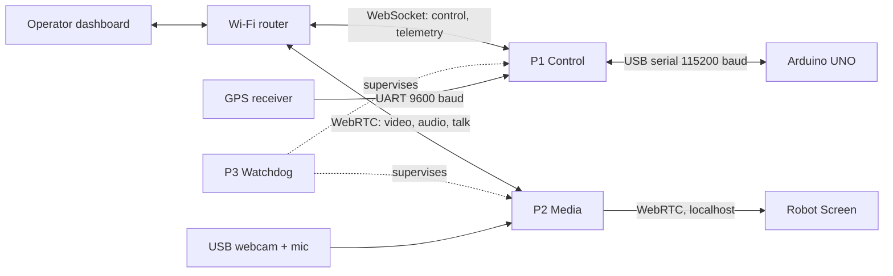
```mermaid
flowchart LR
  D["Operator dashboard"] <--> W["Wi-Fi router"]
  W <-- "WebSocket: control, telemetry" --> P1["P1 Control"]
  W <-- "WebRTC: video, audio, talk" --> P2["P2 Media"]
  P3["P3 Watchdog"] -. supervises .-> P1
  P3 -. supervises .-> P2
  G["GPS receiver"] -- "UART 9600 baud" --> P1
  C["USB webcam + mic"] --> P2
  P2 -- "WebRTC, localhost" --> K["Robot Screen"]
  P1 <-- "USB serial 115200 baud" --> A["Arduino UNO"]
```

**Figure 1.** Overall system architecture.

Figure 2 follows one drive command through every tier and the telemetry that returns. A held key sends one motion command; while it is held, heartbeats keep the dead-man armed, and releasing the key sends a stop.

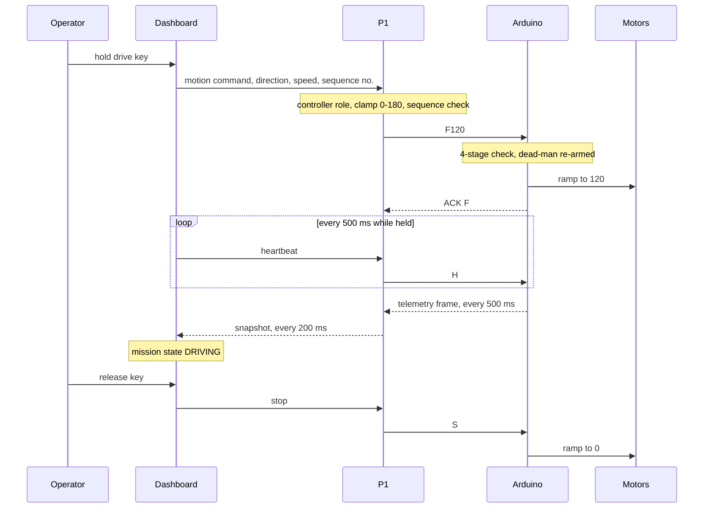
```mermaid
sequenceDiagram
  participant O as Operator
  participant D as Dashboard
  participant P as P1
  participant A as Arduino
  participant M as Motors
  O->>D: hold drive key
  D->>P: motion command, direction, speed, sequence no.
  Note over P: controller role, clamp 0-180, sequence check
  P->>A: F120
  Note over A: 4-stage check, dead-man re-armed
  A->>M: ramp to 120
  A-->>P: ACK F
  loop every 500 ms while held
    D->>P: heartbeat
    P->>A: H
  end
  A-->>P: telemetry frame, every 500 ms
  P-->>D: snapshot, every 200 ms
  Note over D: mission state DRIVING
  O->>D: release key
  D->>P: stop
  P->>A: S
  A->>M: ramp to 0
```

**Figure 2.** End-to-end control loop: command down, telemetry up.

P2 and P3 take no part in this loop: media never carries a drive or stop command, and the watchdog only supervises the processes from outside, so a failure in either cannot delay a stop.

## 3.2 Network Configuration

The two transports in Figure 1 run over one local network, which also makes the robot independent of the internet: no part of the deployment evaluated here reaches outside the Wi-Fi cell. The Pi and the operator laptop join the existing Wi-Fi network, an 802.11n cell on the 2.4 GHz band on channel 10 (2457 MHz) with a 20 MHz operating width. Both hold addresses in the same /24 subnet, so traffic between them is neither routed nor address-translated, which is what lets the media path of Section 3.9.2 rely on host candidates alone. The Pi uses its on-board radio (Figure 5) and takes its address from the router by DHCP: in the deployment measured here it held 192.168.0.105 in 192.168.0.0/24 with the router at 192.168.0.1, on a lease rather than a reservation, so the operator reads the current address off the Pi (ip addr show wlan0) before opening the dashboard. The project supplies no network configuration of its own, neither an access point nor a DHCP reservation nor a static address, so the subnet is whatever the router hands out. The router stays with the operator at the staging point, so the robot works within one radio cell, and extending that reach with a repeater or a second radio is outside the scope of this work (Section 6.3). Table 1 lists the services on the Pi and Table 1a the load and the timing the network has to carry.

**Table 1.** Network services on the Pi.

| Port | Process | Protocol | Carries |
|---|---|---|---|
| TCP 8080 | P1 | HTTP and WebSocket | Dashboard files, control and telemetry, session settings, GPS track, offline map tiles, ICE configuration (Section 3.9.2), health |
| TCP 8443 | P2 | HTTP (no TLS) | WebRTC offer and answer, Robot Screen page, health |
| UDP, negotiated by ICE | P2 | WebRTC | Audio, video and data channel |
| Localhost only | P1, P2 | HTTP | Controller address query; Robot Screen connection |

Control and media use different transports for different reasons. Commands and telemetry run over TCP, because ordered delivery together with the sequence check of Section 3.5.1 keeps a stale command from overtaking a newer one, and the cost of a retransmission is bounded: a command that does not arrive within the dead-man window stops the robot instead of leaving it to run on a stale one (Section 3.5.2). Media runs over UDP, where a lost packet costs picture or voice quality but never delays a command. The dead-man window therefore sets the only hard requirement the network must meet, and the budgets in Table 1a follow from it.

**Table 1a.** Network load and timing requirements.

| Quantity | Value | Set by |
|---|---|---|
| Video, robot to operator | 640x480 at 10 fps, 500 kbps target | Section 3.9.1, Table 12 |
| Audio, each direction | Opus 32 kbps, 60 ms packets | Table 14 |
| Telemetry snapshots | 5 per second from P1, one JSON object each; the firmware frames behind them arrive every 500 ms | Section 3.6.2 |
| Commands and heartbeats | Heartbeat every 500 ms from the controller; one drive command per press and per release; servo commands are not rate limited | Sections 3.5.1 and 3.6 |
| Steady-state load per operator | Under 1 Mbit/s | Sum of the rows above |
| Hard delivery deadline | 2000 ms since the last arming command | Dead-man, Section 3.5.2 |
| Operator-side link timeout | 3000 ms without telemetry gives mission state STOP, counted in 500 ms steps | Table 10 |
| Socket keep-alive | Ping every 20 s, 20 s timeout | P1 WebSocket server |
| Reconnect back-off | 1 s, doubling, capped at 30 s | Section 3.7.2 |

Four intervals bear on the dead-man window, and none of them is a count of the others. The dashboard sends a heartbeat every 500 ms for as long as it holds the controller role, whether or not the robot is being driven; a drive command is sent once when a key or button goes down and a stop once when it is released, with keyboard auto-repeat suppressed, so a sustained drive is carried by the heartbeat rather than by repeated commands. The firmware re-arms its dead-man timer on any arming command it accepts, heartbeats included, and stops the motors once 2000 ms pass with none: an absolute window measured from the last accepted command, not a threshold of missed heartbeats. Independently of that window the firmware emits a telemetry frame every 500 ms and a compact heartbeat line every 1000 ms, but both are outbound reports and neither re-arms the timer. A 2000 ms window spans four heartbeat periods, so an occasional lost heartbeat does not stop the robot.

The load stays well inside the capacity of an ordinary indoor Wi-Fi link: at the staging point the link negotiated 58.5 Mbit/s receive and 72.2 Mbit/s transmit at a signal level of about -47 dBm, more than fifty times the steady-state demand, so the network is sized by latency and loss rather than by throughput, and Section 5.3 reports how both degrade with distance; the dashboard bundle and the offline map tiles are one-off transfers at the start of a session. The keep-alive in Table 1a reclaims a silently dead socket only after up to 40 s, so liveness for safety is not enforced at this layer but by the dead-man at 2000 ms and by the dashboard's 3000 ms telemetry timeout; the keep-alive only frees the socket. Browsers allow microphone and camera capture only in a secure context, and neither port carries TLS (Table 1), so the operator's browser has to be told to treat the Pi's origin as trusted, through the insecure-origin exception recorded in the operator manual. Push-to-talk and the operator camera depend on that manual step, which is a deployment workaround rather than a configured transport security measure (Section 6.3); images and text work without it.

## 3.3 Hardware Platform

The hardware is chosen so that the lowest tier can stop the robot by itself: the Arduino drives the motor drivers directly and can disable them with one output. Table 2 lists the components, and Figure 3 shows how they connect and how power is distributed. The motor supply and the Pi supply are separate, so motor current surges cannot reset the Pi.

**Table 2.** Hardware components.

| Component | Part | Function |
|---|---|---|
| Edge computer | Raspberry Pi 4 Model B, 4 GB | Runs P1, P2, P3 and the Robot Screen |
| Microcontroller | Arduino UNO (ATmega328P, 16 MHz) | Real-time control and sensing |
| Motor drivers | 2 x BTS7960 | One driver per side |
| Drive motors | 4 x DC gear motor [VERIFY rating] | Differential (skid) steering, left and right pairs |
| Camera servos | 2 x hobby servo [VERIFY model] | Pan and tilt, 0-180 deg, home at 90 deg |
| Range sensor | HC-SR04 | Forward range, 0-400 cm |
| Temperature and humidity | DHT11 | degC and % RH |
| Gas sensor | MQ-136 | Raw 10-bit value 0-1023, uncalibrated |
| GPS receiver | NEO-6M | Position, fix, satellite count |
| Camera and microphone | USB webcam with built-in microphone | 640x480 video at 10 fps; 48 kHz audio |
| Robot display | 7-inch HDMI display, 1024x600 | Victim-facing Robot Screen |
| Speaker | Speaker | Operator voice to the victim |
| Battery | 4S pack, 14.8 V nominal, 16.8 V full [VERIFY chemistry, capacity] | Motor and logic power |
| Battery management | 4S 40 A BMS | Pack protection |
| Buck converters | 2 x buck converter, 8 V and 5 V outputs | 8 V to the Arduino barrel jack; 5 V to the servos |
| Pi supply | USB power bank | Separate supply for the Pi |

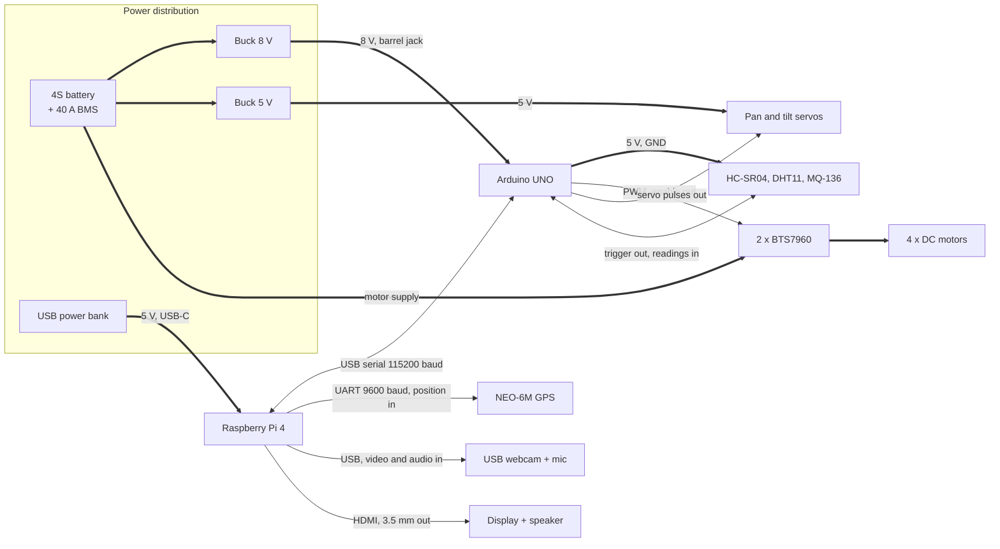
```mermaid
flowchart LR
  subgraph PWR["Power distribution"]
    BAT["4S battery<br/>+ 40 A BMS"]
    B8["Buck 8 V"]
    B5["Buck 5 V"]
    PB["USB power bank"]
    BAT ==> B8
    BAT ==> B5
  end

  PI["Raspberry Pi 4"]
  UNO["Arduino UNO"]
  GPS["NEO-6M GPS"]
  CAM["USB webcam + mic"]
  SCR["Display + speaker"]
  DRV["2 x BTS7960"]
  SV["Pan and tilt servos"]
  SEN["HC-SR04, DHT11, MQ-136"]
  MOT["4 x DC motors"]

  PB == "5 V, USB-C" ==> PI
  B8 == "8 V, barrel jack" ==> UNO
  BAT == "motor supply" ==> DRV
  B5 == "5 V" ==> SV
  UNO == "5 V, GND" ==> SEN
  DRV ==> MOT

  PI <-- "USB serial 115200 baud" --> UNO
  PI -- "UART 9600 baud, position in" --> GPS
  PI -- "USB, video and audio in" --> CAM
  PI -- "HDMI, 3.5 mm out" --> SCR
  UNO -- "PWM, enable out" --> DRV
  UNO -- "servo pulses out" --> SV
  UNO <-- "trigger out, readings in" --> SEN
```

**Figure 3.** Hardware interconnection and power distribution. Thick lines carry power; thin lines carry signals, labelled with the interface and its direction. The Pi and the Arduino are the two hubs, and the separate motor and Pi supplies are grouped on the left.

The Arduino pins used by the firmware are shown in Figure 4 and detailed in Table 3. Each BTS7960 drives forward on one PWM input and reverse on the other, with only one active at a time; both drivers share one enable line, so one output disables all propulsion.

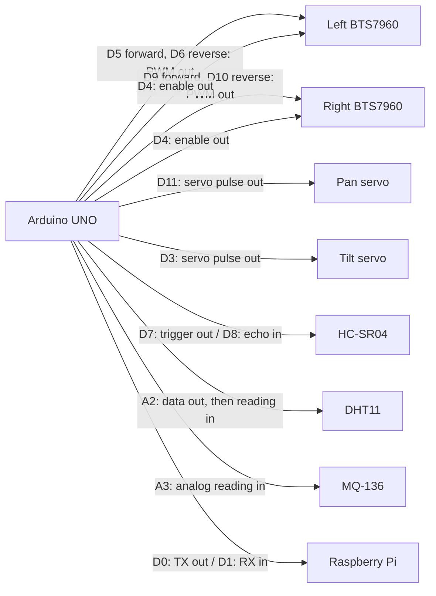
```mermaid
flowchart LR
  UNO["Arduino UNO"]
  LD["Left BTS7960"]
  RD["Right BTS7960"]
  PAN["Pan servo"]
  TILT["Tilt servo"]
  US["HC-SR04"]
  DHT["DHT11"]
  MQ["MQ-136"]
  PI["Raspberry Pi"]

  UNO -- "D5 forward, D6 reverse: PWM out" --> LD
  UNO -- "D9 forward, D10 reverse: PWM out" --> RD
  UNO -- "D4: enable out" --> LD
  UNO -- "D4: enable out" --> RD
  UNO -- "D11: servo pulse out" --> PAN
  UNO -- "D3: servo pulse out" --> TILT
  UNO -- "D7: trigger out / D8: echo in" --> US
  UNO -- "A2: data out, then reading in" --> DHT
  UNO -- "A3: analog reading in" --> MQ
  UNO -- "D0: TX out / D1: RX in" --> PI
```

**Figure 4.** Arduino UNO pin diagram. Every line is drawn from the Arduino outwards to the device it serves, so an arrowhead marks the connection and not the signal direction. Direction is given in the label instead, read from the Arduino's side: "out" leaves the pin and "in" arrives at it, and a label with both names the outgoing pin first. Table 3 gives the full pin map.

**Table 3.** Arduino UNO pin map.

| Pin | Mode | Signal | Notes |
|---|---|---|---|
| D0, D1 | UART over USB | Serial link to the Pi | 115200 baud, newline-terminated ASCII |
| D3 | Output | Tilt servo pulse | ServoTimer2Plus library on Timer2, 0-180 deg |
| D4 | Digital output | Enable for both BTS7960 drivers | Low at boot and on emergency stop |
| D5 | PWM output | Left driver, forward | 0-255 |
| D6 | PWM output | Left driver, reverse | 0-255 |
| D7 | Digital output | HC-SR04 trigger | 10 us pulse every 50 ms |
| D8 | Digital input | HC-SR04 echo | 25 ms timeout; distance = pulse width / 58 |
| D9 | PWM output | Right driver, forward | 0-255; Timer1 left free for these pins |
| D10 | PWM output | Right driver, reverse | 0-255 |
| D11 | Output | Pan servo pulse | ServoTimer2Plus library on Timer2, 0-180 deg |
| D13 | Digital output | On-board status LED | Toggles every 1000 ms |
| A2 | Digital I/O, pull-up | DHT11 single-wire data | Read every 2000 ms, checksum verified |
| A3 | Analog input | MQ-136 output | 10-bit ADC; gas stop at >= 1000 |
| Barrel jack | Power input | 8 V from buck converter | - |
| 5 V, GND | Power output | Supply for HC-SR04, DHT11 and MQ-136 | Shared by the three sensors |

The Pi ports and GPIO header pins used by the project are shown in Figure 5 and listed in Table 4.

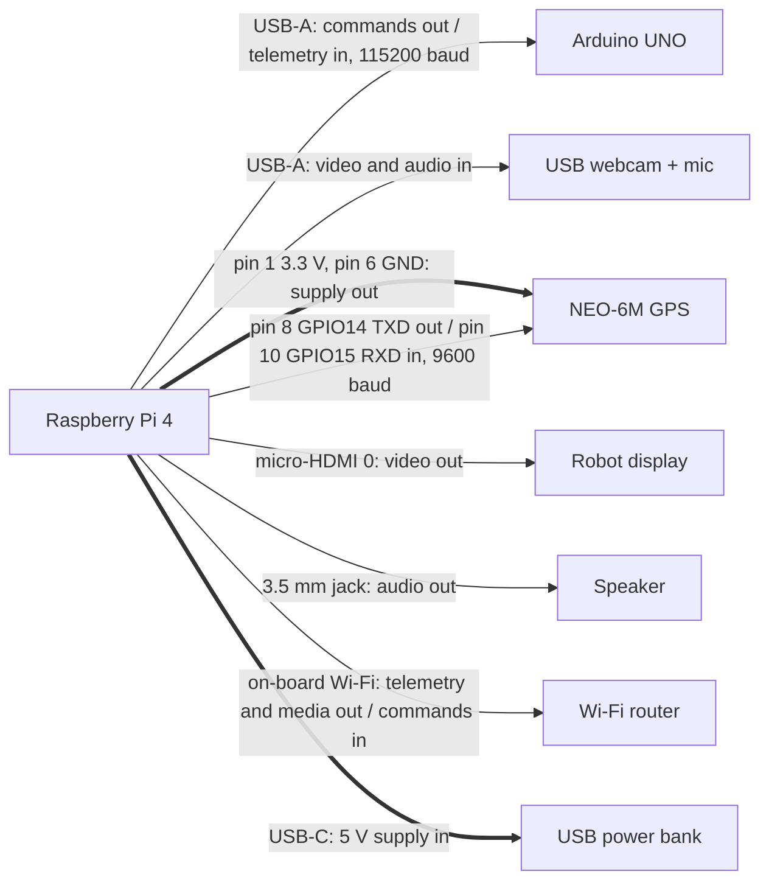
```mermaid
flowchart LR
  PI["Raspberry Pi 4"]
  UNO["Arduino UNO"]
  CAM["USB webcam + mic"]
  GPS["NEO-6M GPS"]
  LCD["Robot display"]
  SPK["Speaker"]
  RT["Wi-Fi router"]
  PWR["USB power bank"]

  PI -- "USB-A: commands out / telemetry in, 115200 baud" --> UNO
  PI -- "USB-A: video and audio in" --> CAM
  PI == "pin 1 3.3 V, pin 6 GND: supply out" ==> GPS
  PI -- "pin 8 GPIO14 TXD out / pin 10 GPIO15 RXD in, 9600 baud" --> GPS
  PI -- "micro-HDMI 0: video out" --> LCD
  PI -- "3.5 mm jack: audio out" --> SPK
  PI -- "on-board Wi-Fi: telemetry and media out / commands in" --> RT
  PI == "USB-C: 5 V supply in" ==> PWR
```

**Figure 5.** Raspberry Pi 4 port and GPIO diagram. Every line is drawn from the Pi outwards to the device it serves, so an arrowhead marks the connection and not the direction. Direction is given in the label instead, read from the Pi's side: "out" leaves the port or pin and "in" arrives at it. The thick lines carry power, and the Pi's own supply arrives on USB-C. Table 4 gives the full connection list.

The GPS uses the Pi's primary UART with the serial login console disabled.

**Table 4.** Raspberry Pi 4 connections.

| Pi interface | Connected to | Use |
|---|---|---|
| USB-A | Arduino UNO | USB serial, 115200 baud |
| USB-A | USB webcam with microphone | Video capture and audio capture |
| Header pin 1 (3.3 V) | GPS VCC | GPS supply |
| Header pin 6 (GND) | GPS GND | Ground |
| Header pin 8 (GPIO 14, TXD) | GPS RX | UART, 9600 baud |
| Header pin 10 (GPIO 15, RXD) | GPS TX | UART, 9600 baud |
| Micro-HDMI 0 | Robot display | Robot Screen |
| 3.5 mm jack | Speaker | Default audio output |
| USB-C | USB power bank | Pi supply |
| On-board Wi-Fi | Wi-Fi router | Dashboard, control and media traffic |

## 3.4 Software Architecture

The software is organised around the same tiers as the hardware in Section 3.3. This section gives its structure; Sections 3.5 to 3.10 describe each part in detail.

The software forms three layers, each written in the language that suits its hardware, over a shared module that the three Pi processes have in common (Table 5). The three layers share no code and talk only through three defined interfaces: the serial command protocol between firmware and P1, the control WebSocket between the dashboard and P1, and WebRTC between the dashboard and P2. Each layer can therefore be built, tested and replaced on its own.

**Table 5.** Software stack.

| Layer | Runs on | Language | Main frameworks | Main modules |
|---|---|---|---|---|
| Firmware | Arduino UNO | C++ | Arduino core, no RTOS | scheduler, command_parser, motors, servos, sensors, telemetry |
| Backend | Raspberry Pi 4 | Python 3, asyncio | FastAPI and uvicorn (P1, P2), aiortc and PyAV (P2), aiohttp (P3) | serial_bridge, safety, websocket_hub, gps_reader, signaling, talkback, supervisor |
| Common | Raspberry Pi 4, inside P1, P2 and P3 | Python 3 | standard library only | protocol, config, access, logging_setup, mock_hardware |
| Frontend | Operator browser | TypeScript | React 19, Vite, Tailwind CSS, Leaflet with PMTiles | useControlSocket, useWebrtcVideo, useTalkback, DriveControl, EmergencyStop, MapPanel |

On the Pi, systemd starts only the watchdog, which spawns the control and media servers as child processes (Figure 6). P1 holds every interface that can move the robot; P2 holds every media device; the Robot Screen kiosk runs in the desktop session.

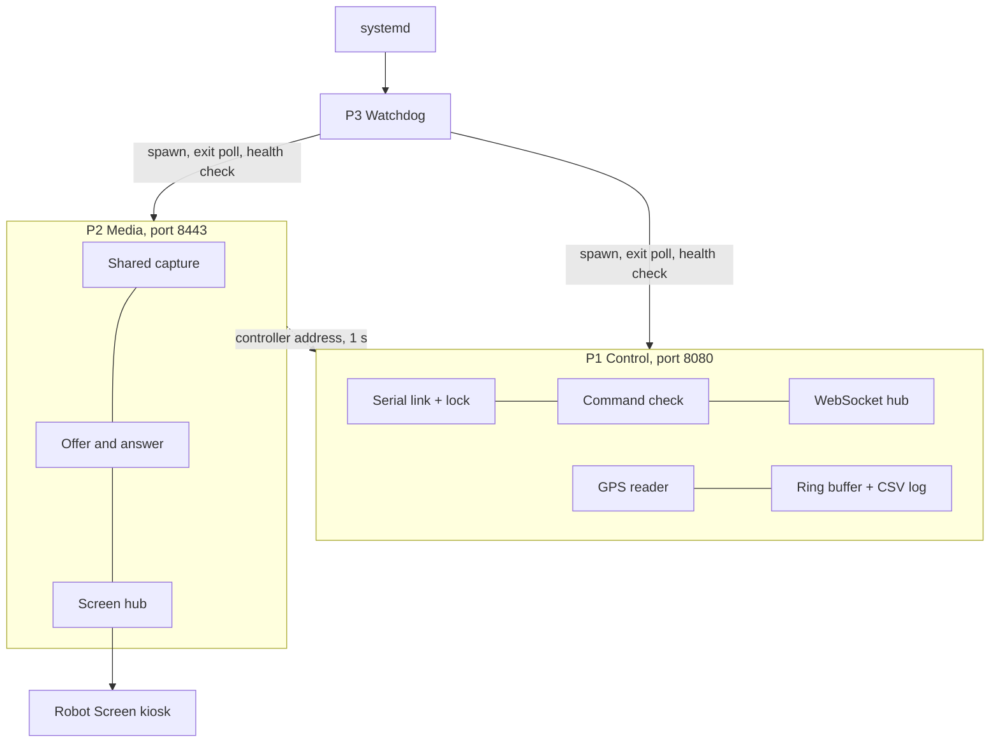
```mermaid
flowchart TB
  SD["systemd"] --> P3["P3 Watchdog"]
  P3 -- "spawn, exit poll, health check" --> P1
  P3 -- "spawn, exit poll, health check" --> P2
  subgraph P1["P1 Control, port 8080"]
    SB["Serial link + lock"] --- CV["Command check"] --- HUB["WebSocket hub"]
    GPS["GPS reader"] --- RB["Ring buffer + CSV log"]
  end
  subgraph P2["P2 Media, port 8443"]
    CAP["Shared capture"] --- SIG["Offer and answer"] --- SH["Screen hub"]
  end
  P2 -. "controller address, 1 s" .-> P1
  SH --> KI["Robot Screen kiosk"]
```

**Figure 6.** Raspberry Pi software architecture and process supervision.

The dashboard is a single-page React application served by P1 (Figure 7). Its interface components hold no network code; they read state from, and send actions through, a small set of hooks. Each hook owns one connection to one server, so a lost media connection leaves the drive controls and telemetry working.

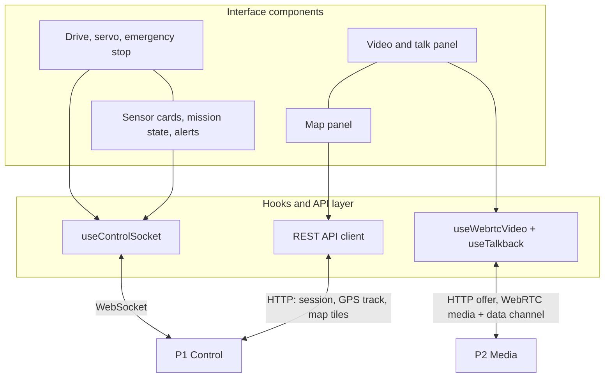
```mermaid
flowchart TB
  subgraph UI["Interface components"]
    DC["Drive, servo, emergency stop"] --- SC["Sensor cards, mission state, alerts"]
    VS["Video and talk panel"] --- MP["Map panel"]
  end
  subgraph HK["Hooks and API layer"]
    CS["useControlSocket"]
    WV["useWebrtcVideo + useTalkback"]
    API["REST API client"]
  end
  DC --> CS
  SC --> CS
  VS --> WV
  MP --> API
  CS <-- "WebSocket" --> P1["P1 Control"]
  API <-- "HTTP: session, GPS track, map tiles" --> P1
  WV <-- "HTTP offer, WebRTC media + data channel" --> P2["P2 Media"]
```

**Figure 7.** Operator dashboard software architecture.

Each layer can also run without its hardware. A development mode (the MOCK_HARDWARE setting) replaces the serial link with an in-process Arduino emulator that mirrors the firmware's framing, command validation, dead-man timer and telemetry cadence; replaces the GPS with a synthetic track; and replaces the camera and microphone with a synthetic video pattern and silence. The full control, telemetry, supervision and media stack therefore runs on a development machine with no robot attached, which is how the software is tested away from the hardware.

## 3.5 Real-Time Firmware and Fail-Safe Control

The firmware holds the authority to stop the robot, so it must stop the motors without help from the Pi or the network. The firmware defines five operating modes (Figure 8): BOOT, READY, ACTIVE, PANIC, and a reserved latched operator-stop mode, ESTOP. Motion is accepted only in READY and ACTIVE with no fault set; telemetry reports READY as 1, ACTIVE as 2 and all other modes (BOOT, PANIC and ESTOP) as 3.

```mermaid
stateDiagram-v2
  [*] --> BOOT
  BOOT --> READY: outputs safe, drivers enabled
  READY --> ACTIVE: valid F, R, L or G
  ACTIVE --> READY: S
  READY --> PANIC: dead-man expiry or gas alarm
  ACTIVE --> PANIC: dead-man expiry or gas alarm
  PANIC --> READY: commands resume or gas clears
  ESTOP --> READY: S
  note right of ESTOP: Reserved latched operator-stop state; defined in the firmware state machine and reported as 3, but not entered in the current build, where the emergency stop is an ordinary S (Table 7).
```

**Figure 8.** Firmware operating modes.

### 3.5.1 Task Scheduling and Command Validation

A cooperative scheduler runs the periodic tasks in Table 6 from the main loop, with timing based on unsigned millisecond differences so that counter rollover does not break it. The command parser is polled on every loop pass and checks each command in four stages before it acts (Figure 9).

**Table 6.** Firmware tasks.

| Task | Period | Work |
|---|---|---|
| Motor service | 10 ms | Ramp PWM toward target by 15 units per tick |
| Safety supervisor | 10 ms | Dead-man and gas checks, fault recovery |
| Fast sensors | 50 ms | HC-SR04 range (25 ms echo timeout) |
| Slow sensors | 2000 ms | DHT11 and MQ-136 |
| Telemetry | 500 ms | One 8-field CSV line |
| Heartbeat | 1000 ms | Mode line and status LED toggle |

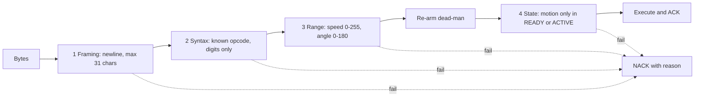
```mermaid
flowchart LR
  RX["Bytes"] --> S1["1 Framing: newline, max 31 chars"]
  S1 --> S2["2 Syntax: known opcode, digits only"]
  S2 --> S3["3 Range: speed 0-255, angle 0-180"]
  S3 --> DM["Re-arm dead-man"]
  DM --> S4["4 State: motion only in READY or ACTIVE"]
  S4 --> EX["Execute and ACK"]
  S1 & S2 & S3 & S4 -. fail .-> NK["NACK with reason"]
```

**Figure 9.** Four-stage command validation. The nine opcodes are F, R, L, G (speed), P, T (angle), S, H and ?.

The control server repeats a lighter check before sending: it clamps speed to 0-180 and angles to 0-180, and rejects motion and servo commands whose sequence number is not higher than the last one from that client.

### 3.5.2 Dead-Man Timer and Stop-Time Guarantee

Every command that passes stages 1 to 3 re-arms the dead-man timer, including heartbeats. When the timer expires, the supervisor sets the PWM outputs to zero and pulls the shared enable line low at once, without ramping (Figure 10). The worst-case stop time after the last command is:

$$t_{stop} \le T_{DM} + T_{S} + J$$

where $T_{DM} = 2000$ ms is the dead-man window, $T_{S} = 10$ ms is the supervisor period, and $J$ is the longest single loop pass, set mainly by the 25 ms echo timeout and the 20 ms DHT11 start pulse.

An ordinary stop command ramps the motors down instead:

$$t_{ramp} = \left\lceil \frac{u}{\Delta u} \right\rceil T_{M}$$

where $u$ is the current PWM value, $\Delta u = 15$ is the ramp step and $T_{M} = 10$ ms is the motor service period; this gives 120 ms from the 180 cap and 170 ms from 255.

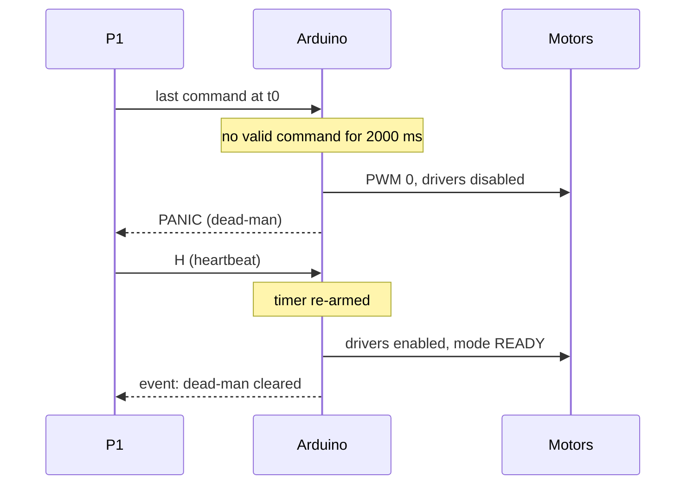
```mermaid
sequenceDiagram
  participant P as P1
  participant A as Arduino
  participant M as Motors
  P->>A: last command at t0
  Note over A: no valid command for 2000 ms
  A->>M: PWM 0, drivers disabled
  A-->>P: PANIC (dead-man)
  P->>A: H (heartbeat)
  Note over A: timer re-armed
  A->>M: drivers enabled, mode READY
  A-->>P: event: dead-man cleared
```

**Figure 10.** Dead-man trip and recovery.

### 3.5.3 Redundant Stop Paths and Gas-Triggered Stop

Table 7 lists every path that stops the motors. The gas stop fires when the raw MQ-136 value reaches 1000; motion stays rejected until a later reading falls below it, and the dashboard warns earlier, at 450 (warning) and 600 (critical).

These dashboard warning and critical levels are not fixed in the code. P1 reads them from an override file, /etc/robot/thresholds.json, at start-up, falling back to built-in defaults when the file is absent, and serves the active set to every dashboard over the session endpoint (Section 3.6) so all operators apply the same limits. The firmware gas stop at 1000 is independent of these display thresholds and cannot be changed from the dashboard.

**Table 7.** Stop paths.

| Trigger | Origin | Action | Bound |
|---|---|---|---|
| Drive key or button released | Dashboard via P1 | S, ramped stop | One network trip |
| Emergency stop button | Dashboard via P1 | S, sent without the sequence check | One network trip |
| Controller connection closes | P1 | S | On socket close |
| Another dashboard takes control | P1 | S | On takeover |
| P1 start-up | P1 | 3 x S, 200 ms apart | Before any other command |
| P1 shutdown | P1 | S | Before the port closes |
| Command flow stops | Firmware | PWM 0, drivers disabled | $t_{stop}$ above |
| Gas value >= 1000 | Firmware | PWM 0, drivers disabled, motion rejected | Gas sampled every 2000 ms |

## 3.6 P1 Control Server and Telemetry

The firmware stops the robot when commands cease, but it assumes that the commands it does receive come from one source and arrive in order. P1 provides that assumption and returns the robot's state to the operator. P1 owns the serial link, the GPS receiver and the control WebSocket.

### 3.6.1 Safe Startup and Single-Writer Serial Link

P1 takes an exclusive, non-blocking lock on a file in a memory-backed directory before it opens any hardware; the kernel releases the lock when the process exits for any reason. The serial port is then opened in exclusive mode, and one asynchronous lock serialises all writes. Figure 11 shows the start-up handshake.

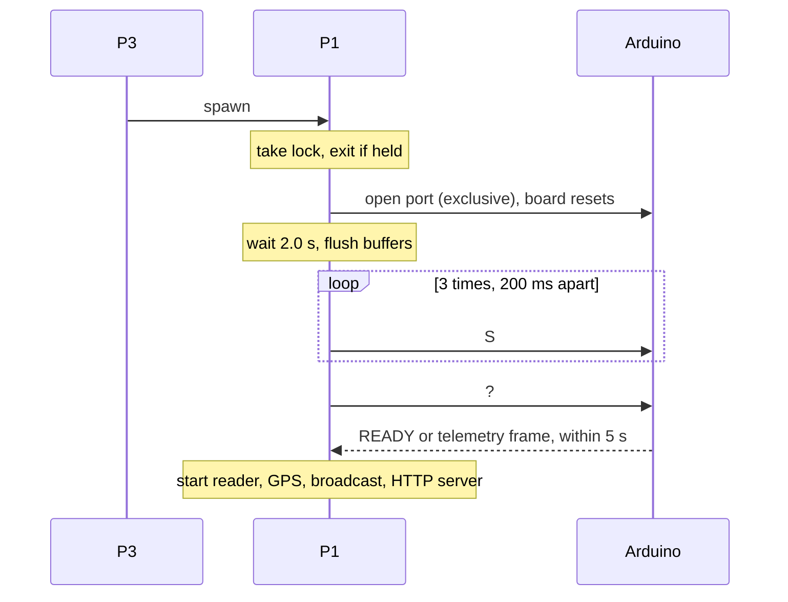
```mermaid
sequenceDiagram
  participant W as P3
  participant P as P1
  participant A as Arduino
  W->>P: spawn
  Note over P: take lock, exit if held
  P->>A: open port (exclusive), board resets
  Note over P: wait 2.0 s, flush buffers
  loop 3 times, 200 ms apart
    P->>A: S
  end
  P->>A: ?
  A-->>P: READY or telemetry frame, within 5 s
  Note over P: start reader, GPS, broadcast, HTTP server
```

**Figure 11.** P1 start-up handshake. A timeout ends P1 with a handshake-failure exit code.

### 3.6.2 Telemetry Pipeline and Session Resume

The firmware sends a frame every 500 ms; P1 broadcasts a snapshot of the latest valid frame every 200 ms on an absolute schedule, merged with GPS and link status (Figure 12). A frame is dropped if any field fails the checks in Table 8; there is no retransmission.

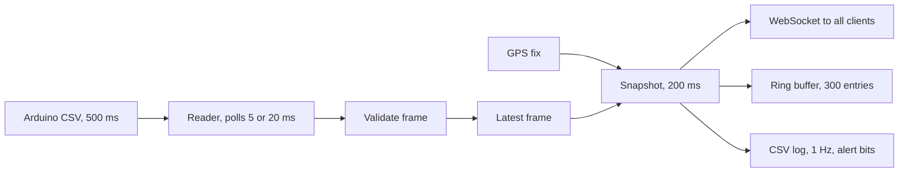
```mermaid
flowchart LR
  A["Arduino CSV, 500 ms"] --> R["Reader, polls 5 or 20 ms"]
  R --> V["Validate frame"]
  V --> L["Latest frame"]
  G["GPS fix"] --> S["Snapshot, 200 ms"]
  L --> S
  S --> WS["WebSocket to all clients"]
  S --> RB["Ring buffer, 300 entries"]
  S --> LOG["CSV log, 1 Hz, alert bits"]
```

**Figure 12.** Telemetry pipeline.

**Table 8.** Telemetry frame fields and accepted ranges (frame at most 80 characters).

| Field | Unit | Accepted range |
|---|---|---|
| Temperature | degC | -40 to 125 |
| Humidity | % | 0 to 100 |
| Gas | raw ADC | 0 to 10000 |
| Range | cm | 0 to 500 |
| Pan angle | deg | 0 to 180 |
| Tilt angle | deg | 0 to 180 |
| Firmware state | - | 1 to 3 |
| Uptime | ms | 0 to 2^32 - 1 |

On reconnect, the dashboard sends the server timestamp of the last snapshot it received; P1 replies with every newer snapshot in the buffer and the size of any gap. The buffer depth and the gap are:

$$D = N \cdot T_{b} = 300 \times 200\ \text{ms} = 60\ \text{s}, \qquad g = \max(0,\ t_{oldest} - t_{last})$$

where $N$ is the buffer size, $T_{b}$ the broadcast period, $t_{oldest}$ the oldest buffered timestamp and $t_{last}$ the client's last timestamp. The buffer is held in memory, so it does not survive a P1 restart.

## 3.7 Fault Tolerance and Supervision

Sections 3.5 and 3.6 make each tier fail into a stop; this section describes how failures are detected and how the system returns to service. Fault tolerance is layered (Figure 13). Each layer acts on its own, and a failure that passes every layer above ends at the firmware, which stops the motors.

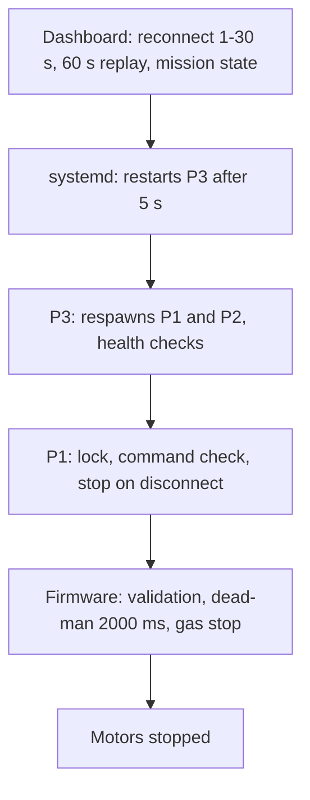
```mermaid
flowchart TB
  L5["Dashboard: reconnect 1-30 s, 60 s replay, mission state"]
  L4["systemd: restarts P3 after 5 s"]
  L3["P3: respawns P1 and P2, health checks"]
  L2["P1: lock, command check, stop on disconnect"]
  L1["Firmware: validation, dead-man 2000 ms, gas stop"]
  M["Motors stopped"]
  L5 --> L4 --> L3 --> L2 --> L1 --> M
```

**Figure 13.** Layered fault tolerance, from the operator side down to the motors.

### 3.7.1 P3 Watchdog: Process Isolation and Supervision

P3 is the only systemd service (restart on failure after 5 s); it spawns P1 and P2 as separate processes with no shared memory and supervises each one with the state machine in Figure 14. The only link between P1 and P2 is a once-per-second localhost query from P2 for the controller's address.

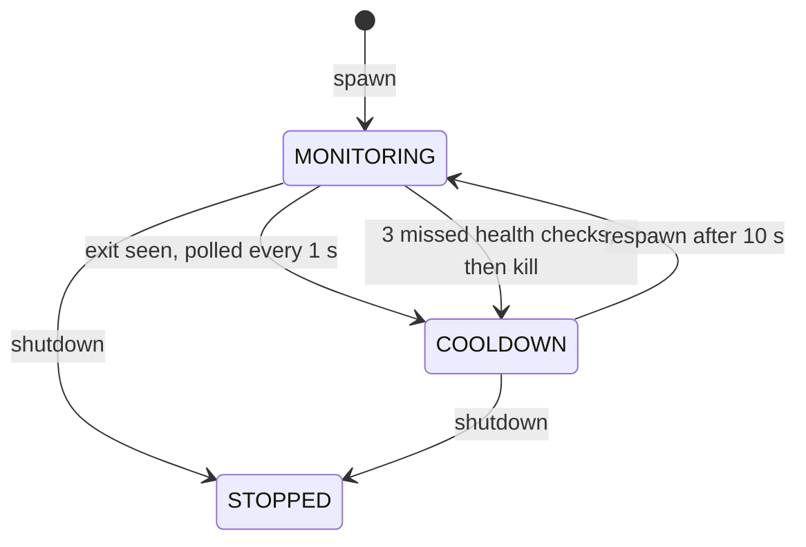
```mermaid
stateDiagram-v2
  [*] --> MONITORING: spawn
  MONITORING --> COOLDOWN: exit seen, polled every 1 s
  MONITORING --> COOLDOWN: 3 missed health checks, then kill
  COOLDOWN --> MONITORING: respawn after 10 s
  MONITORING --> STOPPED: shutdown
  COOLDOWN --> STOPPED: shutdown
```

**Figure 14.** Per-process supervision. Health checks run every 10 s with a 5 s timeout.

### 3.7.2 Recovery Time Model and Graceful Degradation

The time from a failure to a working process is:

$$T_{rec} = T_{det} + T_{p} + T_{c} + T_{init}$$

where $T_{det}$ is the detection time (at most 1 s for a crash, at most $3 \times 10 + 5 = 35$ s for a hang), $T_{p} = 1$ s is the poll before cooldown, $T_{c} = 10$ s is the cooldown, and $T_{init}$ is start-up time, which for P1 is 2.0 s + 3 x 0.2 s plus up to 5 s for the handshake. A P1 crash therefore recovers in 14.6 s to 19.6 s plus interpreter start-up; the dashboard adds up to one reconnect back-off step. Table 9 shows how each failure degrades the mission.

P1 reports why it exited through its process exit code, which the watchdog reads to decide how to react. A clean exit, or an exit because a healthy peer already holds the serial lock (code 0), draws no alarm: the watchdog simply waits out the cooldown rather than counting a crash. An unexpected lock error (code 1) or a failed Arduino handshake (code 2) is treated as a crash and respawned. An invalid configuration (code 3) is logged distinctly so that a persistent misconfiguration cannot drive a tight respawn loop. P2 uses the same configuration-invalid code.

**Table 9.** Failure effects and recovery.

| Failure | Detected by | Effect | Recovery |
|---|---|---|---|
| Operator link lost | Dead-man; socket close | Robot stops; mission STOP | Reconnect with back-off, telemetry replay |
| P1 crash or hang | P3 | No control or telemetry; dead-man stops robot | Respawn; buffered history lost |
| P2 crash | P3 | Video and talk lost; control unaffected; mission DRIVING LIMITED | Respawn; operator retries video |
| Arduino link error | Serial read or write error | Serial flag false; mission STOP | Reads retried every 0.5 s; port reopened when P1 restarts |
| Camera fails to open | Media server | Synthetic test pattern sent | Next session |
| Microphone lost | Media server | Silence sent | Reopen tried every 2 s |
| GPS port error | P1 | No fix; GPS-lost alert bit set | Port reopened after 2 s |
| Robot Screen browser exits | Kiosk launcher | Victim screen blank | Relaunch after 3 s |
| P3 crash | systemd | P1 and P2 stop with it; dead-man stops robot | Restart after 5 s, then P1 and P2 respawn |

Figure 15 shows how one failure, a Wi-Fi drop, passes through the tiers and how the system returns to service without operator action beyond reconnecting.

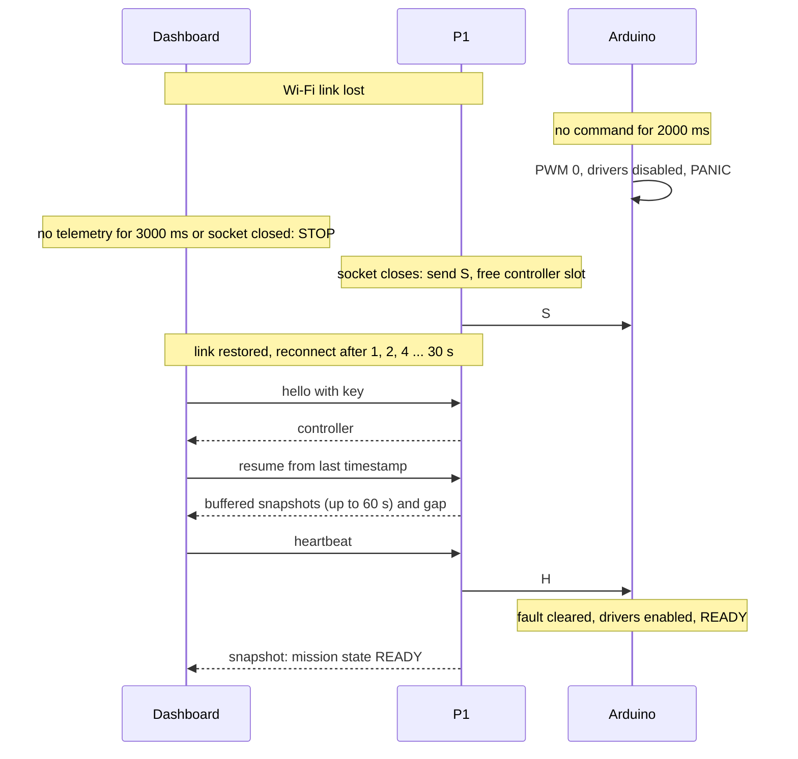
```mermaid
sequenceDiagram
  participant D as Dashboard
  participant P as P1
  participant A as Arduino
  Note over D,P: Wi-Fi link lost
  Note over A: no command for 2000 ms
  A->>A: PWM 0, drivers disabled, PANIC
  Note over D: no telemetry for 3000 ms or socket closed: STOP
  Note over P: socket closes: send S, free controller slot
  P->>A: S
  Note over D,P: link restored, reconnect after 1, 2, 4 ... 30 s
  D->>P: hello with key
  P-->>D: controller
  D->>P: resume from last timestamp
  P-->>D: buffered snapshots (up to 60 s) and gap
  D->>P: heartbeat
  P->>A: H
  Note over A: fault cleared, drivers enabled, READY
  P-->>D: snapshot: mission state READY
```

**Figure 15.** Failure chain for a Wi-Fi drop: stop, reconnect, replay, resume.

### 3.7.3 Mission State for Operator Awareness

The dashboard reduces link and firmware status to one of four mission states, evaluated in the priority order of Table 10.

**Table 10.** Mission state rules (first match wins).

| Priority | State | Condition |
|---|---|---|
| 1 | STOP | Control socket down, or serial link down, or no telemetry for more than 3000 ms |
| 2 | DRIVING LIMITED | Video link down |
| 3 | DRIVING | Firmware reports driving |
| 4 | READY | Otherwise |

## 3.8 Access Control and Multi-Operator Arbitration

Because any dashboard may reconnect after a failure (Section 3.7), the system must also decide which of several connected dashboards may drive. The decision is made once, in P1, and Section 3.9 reuses it for victim interaction. A dashboard becomes controller only by presenting the robot's controller key; all others are observers, whose commands, including stop, are rejected. The most recent dashboard with the right key takes the controller slot; the previous holder is demoted and the robot is stopped (Figure 16). P1 and P2 check the key in the same way (Table 11), and P2 grants talk only to a keyed session from the host P1 reports as controller.

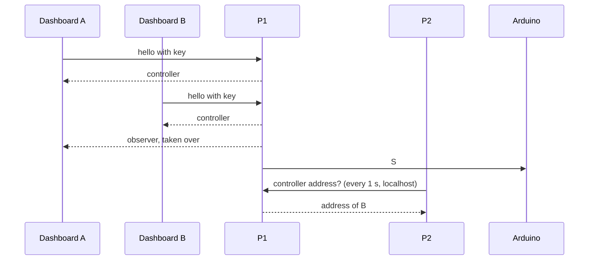
```mermaid
sequenceDiagram
  participant A as Dashboard A
  participant B as Dashboard B
  participant P as P1
  participant M as P2
  participant U as Arduino
  A->>P: hello with key
  P-->>A: controller
  B->>P: hello with key
  P-->>B: controller
  P-->>A: observer, taken over
  P->>U: S
  M->>P: controller address? (every 1 s, localhost)
  P-->>M: address of B
```

**Figure 16.** Controller takeover.

**Table 11.** Key check results.

| Result | Condition | Role |
|---|---|---|
| OK | Key matches (constant-time comparison) | Controller |
| No key | No key presented; not counted as a failure | Observer |
| Bad key | Wrong key; failure counted for that host | Observer |
| Locked | 5 failures within 300 s; host refused for 300 s, even with the right key | Observer |
| Disabled | No key configured on the robot | Observer for everyone |

Failure counters are kept in memory per process. The dashboard discards a refused key so that reconnects do not add to the count. The key travels over plain HTTP and WebSocket. Both P1 and P2 accept requests from any origin (permissive CORS), because the dashboard may be served from the Pi, from a development server or from a content-delivery network, so its origin is not fixed; on the isolated local network this adds no exposure beyond the plain-HTTP key already noted.

## 3.9 Two-Way Victim Interaction

With one controller established (Section 3.8), the same operator can see, hear and talk to the victim. This path must never delay a stop. The robot carries a display and speaker facing the victim, driven by a kiosk browser (the Robot Screen) on the Pi, and all communication between the operator and the victim runs through P2. Here "P2" names the media process (Section 3.4), not a peer-to-peer protocol.

Media is kept out of P1 because video encoding is the heaviest load on the Pi, and a stall or crash in a codec library must not delay a stop; P2 can also be restarted while P1 keeps driving (Table 9). The only link between them is P2's once-per-second query for the controller's address (Section 3.7.1); P2 never sends anything to P1 or to the Arduino.

### 3.9.1 The P2 Media Process

P2 is a single Python process built on aiortc, a WebRTC implementation for asyncio, with PyAV (FFmpeg) for capture, decoding and encoding; every peer connection runs on one event loop (Figure 6).

- **Shared capture.** The webcam (V4L2) and the microphone (ALSA) can each be opened only once, so P2 opens each device on first use and fans its frames out to every session. Video is unbuffered, since a viewer needs only the newest frame; audio is buffered per session, since every audio frame matters. If the camera cannot be opened, the session receives a synthetic test pattern; if the microphone is missing or drops off USB, the session receives silence and P2 retries the device every 2 s.
- **Per-session tracks.** Each dashboard session gets its own outbound video and audio track, and a private copy of every camera frame for its own encoder.

Each dashboard opens one peer connection to P2 that carries both directions at once: P2 sends the robot's camera and microphone to the operator, and the operator sends voice, video and text back over the same connection (Figure 17). Any number of dashboards may connect; all receive the robot's media, but only the controller can send to the Robot Screen. Table 12 lists the video parameters.

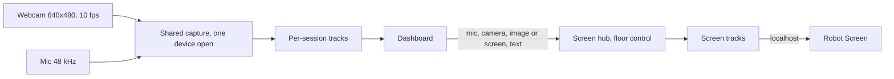
```mermaid
flowchart LR
  CAM["Webcam 640x480, 10 fps"] --> SH["Shared capture, one device open"]
  MIC["Mic 48 kHz"] --> SH
  SH --> SES["Per-session tracks"]
  SES --> D["Dashboard"]
  D -- "mic, camera, image or screen, text" --> HUB["Screen hub, floor control"]
  HUB --> ST["Screen tracks"]
  ST -- "localhost" --> K["Robot Screen"]
```

**Figure 17.** Two-way media path (WebRTC). Video is encoded per session as VP8 or H.264, as negotiated with the browser; each session gets its own copy of every camera frame.

**Table 12.** Video parameters.

| Parameter | Robot to operator | Operator to robot |
|---|---|---|
| Source | USB webcam, V4L2 | Laptop camera, still image or shared screen |
| Resolution and rate | 640x480, 10 fps | Camera 640x480 at 10 fps; image 1024x576 at 2 fps; screen at 5 fps |
| Bitrate target | 500 kbps | Chosen by the browser |
| Codec | VP8 or H.264, negotiated per session | Decoded by P2, re-encoded for the Robot Screen |
| Encoders | One per dashboard session | One, for the Robot Screen connection |
| Source loss | Synthetic test pattern | Last frame repeated after 1 s; black frame when no operator video |

### 3.9.2 Signalling and Session Lifecycle

The dashboard sends its SDP offer in one HTTP POST, together with its controller key if it has one, and the answer comes back in the HTTP response (Figure 18). There is no separate signalling server and no trickle ICE: P2 finishes gathering its candidates before it replies, so the answer is complete when it arrives. Because both peers are on the same local network, a direct host-to-host path is always available and no TURN relay is needed. The response also reports the key check result (Section 3.8), so the dashboard knows at once whether the session can talk or only watch.

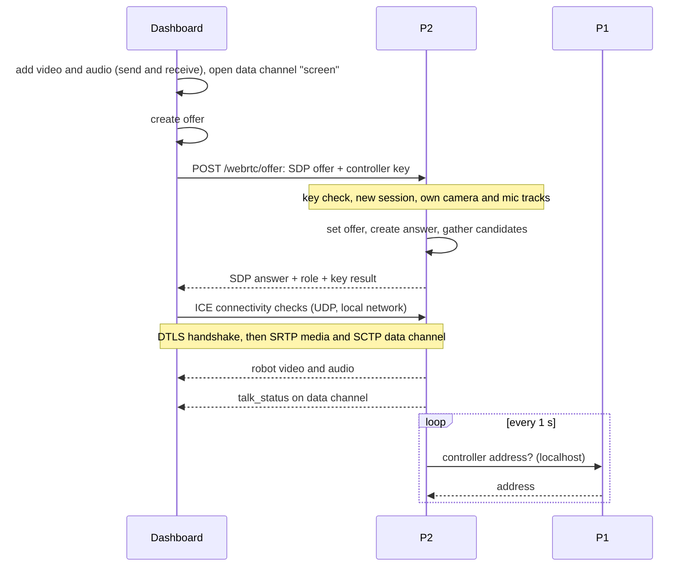
```mermaid
sequenceDiagram
  participant D as Dashboard
  participant M as P2
  participant P as P1
  D->>D: add video and audio (send and receive), open data channel "screen"
  D->>D: create offer
  D->>M: POST /webrtc/offer: SDP offer + controller key
  Note over M: key check, new session, own camera and mic tracks
  M->>M: set offer, create answer, gather candidates
  M-->>D: SDP answer + role + key result
  D->>M: ICE connectivity checks (UDP, local network)
  Note over D,M: DTLS handshake, then SRTP media and SCTP data channel
  M-->>D: robot video and audio
  M-->>D: talk_status on data channel
  loop every 1 s
    M->>P: controller address? (localhost)
    P-->>M: address
  end
```

**Figure 18.** WebRTC signalling and session set-up between a dashboard and P2.

The dashboard offers its audio and video in both directions from the start, but sends nothing until the operator chooses to talk or show video; it then attaches the chosen source to the existing sender. Starting or stopping talk or video therefore never needs a second offer and answer.

When a connection fails or closes, P2 removes the session and releases the floor if the session held it; when no session is left, the camera and microphone are closed. P2 keeps no state that survives a restart, so reconnection is driven by the client. After video has connected once, a later loss is shown to the operator with a retry button rather than hidden by silent reconnects, so the operator knows that the video was interrupted.

Candidate gathering needs no help on this network. The dashboard creates its peer connection with no ICE servers configured, so both sides offer host candidates only, and the single segment of Section 3.2 makes a direct path available without STUN or a TURN relay. P1 does serve an ICE-configuration endpoint (GET /api/ice-config, rate limited to five requests per minute per client) for a deployment that would need STUN, but the dashboard does not read it in the local-network mode evaluated here. An internet-overlay mode, in which the robot would be reached through a relay and the same endpoint would also issue a TURN server, is provided for in the configuration (the ENABLE_OVERLAY setting in the watchdog environment) but is not implemented or evaluated in this work; the turn_status field carried in each telemetry snapshot therefore reports unavailable throughout.

### 3.9.3 Data Channel Protocol

Each dashboard connection carries one reliable, ordered data channel named "screen" over the same DTLS connection as the media. It carries short JSON messages for control of the Robot Screen (Table 13); media and drive commands never travel on it. P2 validates every message: malformed messages are dropped, and messages from a session that is not the controller are refused with a view-only reply.

**Table 13.** Data channel messages.

| Message | Direction | Purpose |
|---|---|---|
| media_state | Dashboard to P2 to Robot Screen | Operator is talking or not; which video source is shown |
| screen_text | Dashboard to P2 to Robot Screen | Text message for the victim (at most 280 characters, with a timestamp) |
| screen_clear | Dashboard to P2 to Robot Screen | Remove the text from the screen |
| floor_release | Dashboard to P2 | Give up the Robot Screen |
| display_mode | Dashboard to P2 | Switch the robot display between the kiosk and the Pi desktop |
| talk_status | P2 to dashboard | Screen online, floor state (free, you, other), display mode, can control |
| screen_state | P2 to Robot Screen | Whether an operator is present, talking or showing video |
| screen_ack | Robot Screen to P2 to dashboard | The text with this timestamp is now shown |
| floor_denied, view_only | P2 to dashboard | Request refused: another operator holds the screen, or no controller key |

The acknowledgement closes the loop for text: the dashboard marks a message as delivered only when the Robot Screen confirms it, not when it was sent. P2 sends talk_status to every dashboard whenever the floor, the controller or the screen connection changes, so all operators see the same state.

### 3.9.4 Operator-to-Robot Relay and Floor Control

The operator's media does not go from the dashboard to the Robot Screen directly. The kiosk browser connects only to P2, over localhost, and P2 relays the operator's media to it. Floor control and the controller check are therefore enforced in one place, and no remote host can reach the victim's screen or speaker, since the screen endpoint refuses any address other than localhost. The kiosk also keeps one long-lived connection that does not change when operators connect, disconnect or take over.

The cost is one decode and one re-encode on the Pi. The Robot Screen connection has two fixed outbound tracks that always read from the current floor holder: the video track sends the holder's newest frame, repeating the last one after 1 s without a new frame and sending black when there is no operator video; the audio track re-encodes the holder's voice as 48 kHz mono, 60 ms Opus packets (Section 3.9.5), and sends silence otherwise. Because these tracks never change, talking, switching video sources and handing over the floor need no renegotiation.

Only one session may hold the Robot Screen at a time (Figure 19). Talking follows driving: P2 accepts talk, video and text only from a session that presented the controller key and comes from the address P1 reports as its controller (Section 3.8, Figure 16). A takeover therefore moves the talk path to the new driver within about one second. On release, P2 drops any queued operator media, clears the text and tells the screen that no operator is present.

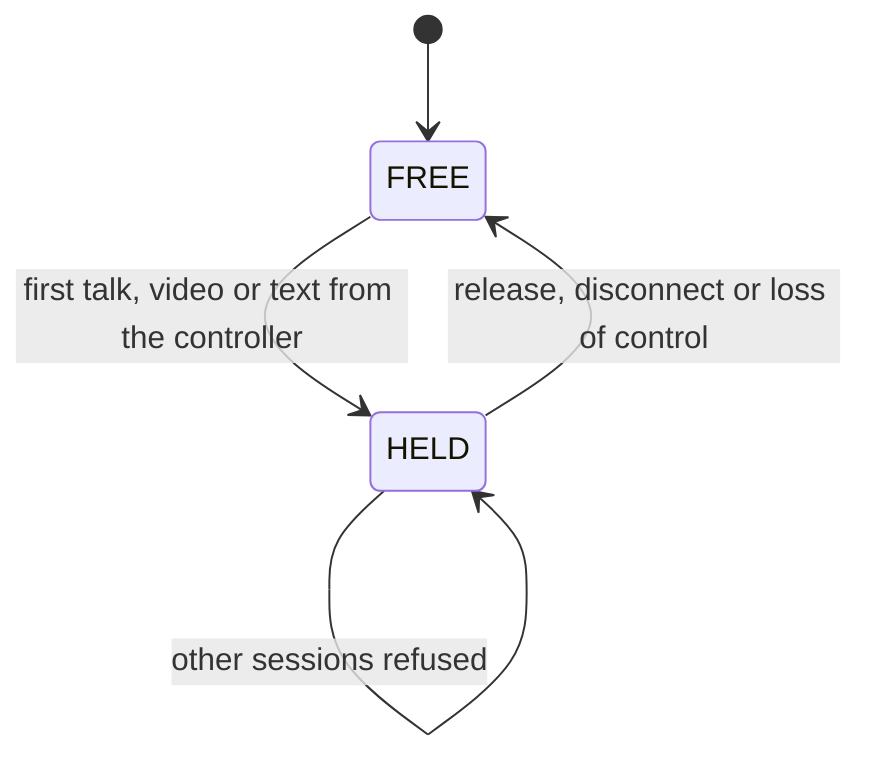
```mermaid
stateDiagram-v2
  [*] --> FREE
  FREE --> HELD: first talk, video or text from the controller
  HELD --> FREE: release, disconnect or loss of control
  HELD --> HELD: other sessions refused
```

**Figure 19.** Robot Screen floor control. A release clears the screen text and media.

### 3.9.5 Low-Latency Audio on a Constrained CPU

P2 encodes its own 60 ms Opus packets in both directions instead of the usual 20 ms, which cuts the packet rate from 50 to 16.7 packets/s and the per-packet work on the event loop to a third. It captures the microphone through a shared ALSA device with a fixed period of 960 frames (20 ms), which gives 50 reads/s against about 511 reads/s for the device's smallest period of 94 frames (Table 14).

**Table 14.** Audio parameters.

| Parameter | Robot to operator | Operator to robot |
|---|---|---|
| Format | 48 kHz, mono, 16-bit | 48 kHz, mono, 16-bit |
| Codec | Opus, voice mode, 32 kbps | Opus, voice mode, 32 kbps |
| Packet length | 60 ms | 60 ms |
| Capture period and buffer | 960 frames (20 ms), 7680 frames (160 ms) | - |
| Buffering | One queue per session | Inbound queue of 10 frames (about 200 ms); 120 ms start cushion; 400 ms cap |
| Lateness | Paced by the device | Clock reset when more than 100 ms late, no catch-up burst |
| Source loss | Silence, reopen every 2 s | Silence until the cushion refills |

## 3.10 GPS Localisation and Offline Mapping

The operator also needs to know where the robot is, both to guide it and to report the victim's position to the rescue team, without depending on the internet. P1 reads NMEA sentences from the receiver on a separate thread, merges the latest fix into each telemetry snapshot (Section 3.6.2) and adds a track point only after the robot moves at least 10 m, so drift around a stopped robot adds no points (Figure 20). Distance uses the equirectangular approximation:

$$d = R \sqrt{(\Delta\varphi)^2 + (\Delta\lambda \cos\bar{\varphi})^2}$$

where $R = 6371000$ m, $\Delta\varphi$ and $\Delta\lambda$ are the latitude and longitude differences in radians, and $\bar{\varphi}$ is their mean latitude.

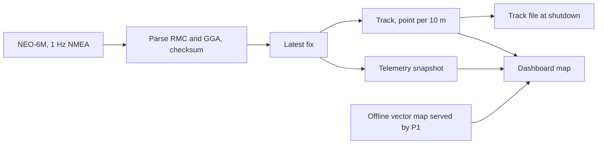
```mermaid
flowchart LR
  G["NEO-6M, 1 Hz NMEA"] --> NP["Parse RMC and GGA, checksum"]
  NP --> FX["Latest fix"]
  FX --> SN["Telemetry snapshot"]
  FX --> TR["Track, point per 10 m"]
  TR --> GJ["Track file at shutdown"]
  TR --> MAP["Dashboard map"]
  SN --> MAP
  OM["Offline vector map served by P1"] --> MAP
```

**Figure 20.** GPS and map data flow. Online map tiles, when reachable, show outside the offline map area.
