# 3. Methodology

This section describes the design of the rescue robot and the mechanisms that provide its safety, fault-tolerance and victim-interaction properties. All values are design or configured values unless marked otherwise; measured performance is reported in Section 5.

## 3.1 Design Requirements and Principles

The system serves a single rescue operator who sends a small ground robot into a confined or collapsed space to locate and interact with a trapped person. It must support teleoperated driving (FR1), camera pan/tilt independent of the chassis (FR2), live video and audio from the robot (FR3), and two-way victim interaction (FR4), in which the operator's voice plays through the robot's speaker and the operator's face, an image, a shared screen or a text message appears on a display facing the victim. It must also provide environmental sensing with threshold alerts (FR5), GPS position and path tracking (FR6), and full operation without internet access (FR7).

Six non-functional requirements constrain the design: a bounded stop time whenever command flow ceases (NFR1); fault tolerance, so that one failed component neither disables unrelated functions nor needs manual recovery (NFR2); single-operator authority, with exactly one authenticated operator commanding the robot or addressing the victim at a time (NFR3); low cost (NFR4); commodity hardware (NFR5); and testability of the full software stack without the physical robot (NFR6). These requirements are realised as the seven architectural invariants in Table 1.

**Table 1.** Architectural invariants and their enforcement.

| No. | Invariant | Enforcement mechanism | Req. |
|---|---|---|---|
| I | Motor safety is independent of the network and the edge computer | Firmware dead-man timer: no valid command for 2000 ms disables the drivers | NFR1 |
| II | Control, media and supervision are decoupled | Separate processes with no shared memory; one read-only localhost query between them | NFR2 |
| III | Every process is supervised | systemd -> watchdog -> control and media servers | NFR2 |
| IV | Control and media use independent transports | WebSocket for control, WebRTC for media | NFR2 |
| V | Operator state is always simple | One function derives a four-valued mission state | NFR3 |
| VI | Only one writer commands the microcontroller | Process lock, exclusive serial open, single key-protected controller role | NFR3 |
| VII | Primary operation needs no internet | Dashboard, control, telemetry, media and map are served by the robot | FR7 |

The guiding principle is that each tier is a separate failure domain, and the authority to stop the robot sits at the lowest tier that can still act when everything above it has failed (Figure 1). Whatever fails, whether the browser, the Wi-Fi link or the edge computer, the result is the same: commands stop reaching the microcontroller, and the firmware stops the motors by itself.

**Figure 1.** Failure domains and the tier that stops the robot when each one fails.

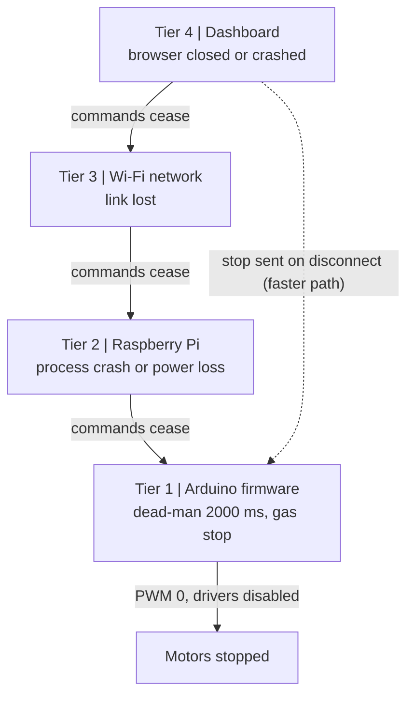

## 3.2 System Architecture

The system has four tiers (Figure 2): an Arduino UNO for real-time control; a Raspberry Pi 4 edge computer running a control server (P1), a media server (P2) and a watchdog (P3), and driving the victim-facing Robot Screen; a local Wi-Fi network; and a browser dashboard on the operator's laptop.

The Pi and the Arduino communicate over the UNO's USB-serial link (115,200 baud) using short newline-terminated ASCII commands such as `F120` (forward at speed 120) or `S` (stop); the full protocol is given in Appendix B. Between the dashboard and the Pi there are two independent transports (Invariant IV). A WebSocket to P1 carries commands, heartbeats and emergency stops, with telemetry in return. A WebRTC session with P2 carries the robot's camera and microphone to the operator, and the operator's voice, video and text to the Robot Screen. Because the two transports end in different processes, a media failure leaves driving, telemetry and stopping intact, and losing the control connection does not interrupt the victim's view of the operator.

**Figure 2.** Overall architecture: four tiers, two independent transports and the victim-facing Robot Screen.

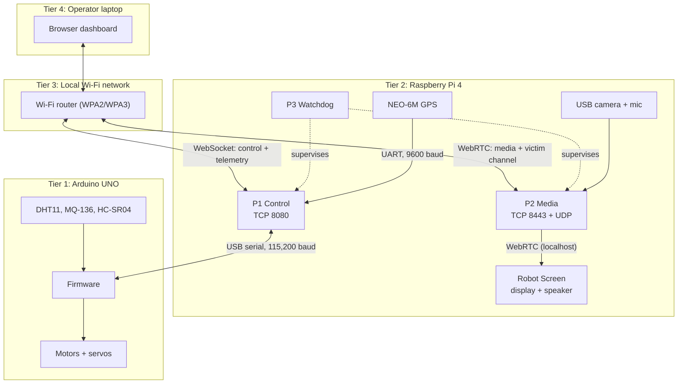

A drive command crosses two validators, one on the Pi and one on the Arduino, before it moves a motor (Figure 3).

**Figure 3.** End-to-end command flow, from key press to motor.

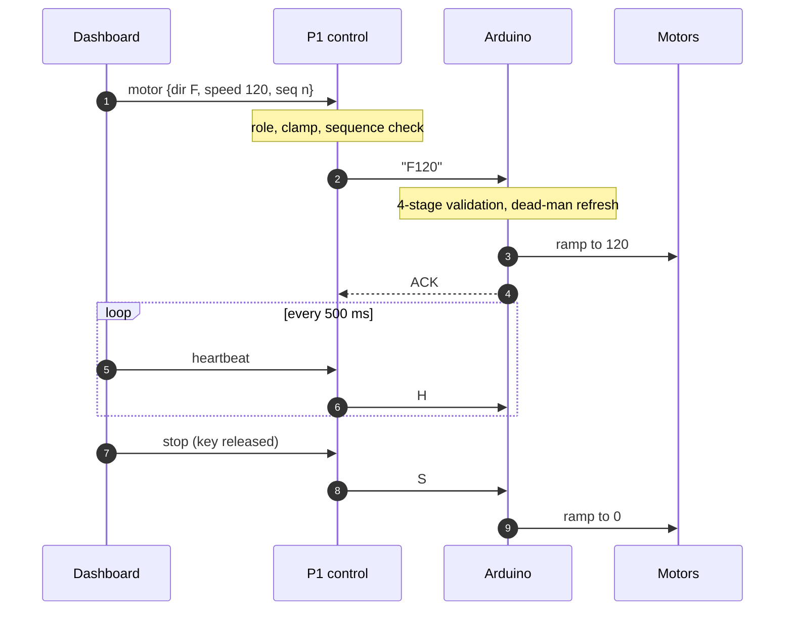

The three computing tiers share no code; they share one protocol definition that is mirrored in each code base. Table 2 lists the software of each tier. The Pi software runs as three processes: P1 owns the serial and GPS ports, validates commands, broadcasts telemetry and serves the dashboard and offline map; P2 captures the camera and microphone and relays operator media to the Robot Screen; P3 starts and supervises P1 and P2 and is the only systemd service. The dashboard is a React single-page application served by P1, with separate modules for the control and media transports, so a media failure in the browser cannot interrupt control.

To meet NFR6, the Pi software can run in an emulation mode in which a software model of the Arduino replaces the serial port and a simulated receiver replaces the GPS. The emulated Arduino implements the same command parser, dead-man timer and telemetry format, so the unchanged software stack runs on any laptop and the automated tests (Section 4.3) run without hardware.

**Table 2.** Technology stack per tier.

| Tier | Hardware | Environment | Languages and libraries |
|---|---|---|---|
| Real-time control | Arduino UNO (ATmega328P, 16 MHz, 2 KB SRAM) | Bare metal | C++, Arduino core |
| Edge | Raspberry Pi 4, 4 GB | Debian 12, systemd | Python 3.11: FastAPI, pyserial, aiortc, PyAV; Chromium kiosk |
| Network | Wi-Fi router | 802.11, WPA2/WPA3 | WebSocket, WebRTC, HTTP |
| Operator | Laptop | Chromium-based browser | TypeScript, React, Leaflet, PMTiles |

## 3.3 Hardware Platform

All components are off-the-shelf modules connected by wiring (Figure 4).

**Locomotion and actuation.** A four-wheel-drive chassis carries four DC gear motors, wired as left and right pairs. Each pair is driven by one BTS7960 half-bridge driver, and both drivers share one enable line, so a single output can disable all propulsion. Steering is differential (skid) steering. Two hobby servos orient the camera over 0-180 deg in pan and tilt.

**Sensing.** Table 3 summarises the sensors. The MQ-136 gas sensor is uncalibrated and is reported as a raw 10-bit ADC value (0-1023), so it indicates relative gas presence rather than a concentration in ppm.

**Table 3.** Sensing suite.

| Sensor | Connected to | Quantity measured | Sampling period |
|---|---|---|---|
| DHT11 | Arduino | Temperature (degC), humidity (%) | 2000 ms |
| MQ-136 | Arduino, 10-bit ADC | Gas, raw ADC 0-1023 | 2000 ms |
| HC-SR04 | Arduino | Forward range, up to 400 cm | 50 ms |
| NEO-6M | Pi UART, 9600 baud | Position, fix, satellite count | 1 s |

**Audio-visual interaction.** A USB webcam on the pan/tilt head is captured at 640x480 and 10 fps, and a USB microphone picks up sound at the robot. Toward the victim, a speaker on the Pi's 3.5 mm jack plays the operator's voice, and a forward-facing 7-inch HDMI display (1024x600) shows the Robot Screen: a reassurance message when idle, otherwise the operator's video or image with text overlaid.

**Power.** A 4S Li-ion pack (14.8 V nominal, 16.8 V full) with a BMS feeds the motor drivers directly; buck converters supply 5 V for the servos and sensors and about 8 V for the Arduino (Figure 5). The Pi runs from a separate USB power bank, so motor current surges cannot brown it out; if it does lose power, the dead-man timer still stops the motors.

**Figure 4.** Electrical wiring of the robot.

> [FIGURE: insert hardware wiring diagram]

**Figure 5.** Power distribution. The edge computer is electrically isolated from the motor supply.

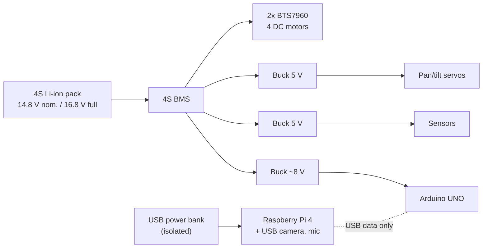

## 3.4 Real-Time Firmware and Fail-Safe Control

### 3.4.1 Task Scheduling and Command Validation

The firmware has no operating system. Its main loop reads incoming serial bytes and then runs every task whose period has elapsed (Table 4). Only the ultrasonic and DHT11 reads block, each for at most about 25 ms.

**Table 4.** Scheduled firmware tasks.

| Task | Period | Work | Max blocking |
|---|---|---|---|
| Motor service | 10 ms | Ramp PWM toward target | - |
| Safety | 10 ms | Gas check, dead-man check, fault recovery | - |
| Range sensor | 50 ms | HC-SR04 echo measurement | 25 ms |
| Slow sensors | 2000 ms | DHT11 and MQ-136 reads | ~25 ms |
| Telemetry | 500 ms | Send one CSV line to the Pi | - |
| Heartbeat | 1000 ms | Send mode and uptime | - |

Every received line passes framing, syntax, range and state checks (Figure 6). A failure at any stage returns a rejection message and nothing is actuated. The dead-man timer is refreshed after stage 3, so any well-formed command proves the link is alive even if stage 4 rejects it.

**Figure 6.** Firmware command validation.

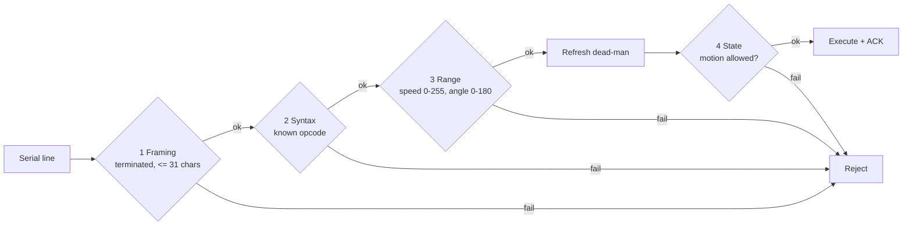

The firmware holds one of four operating modes (Figure 7). Motion is allowed only in READY and ACTIVE. PANIC is entered when the dead-man expires or the gas reading reaches the alarm level; it disables the drivers immediately and clears automatically once the cause is gone.

**Figure 7.** Firmware mode state machine.

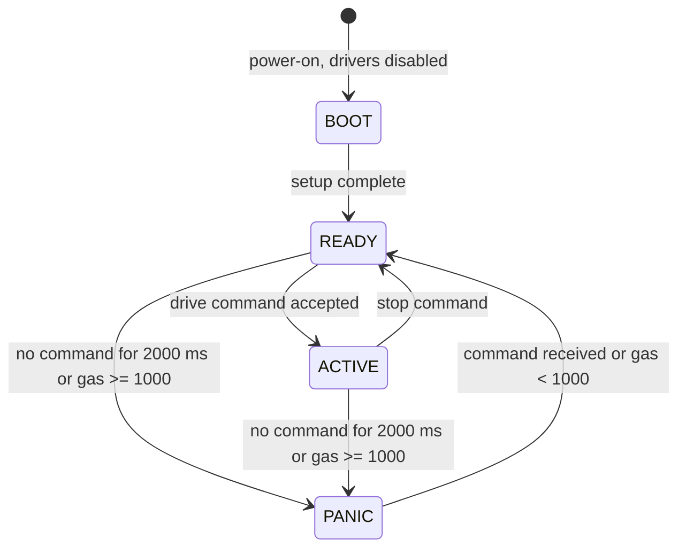

Each drive command sets signed targets for the left and right sides; pivot turns drive the two sides in opposite directions. The motor task moves the output toward its target by $\Delta u = 15$ PWM units every $T_m = 10$ ms, which limits current spikes, so a change from 0 to 180 takes 120 ms:

$$
t_{\text{ramp}} = \left\lceil \frac{|u_{\text{target}} - u_{\text{current}}|}{\Delta u} \right\rceil T_{m}
$$

A safety stop bypasses the ramp and cuts PWM to zero at once. The Pi additionally caps speed at 180 of 255, which limits the mean motor voltage to $\bar V_m = (u/255)\,V_{\text{bat}}$ = 10.4 V at the nominal 14.8 V and 11.9 V at a full 16.8 V.

### 3.4.2 Dead-Man Timer and Stop-Time Guarantee

The controlling dashboard sends a heartbeat every 500 ms, which P1 forwards to the Arduino. The firmware stops the motors when no valid command has arrived for 2000 ms (Figure 8), so four heartbeats can be lost before the robot stops. The worst-case stop time follows from the scheduler (Table 5):

$$
T_{\text{stop}} \le T_{DM} + T_{s} + T_{b,\max} \approx 2000 + 10 + 50 = 2060\ \text{ms}
$$

**Table 5.** Terms of the stop-time bound.

| Symbol | Meaning | Value |
|---|---|---|
| $T_{DM}$ | Dead-man window | 2000 ms |
| $T_s$ | Safety-task period | 10 ms |
| $T_{b,\max}$ | Worst blocking in one loop pass | ~50 ms |

**Figure 8.** Heartbeat and dead-man trip after the link is lost.

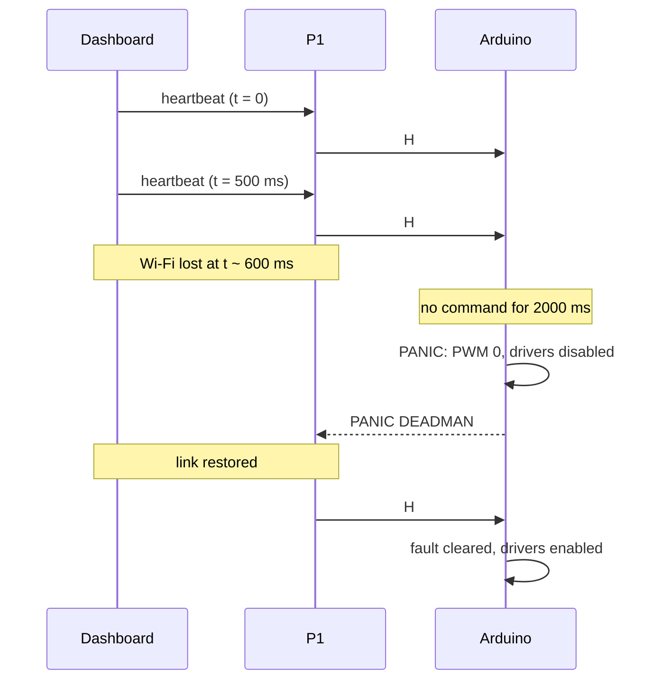

### 3.4.3 Redundant Stop Paths and Gas-Triggered Stop

Command bounds are enforced at three layers: the dashboard for usability, P1 for early rejection with a readable reason, and the firmware as the only authoritative check. P1 rejects commands from non-controllers, clamps speed and angle, and discards commands with an out-of-date sequence number, so a delayed packet cannot override a newer one.

The dead-man is the last line of defence, not the only stop (Table 6). When the controller's connection closes, P1 immediately sends a stop, which halts the robot within the 120 ms ramp instead of waiting 2 s. The emergency-stop button is a normal stop command with priority: P1 skips the sequence check and the firmware accepts it in every mode.

**Table 6.** Stop mechanisms.

| Stop | Trigger | Ramp | Mode after | Cleared by |
|---|---|---|---|---|
| Operator stop | Button or key release | Yes, <= 120 ms | READY | - |
| Disconnect stop | Controller connection closed | Yes | READY | - |
| Start-up stop | P1 start (sent 3 times) | Yes | READY | - |
| Dead-man | 2000 ms without commands | No | PANIC | Next valid command |
| Gas panic | Gas ADC >= 1000 | No | PANIC | Gas ADC < 1000 |

The firmware checks the gas alarm in every safety pass, so a gas stop needs neither the Pi nor the network. The dashboard uses lower thresholds on the same raw scale to warn the operator first (Table 8). The ultrasonic range, by contrast, is advisory: it is highlighted on the dashboard below 30 cm and 20 cm but never blocks a command, because in rubble the operator may need to push through close obstacles.

## 3.5 Edge Control Server and Telemetry

### 3.5.1 Safe Startup and Single-Writer Serial Link

Opening the serial port resets the Arduino, so P1 waits 2 s for it to boot, clears the buffers and sends three stop commands to guarantee the robot starts at standstill (Figure 9). If the Arduino does not answer within 5 s, P1 exits with a distinct code so that the watchdog can report the cause.

**Figure 9.** Start-up sequence.

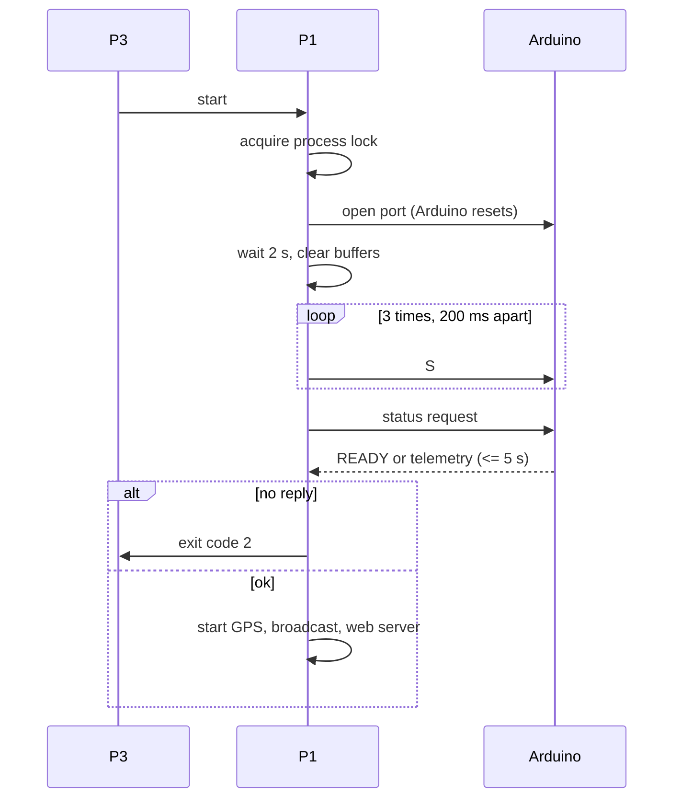

Two programs writing to the same serial port would interleave bytes and produce commands nobody sent. Exclusion is therefore enforced at four independent levels (Table 7).

**Table 7.** Exclusion mechanisms on the serial link.

| Mechanism | Prevents |
|---|---|
| Process lock file | A second copy of P1 |
| Exclusive serial open | Any other program opening the port |
| Write lock inside P1 | Interleaved writes within P1 |
| Single controller role | Two operators commanding at once |

### 3.5.2 Telemetry Pipeline and Session Resume

P1 runs three asynchronous tasks and one thread, connected only through "latest value" slots rather than queues (Figure 10). A serial stall therefore cannot block the broadcast, and a slow dashboard cannot back up the serial link.

**Figure 10.** Telemetry pipeline in P1.

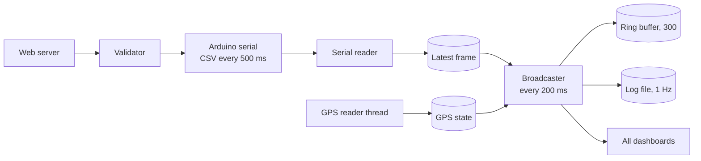

Each CSV frame from the Arduino is accepted only if it has exactly 8 fields and every value lies in its plausible range. A damaged frame is dropped rather than retransmitted, because a fresh frame arrives within 500 ms and an old reading has no value for teleoperation. Every 200 ms, P1 combines the latest frame and GPS state into one snapshot. Ticks are scheduled on absolute times, $t_k = t_0 + k\,T_b$ with $T_b$ = 200 ms, so the period does not drift; a missed tick is rescheduled from the current time instead of causing a burst of catch-up messages.

Every snapshot is also stored in a ring buffer of $N$ = 300 entries, covering $N T_b$ = 60 s. When a dashboard reconnects after a link drop, it sends the timestamp $ts_{\text{last}}$ of the last snapshot it received; P1 replays everything newer and reports the size of any lost history:

$$
\text{gap} = \max\left(0,\; ts_{\text{oldest}} - ts_{\text{last}}\right)
$$

Alert thresholds are loaded from a configuration file (Table 8), and active alerts are logged once per second.

**Table 8.** Alert thresholds.

| Quantity | Warning | Critical | Firmware action |
|---|---|---|---|
| Temperature | 50 degC | 70 degC | None |
| Gas (raw ADC) | 450 | 600 | PANIC at >= 1000 |
| Range | 30 cm | 20 cm | None |
| GPS | No fix | - | None |

## 3.6 Fault Tolerance and Supervision

### 3.6.1 Process Isolation and Watchdog Supervision

Supervision is a linear chain in which every process has exactly one supervisor (Figure 11). P1 and P2 own disjoint devices and share no memory, so a crash in one does not affect the other; their only interaction is a read-only query from P2 to P1 about who the current controller is (Section 3.8).

**Figure 11.** Supervision chain and what is lost while each unit is down.

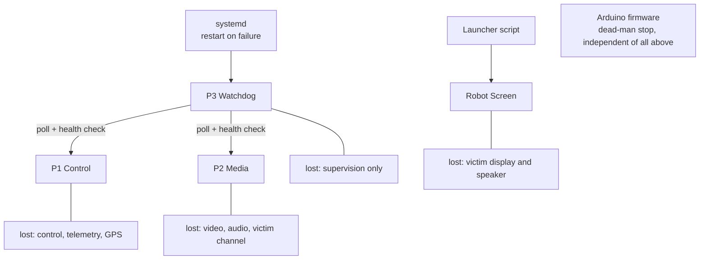

P3 detects a crashed process by polling its status every 1 s, and a process that is alive but frozen by an HTTP health check every 10 s (5 s timeout), killing it after three consecutive failures. After either event it waits a 10 s cooldown and restarts the process. P1 reports why it exited through its exit code, so P3 can tell a real crash from a harmless or configuration-related exit (Table 9); only real crashes count toward the restart counter.

**Table 9.** P1 exit codes.

| Code | Meaning | Counted as crash |
|---|---|---|
| 0 | Another P1 already running, or clean exit | No |
| 1 | Lock error | Yes |
| 2 | Arduino did not respond | Yes |
| 3 | Invalid configuration | No |
| Signal / killed | Crash or frozen process | Yes |

### 3.6.2 Recovery Time Model and Graceful Degradation

Recovery time is the sum of detection time, the supervisor's loop and cooldown, and the start-up time of the restarted process:

$$
T_{\text{rec}} = T_{\text{det}} + T_{\text{poll}} + T_{\text{cool}} + T_{\text{start}}
$$

For a crash, $T_{\text{det}} \le 1$ s; for a frozen process, $20 < T_{\text{det}} \le 3T_h + T_{to} = 35$ s, with health period $T_h$ = 10 s and timeout $T_{to}$ = 5 s. With $T_{\text{poll}}$ = 1 s, $T_{\text{cool}}$ = 10 s and about 4 s for P1 start-up, a P1 crash is expected to be recovered in about 16 s. If the robot was driving, the dead-man has already stopped it within about 2 s. Measured values are given in Section 5.4.

Each fault removes a defined capability and leaves the rest running (Table 10).

**Table 10.** System behaviour under faults.

| Fault | Drive | Telemetry | Video / talk | Mission state |
|---|---|---|---|---|
| None | Yes | Yes | Yes | READY / DRIVING |
| Media server or WebRTC lost | Yes | Yes | No | DRIVING_LIMITED |
| Camera or microphone fault | Yes | Yes | Test pattern / silence | READY / DRIVING |
| Control connection or P1 lost | No (dead-man) | No | Yes, if P2 up | STOP |
| Arduino disconnected | No | No | Yes | STOP |
| Pi offline | No (dead-man) | No | No | STOP |
| GPS fix lost | Yes | Yes, no position | Yes | Unchanged |

### 3.6.3 Mission State for Operator Awareness

A single function, implemented identically on the Pi and in the dashboard, reduces the whole system status to one of four states (Figure 12). The rules are checked in order and the first match wins. The state is advisory; motor safety remains in the firmware.

**Figure 12.** Mission state derivation (first matching rule wins).

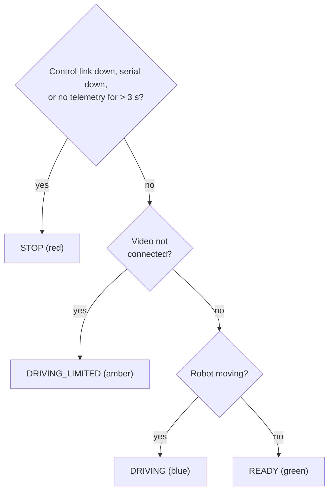

The two transports recover differently. Control reconnects automatically with exponential backoff (1 s doubling to 30 s) and resumes from the ring buffer, because the robot cannot be driven safely without it. Video, once lost, is restored only when the operator presses Retry, so its loss is shown as a decision rather than hidden by silent retries.

## 3.7 Two-Way Victim Interaction

### 3.7.1 WebRTC Media Architecture

The operator's WebRTC connection carries four media tracks and one data channel (Table 11). P2 forwards the operator's tracks and text to a second WebRTC connection on localhost that feeds the Robot Screen (Figure 13).

**Figure 13.** Two WebRTC connections joined by P2.

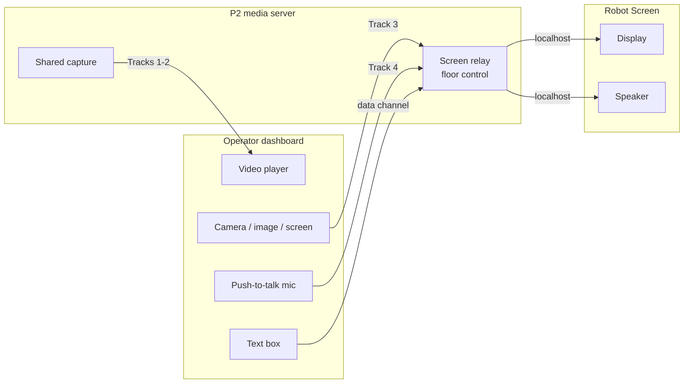

**Table 11.** Media tracks.

| Track | Direction | Content | Format |
|---|---|---|---|
| 1 | Robot to operator | Camera | VP8 or H.264, 640x480, 10 fps |
| 2 | Robot to operator | Microphone | Mono Opus, 32 kbit/s |
| 3 | Operator to robot | Laptop camera, image or shared screen | Browser-negotiated |
| 4 | Operator to robot | Push-to-talk voice | Opus |
| Data | Both | Text messages and control | JSON, reliable, ordered |

Each peer sends its offer and receives P2's answer in a single HTTP request. Because the operator and the robot share one subnet, no STUN or TURN server is needed. The Robot Screen's endpoint accepts requests only from localhost, and the operator's endpoint checks the controller key. A camera or microphone can be opened by only one program, so P2 opens each device once and distributes it to every connected dashboard, giving each session its own copy of every video frame so that parallel encoders never share memory.

### 3.7.2 Robot Screen, Floor Control and Push-to-Talk

Only one session may address the victim at a time: the controller that first sends media or text holds the floor until it releases it or disconnects (Figure 14). Releasing the floor returns the screen to the idle reassurance message. Voice is sent only while the Talk button is held, so the robot's speaker does not feed back into its own microphone. Text messages are limited to 280 characters, and the Robot Screen confirms to the operator when a message is displayed.

**Figure 14.** Floor control for the Robot Screen.

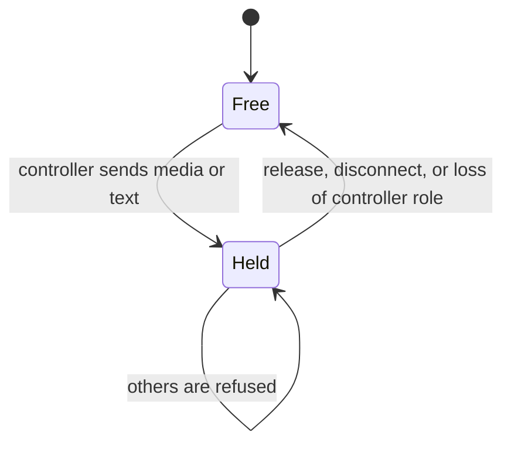

### 3.7.3 Low-Latency Audio on a Constrained CPU

P2 encodes audio as mono Opus in 60 ms packets instead of the default 20 ms, which cuts the per-packet processing load on the Pi by a factor of three. On the victim side, the operator's voice is buffered: playback starts only when 120 ms is stored, so words are not chopped, and the buffer is trimmed above 400 ms, so the added delay stays bounded:

$$
d_{\text{added}} \le 400\ \text{ms}, \qquad \text{resume when buffer} \ge 120\ \text{ms}
$$

Capture is also resilient: if the camera fails, P2 sends a synthetic test pattern, and if the microphone fails, it sends silence and retries the device every 2 s. The session therefore stays up and the operator never has to reload the dashboard.

## 3.8 Access Control and Multi-Operator Arbitration

Any dashboard on the network may watch, but only the one holding the single controller role may act (Table 12). The role requires a controller key.

**Table 12.** Permission matrix.

| Action | Controller | Observer |
|---|---|---|
| Receive telemetry, video, audio, map | Yes | Yes |
| Drive, pan/tilt, emergency stop | Yes | No |
| Talk, show video, image or text | Yes (with floor) | No |

A dashboard that presents the correct key always takes the controller role. The previous controller is demoted to observer and notified, and the robot is stopped so that the new operator starts from standstill. This allows an operator to take over from a frozen or abandoned laptop.

Keys are compared in constant time. Five wrong keys from one host within 5 minutes lock that host out for $T_L$ = 5 minutes, even if it then sends the correct key. For a three-digit key ($K$ = 1000 possibilities, $f$ = 5 attempts per lockout), guessing all keys from one host takes:

$$
T_{\text{exhaust}} = \frac{K}{f}\, T_{L} = \frac{1000}{5} \times 300\ \text{s} \approx 16.7\ \text{h}
$$

P2 cannot see P1's state directly, so it asks P1 on localhost every second which host holds the controller role. A media session may talk to the victim only if it presented the key and comes from that host; when the controller changes, the previous holder loses the floor.

## 3.9 GPS Localisation and Offline Mapping

A dedicated thread reads the NEO-6M receiver and accepts position (RMC) and fix-quality (GGA) NMEA sentences only after their checksum is verified. Distances between fixes are computed with the equirectangular approximation of the haversine formula, which is accurate over the few-metre steps of a robot track and cheaper to compute:

$$
d = R\sqrt{\Delta\varphi^2 + \left(\Delta\lambda \cos\bar\varphi\right)^2}
$$

where $R$ = 6,371,000 m, $\Delta\varphi$ and $\Delta\lambda$ are the latitude and longitude differences in radians, and $\bar\varphi$ is the mean latitude.

A stationary GPS receiver wanders by several metres, which would draw a false path. A new track point is therefore stored only when the robot is at least 10 m from the last stored point:

$$
p_k \text{ stored} \iff \text{fix} \wedge \left(\text{track empty} \vee d(p_{\text{last}}, p_k) \ge 10\ \text{m}\right)
$$

The map of the operating area is stored on the Pi as a single PMTiles file. The browser requests only the byte ranges of the tiles it draws (HTTP range requests), so the map works without internet inside the stored area.

## 3.10 Network Configuration

One ordinary WPA2/WPA3 Wi-Fi router forms the network. The Pi and the operator's laptop join it, the Pi's address is fixed by a DHCP reservation, and the operator opens the dashboard in a browser. Control, telemetry, media and the map all stay on the local network, so no function depends on the internet. Coverage is bounded by the range of one router (Section 6.3).

Table 13 gives the estimated bandwidth per viewing dashboard; measured values are reported in Section 5.2. The relay from P2 to the Robot Screen runs on the Pi's loopback interface and uses no network bandwidth.

**Table 13.** Bandwidth per viewing dashboard (design estimates).

| Stream | Basis | Estimate |
|---|---|---|
| Telemetry | ~400 B JSON x 5/s | ~16 kbit/s |
| Video | 640x480, 10 fps, VP8 | ~0.5-1.5 Mbit/s |
| Robot audio | Mono Opus | 32 kbit/s |
| Operator media (when used) | Voice; video up to 640x480 | Browser-dependent |
| **Total** | | **~1-2 Mbit/s** |
