# 3. Methodology

## 3.1 Design Requirements and Principles

Table 1 lists the requirements and the mechanism that meets each one. The main design rule is that the authority to stop the robot sits at the lowest tier, the microcontroller, so that a failure in any tier above it ends in a stop.

**Table 1.** Design requirements and implementing mechanisms.

| No. | Requirement | Mechanism |
|---|---|---|
| R1 | The robot stops in bounded time when commands cease | Firmware dead-man timer (2000 ms) disables the motor drivers |
| R2 | Operation survives a temporary link loss | Dashboard reconnects with back-off (1 s to 30 s); 60 s telemetry replay |
| R3 | Failed software recovers without manual action | Watchdog process restarts the control and media servers; systemd restarts the watchdog |
| R4 | Exactly one process writes to the microcontroller | Process lock plus exclusive serial open |
| R5 | Exactly one operator controls the robot and talks to the victim | Controller key and a single controller slot |
| R6 | Victim interaction cannot delay a stop | Talk path runs in the media process on a separate transport |
| R7 | Operation without internet | Dashboard, media and offline map are served by the robot |
| R8 | Software is testable without hardware | Emulation mode with a software model of the Arduino and GPS; 111 automated tests |

## 3.2 System Architecture

The system has four tiers: an Arduino UNO for real-time control, a Raspberry Pi 4 running three Python processes (P1 control, P2 media, P3 watchdog), a local Wi-Fi network, and a browser dashboard (Figure 1). Control and media use separate transports that end in separate processes, so a media failure leaves driving and stopping intact.

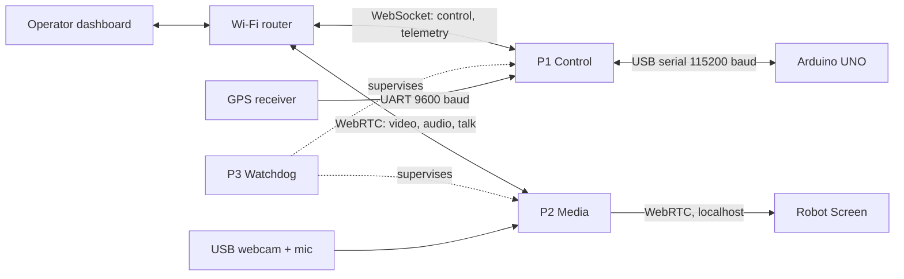

**Figure 1.** System architecture: four tiers and two independent transports.

## 3.3 Hardware Platform

Table 2 lists the components and their connections. The motor supply and the Pi supply are separate (Figure 2), so motor current surges cannot reset the Pi.

**Table 2.** Hardware components and interfaces.

| Component | Part | Connection | Function |
|---|---|---|---|
| Edge computer | Raspberry Pi 4 Model B, 4 GB | - | Runs P1, P2, P3 and the Robot Screen |
| Microcontroller | Arduino UNO (ATmega328P, 16 MHz) | USB serial to Pi, 115200 baud | Real-time control and sensing |
| Motor drivers | 2 x BTS7960 | Left D5/D6, right D9/D10, shared enable D4 | One driver per side |
| Drive motors | 4 x DC gear motor [VERIFY rating] | Left and right pairs | Differential (skid) steering |
| Camera servos | 2 x hobby servo [VERIFY model] | Pan D11, tilt D3 | 0-180 deg, home at 90 deg |
| Range sensor | HC-SR04 | Trigger D7, echo D8 | Forward range, 0-400 cm |
| Temperature and humidity | DHT11 | A2 | degC and % RH |
| Gas sensor | MQ-136 | A3, 10-bit ADC | Raw value 0-1023, uncalibrated |
| GPS receiver | NEO-6M | Pi UART, 9600 baud | Position, fix, satellite count |
| Camera and microphone | USB webcam with built-in microphone | Pi USB | 640x480 video at 10 fps; 48 kHz audio |
| Robot display | 7-inch HDMI display, 1024x600 | Pi HDMI | Victim-facing Robot Screen |
| Speaker | Speaker | Pi 3.5 mm jack | Operator voice to the victim |

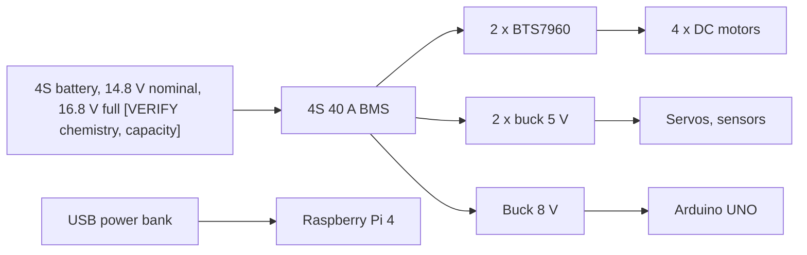

**Figure 2.** Power distribution. The Pi has its own supply.

The control server caps the motor PWM duty at 180 of 255, which limits the average motor voltage:

$$V_{avg} = V_{bat} \cdot \frac{u_{max}}{255} = 16.8 \cdot \frac{180}{255} \approx 11.9\ \text{V}$$

where $V_{bat}$ is the full-charge pack voltage and $u_{max}$ is the PWM cap.

## 3.4 Real-Time Firmware and Fail-Safe Control

The firmware has four operating modes (Figure 3). Motion is accepted only in READY and ACTIVE with no fault set; telemetry reports READY as 1, ACTIVE as 2 and all other modes as 3.

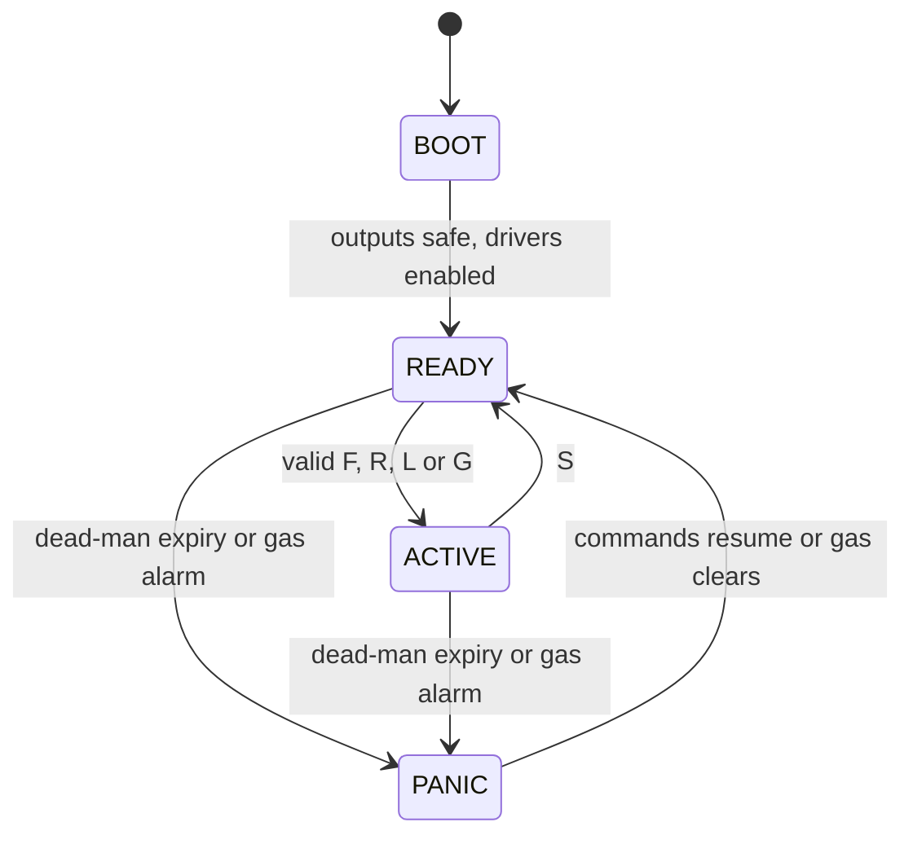

**Figure 3.** Firmware operating modes.

### 3.4.1 Task Scheduling and Command Validation

A cooperative scheduler runs the periodic tasks in Table 3 from the main loop, with timing based on unsigned millisecond differences so that counter rollover does not break it. The command parser is polled on every loop pass and checks each command in four stages before it acts (Figure 4).

**Table 3.** Firmware tasks.

| Task | Period | Work |
|---|---|---|
| Motor service | 10 ms | Ramp PWM toward target by 15 units per tick |
| Safety supervisor | 10 ms | Dead-man and gas checks, fault recovery |
| Fast sensors | 50 ms | HC-SR04 range (25 ms echo timeout) |
| Slow sensors | 2000 ms | DHT11 and MQ-136 |
| Telemetry | 500 ms | One 8-field CSV line |
| Heartbeat | 1000 ms | Mode line and status LED toggle |

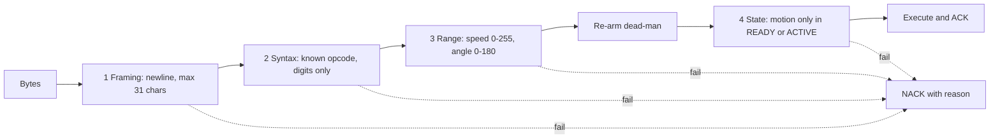

**Figure 4.** Four-stage command validation. The nine opcodes are F, R, L, G (speed), P, T (angle), S, H and ?.

The control server repeats a lighter check before sending: it clamps speed to 0-180 and angles to 0-180, and rejects motion and servo commands whose sequence number is not higher than the last one from that client.

### 3.4.2 Dead-Man Timer and Stop-Time Guarantee

Every command that passes stages 1 to 3 re-arms the dead-man timer, including heartbeats. When the timer expires, the supervisor sets the PWM outputs to zero and pulls the shared enable line low at once, without ramping (Figure 5). The worst-case stop time after the last command is:

$$t_{stop} \le T_{DM} + T_{S} + J$$

where $T_{DM} = 2000$ ms is the dead-man window, $T_{S} = 10$ ms is the supervisor period, and $J$ is the longest single loop pass, set mainly by the 25 ms echo timeout and the 20 ms DHT11 start pulse.

An ordinary stop command ramps the motors down instead:

$$t_{ramp} = \left\lceil \frac{u}{\Delta u} \right\rceil T_{M}$$

where $u$ is the current PWM value, $\Delta u = 15$ is the ramp step and $T_{M} = 10$ ms is the motor service period; this gives 120 ms from the 180 cap and 170 ms from 255.

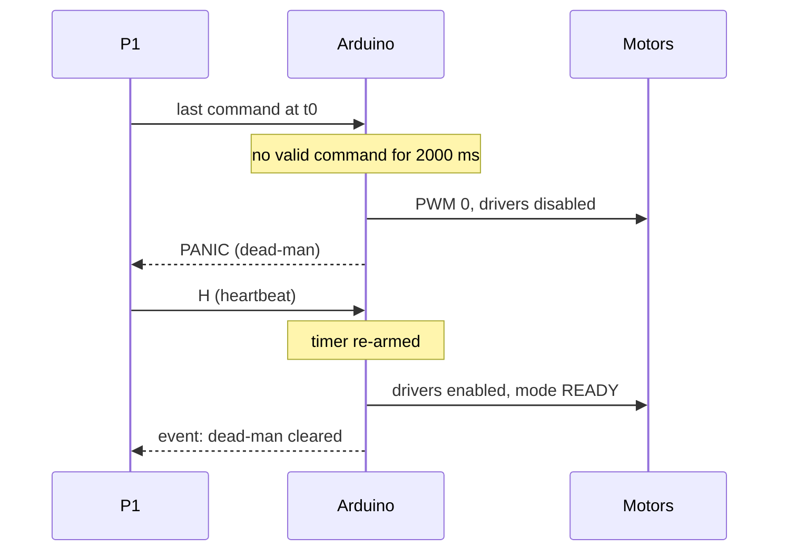

**Figure 5.** Dead-man trip and recovery.

### 3.4.3 Redundant Stop Paths and Gas-Triggered Stop

Table 4 lists every path that stops the motors. The gas stop fires when the raw MQ-136 value reaches 1000; motion stays rejected until a later reading falls below it, and the dashboard warns earlier, at 450 (warning) and 600 (critical).

**Table 4.** Stop paths.

| Trigger | Origin | Action | Bound |
|---|---|---|---|
| Drive key or button released | Dashboard via P1 | S, ramped stop | One network trip |
| Emergency stop button | Dashboard via P1 | S, sent without the sequence check | One network trip |
| Controller connection closes | P1 | S | On socket close |
| Another dashboard takes control | P1 | S | On takeover |
| P1 start-up | P1 | 3 x S, 200 ms apart | Before any other command |
| P1 shutdown | P1 | S | Before the port closes |
| Command flow stops | Firmware | PWM 0, drivers disabled | $t_{stop}$ above |
| Gas value >= 1000 | Firmware | PWM 0, drivers disabled, motion rejected | Gas sampled every 2000 ms |

## 3.5 Edge Control Server and Telemetry

P1 owns the serial link, the GPS receiver and the control WebSocket.

### 3.5.1 Safe Startup and Single-Writer Serial Link

P1 takes an exclusive, non-blocking lock on a file in a memory-backed directory before it opens any hardware; the kernel releases the lock when the process exits for any reason. The serial port is then opened in exclusive mode, and one asynchronous lock serialises all writes. Figure 6 shows the start-up handshake.

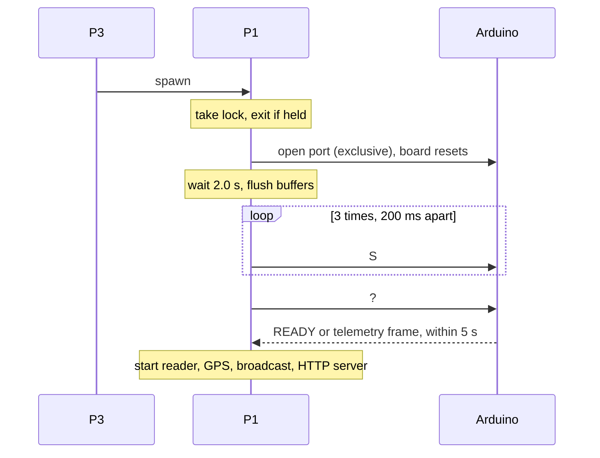

**Figure 6.** P1 start-up handshake. A timeout ends P1 with a handshake-failure exit code.

### 3.5.2 Telemetry Pipeline and Session Resume

The firmware sends a frame every 500 ms; P1 broadcasts a snapshot of the latest valid frame every 200 ms on an absolute schedule, merged with GPS and link status (Figure 7). A frame is dropped if any field fails the checks in Table 5; there is no retransmission.

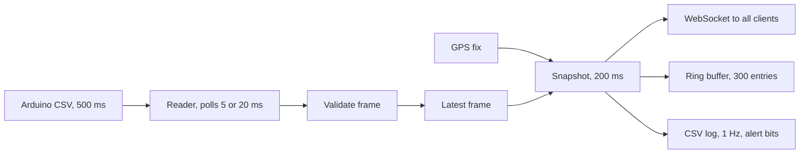

**Figure 7.** Telemetry pipeline.

**Table 5.** Telemetry frame fields and accepted ranges (frame at most 80 characters).

| Field | Unit | Accepted range |
|---|---|---|
| Temperature | degC | -40 to 125 |
| Humidity | % | 0 to 100 |
| Gas | raw ADC | 0 to 10000 |
| Range | cm | 0 to 500 |
| Pan angle | deg | 0 to 180 |
| Tilt angle | deg | 0 to 180 |
| Firmware state | - | 1 to 3 |
| Uptime | ms | 0 to 2^32 - 1 |

On reconnect, the dashboard sends the server timestamp of the last snapshot it received; P1 replies with every newer snapshot in the buffer and the size of any gap. The buffer depth and the gap are:

$$D = N \cdot T_{b} = 300 \times 200\ \text{ms} = 60\ \text{s}, \qquad g = \max(0,\ t_{oldest} - t_{last})$$

where $N$ is the buffer size, $T_{b}$ the broadcast period, $t_{oldest}$ the oldest buffered timestamp and $t_{last}$ the client's last timestamp. The buffer is held in memory, so it does not survive a P1 restart.

## 3.6 Fault Tolerance and Supervision

Each process is a separate failure domain, and recovery does not need the operator.

### 3.6.1 Process Isolation and Watchdog Supervision

P3 is the only systemd service (restart on failure after 5 s); it spawns P1 and P2 as separate processes with no shared memory and supervises each one with the state machine in Figure 8. The only link between P1 and P2 is a once-per-second localhost query from P2 for the controller's address.

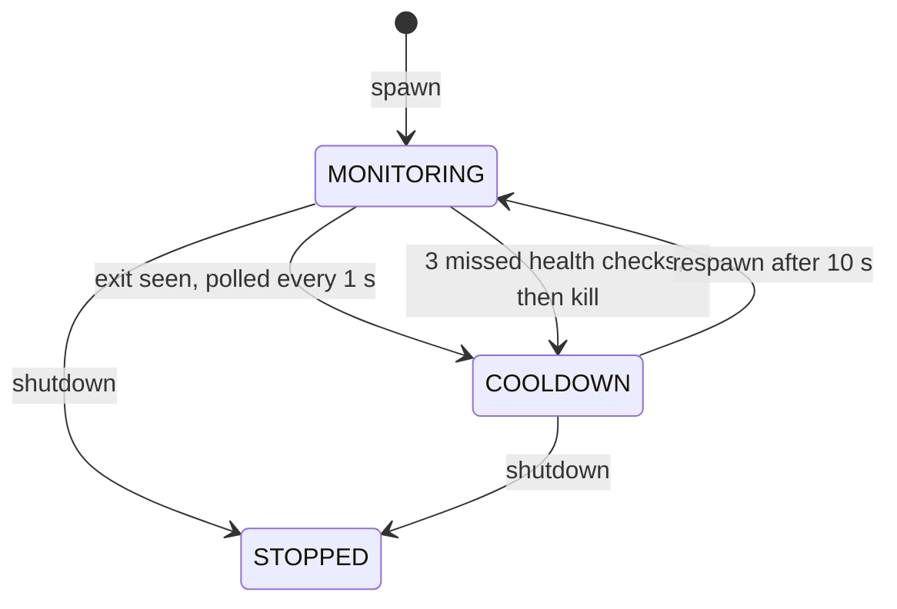

**Figure 8.** Per-process supervision. Health checks run every 10 s with a 5 s timeout.

### 3.6.2 Recovery Time Model and Graceful Degradation

The time from a failure to a working process is:

$$T_{rec} = T_{det} + T_{p} + T_{c} + T_{init}$$

where $T_{det}$ is the detection time (at most 1 s for a crash, at most $3 \times 10 + 5 = 35$ s for a hang), $T_{p} = 1$ s is the poll before cooldown, $T_{c} = 10$ s is the cooldown, and $T_{init}$ is start-up time, which for P1 is 2.0 s + 3 x 0.2 s plus up to 5 s for the handshake. A P1 crash therefore recovers in 13.6 s to 19.6 s plus interpreter start-up; the dashboard adds up to one reconnect back-off step. Table 6 shows how each failure degrades the mission.

**Table 6.** Failure effects and recovery.

| Failure | Detected by | Effect | Recovery |
|---|---|---|---|
| Operator link lost | Dead-man; socket close | Robot stops; mission STOP | Reconnect with back-off, telemetry replay |
| P1 crash or hang | P3 | No control or telemetry; dead-man stops robot | Respawn; buffered history lost |
| P2 crash | P3 | Video and talk lost; control unaffected; mission DRIVING LIMITED | Respawn; operator retries video |
| Arduino link error | Serial read or write error | Serial flag false; mission STOP | Reads retried every 0.5 s; port reopened when P1 restarts |
| Camera fails to open | Media server | Synthetic test pattern sent | Next session |
| Microphone lost | Media server | Silence sent | Reopen tried every 2 s |
| GPS port error | P1 | No fix; GPS-lost alert bit set | Port reopened after 2 s |
| Robot Screen browser exits | Kiosk launcher | Victim screen blank | Relaunch after 3 s |
| P3 crash | systemd | P1 and P2 stop with it; dead-man stops robot | Restart after 5 s, then P1 and P2 respawn |

### 3.6.3 Mission State for Operator Awareness

The dashboard reduces link and firmware status to one of four mission states, evaluated in the priority order of Table 7.

**Table 7.** Mission state rules (first match wins).

| Priority | State | Condition |
|---|---|---|
| 1 | STOP | Control socket down, or serial link down, or no telemetry for more than 3000 ms |
| 2 | DRIVING LIMITED | Video link down |
| 3 | DRIVING | Firmware reports driving |
| 4 | READY | Otherwise |

## 3.7 Two-Way Victim Interaction

The robot carries a display and speaker facing the victim, driven by a kiosk browser (the Robot Screen) on the Pi.

### 3.7.1 WebRTC Media Architecture

Each dashboard opens one peer connection to P2 with two-way audio and video and one data channel; the offer and answer are exchanged in a single HTTP request. P2 decodes the operator's media and re-encodes it for the Robot Screen, which connects to P2 only from localhost (Figure 9).

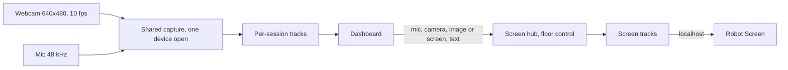

**Figure 9.** Media paths. Video is encoded per session as VP8 or H.264, as negotiated with the browser; each session gets its own copy of every camera frame.

### 3.7.2 Robot Screen, Floor Control and Push-to-Talk

Only one session may use the Robot Screen at a time (Figure 10), and only if it is the current controller. Push-to-talk switches an already attached microphone track on and off, so talking starts without renegotiation; text messages are limited to 280 characters, and the screen confirms each one back to the operator.

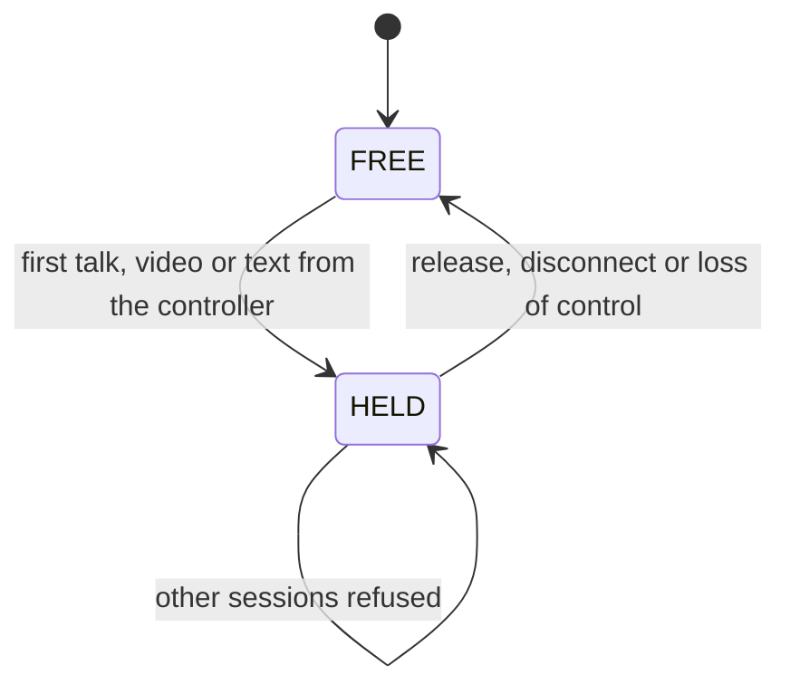

**Figure 10.** Robot Screen floor control. A release clears the screen text and media.

### 3.7.3 Low-Latency Audio on a Constrained CPU

P2 encodes its own 60 ms Opus packets in both directions, which cuts the per-packet work on the event loop to a third, and captures the microphone through a shared ALSA device with a fixed 20 ms period (Table 8). The packet rate and the capture read rate are:

$$R_{pkt} = \frac{1000}{T_{pkt}}, \qquad R_{read} = \frac{f_{s}}{N_{period}}$$

where $T_{pkt}$ is the packet length in ms (20 ms gives 50 packets/s, 60 ms gives 16.7 packets/s), $f_{s} = 48000$ Hz is the sample rate and $N_{period}$ is the capture period in frames (960 frames gives 50 reads/s, against about 511 reads/s for the device's smallest period of 94 frames).

**Table 8.** Audio parameters.

| Parameter | Robot to operator | Operator to robot |
|---|---|---|
| Format | 48 kHz, mono, 16-bit | 48 kHz, mono, 16-bit |
| Codec | Opus, voice mode, 32 kbps | Opus, voice mode, 32 kbps |
| Packet length | 60 ms | 60 ms |
| Capture period and buffer | 960 frames (20 ms), 7680 frames (160 ms) | - |
| Buffering | One queue per session | Inbound queue of 10 frames (about 200 ms); 120 ms start cushion; 400 ms cap |
| Lateness | Paced by the device | Clock reset when more than 100 ms late, no catch-up burst |
| Source loss | Silence, reopen every 2 s | Silence until the cushion refills |

## 3.8 Access Control and Multi-Operator Arbitration

A dashboard becomes controller only by presenting the robot's controller key; all others are observers, whose commands, including stop, are rejected. The most recent dashboard with the right key takes the controller slot; the previous holder is demoted and the robot is stopped (Figure 11). P1 and P2 check the key in the same way (Table 9), and P2 grants talk only to a keyed session from the host P1 reports as controller.

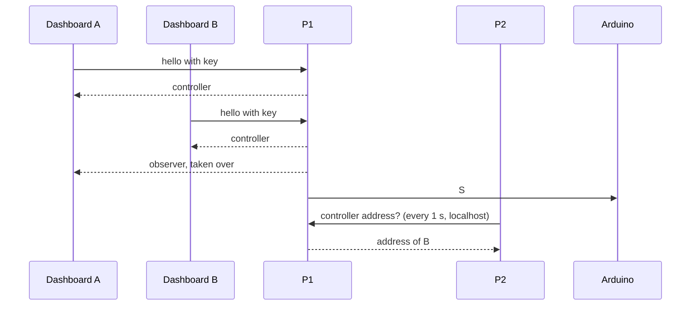

**Figure 11.** Controller takeover.

**Table 9.** Key check results.

| Result | Condition | Role |
|---|---|---|
| OK | Key matches (constant-time comparison) | Controller |
| No key | No key presented; not counted as a failure | Observer |
| Bad key | Wrong key; failure counted for that host | Observer |
| Locked | 5 failures within 300 s; host refused for 300 s, even with the right key | Observer |
| Disabled | No key configured on the robot | Observer for everyone |

Failure counters are kept in memory per process. The dashboard discards a refused key so that reconnects do not add to the count. The key travels over plain HTTP and WebSocket.

## 3.9 GPS Localisation and Offline Mapping

P1 reads NMEA sentences from the receiver on a separate thread and adds a track point only after the robot moves at least 10 m, so drift around a stopped robot adds no points (Figure 12). Distance uses the equirectangular approximation:

$$d = R \sqrt{(\Delta\varphi)^2 + (\Delta\lambda \cos\bar{\varphi})^2}$$

where $R = 6371000$ m, $\Delta\varphi$ and $\Delta\lambda$ are the latitude and longitude differences in radians, and $\bar{\varphi}$ is their mean latitude.

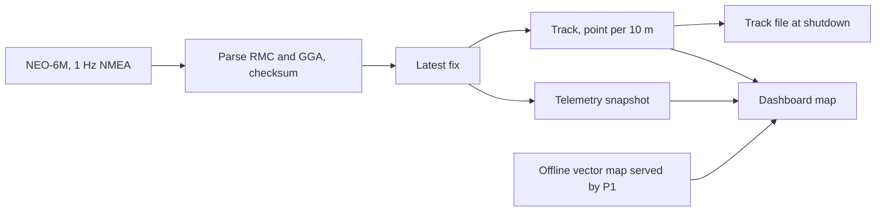

**Figure 12.** GPS and map data flow. Online map tiles, when reachable, show outside the offline map area.

## 3.10 Network Configuration

The Pi and the operator laptop join one Wi-Fi router, which reserves a fixed address for the Pi; the operator opens the dashboard from that address. Table 10 lists the services on the Pi.

**Table 10.** Network services on the Pi.

| Port | Process | Protocol | Carries |
|---|---|---|---|
| TCP 8080 | P1 | HTTP and WebSocket | Dashboard files, control and telemetry, session settings, GPS track, offline map tiles, health |
| TCP 8443 | P2 | HTTP (no TLS) | WebRTC offer and answer, Robot Screen page, health |
| UDP, negotiated by ICE | P2 | WebRTC | Audio, video and data channel |
| Localhost only | P1, P2 | HTTP | Controller address query; Robot Screen connection |

The control WebSocket uses keep-alive pings every 20 s with a 20 s timeout. Browsers allow microphone and camera capture only in a secure context, so the operator's browser must treat the Pi's address as secure for push-to-talk and camera; images and text work without it.
