# 3. Methodology

This section describes the design from the requirements down to the individual mechanisms. The whole design follows one rule: the robot must stop whenever any part of the system above the motors fails, and nothing added for the operator or the victim may weaken that guarantee. Sections 3.1 to 3.4 set out the requirements, the architecture, the network and the hardware. Sections 3.5 to 3.7 then follow the stop guarantee upward through the tiers: the firmware enforces it (3.5), the control server feeds it safely (3.6), and supervision restores service after a failure without bypassing it (3.7). Section 3.8 decides which operator holds control, and Section 3.9 builds victim interaction on that decision while keeping it apart from the stop path. Section 3.10 adds localisation for the operator.

## 3.1 Design Requirements and Principles

Table 1 lists the requirements, the mechanism that meets each one and the section that describes it. The main design rule is that the authority to stop the robot sits at the lowest tier, the microcontroller, so that a failure in any tier above it ends in a stop.

**Table 1.** Design requirements and implementing mechanisms.

| No. | Requirement | Mechanism | Section |
|---|---|---|---|
| R1 | The robot stops in bounded time when commands cease | Firmware dead-man timer (2000 ms) disables the motor drivers | 3.5.2, 3.5.3 |
| R2 | Operation survives a temporary link loss | Dashboard reconnects with back-off (1 s to 30 s); 60 s telemetry replay | 3.6.2, 3.7.2 |
| R3 | Failed software recovers without manual action | Watchdog process restarts the control and media servers; systemd restarts the watchdog | 3.7.1, 3.7.2 |
| R4 | Exactly one process writes to the microcontroller | Process lock plus exclusive serial open | 3.6.1 |
| R5 | Exactly one operator controls the robot and talks to the victim | Controller key and a single controller slot | 3.8, 3.9.5 |
| R6 | Victim interaction cannot delay a stop | Talk path runs in the media process on a separate transport | 3.2, 3.9 |
| R7 | Operation without internet | Dashboard, media and offline map are served by the robot | 3.3, 3.10 |
| R8 | Software is testable without hardware | Emulation mode with a software model of the Arduino and GPS; 111 automated tests | 4.1 |

## 3.2 System Architecture

The architecture applies the design rule by separating the system into tiers that can fail on their own. The system has four tiers: an Arduino UNO for real-time control, a Raspberry Pi 4 running three Python processes (P1 control, P2 media, P3 watchdog), a local Wi-Fi network, and a browser dashboard (Figure 1). Control and media use separate transports that end in separate processes, so a media failure leaves driving and stopping intact.

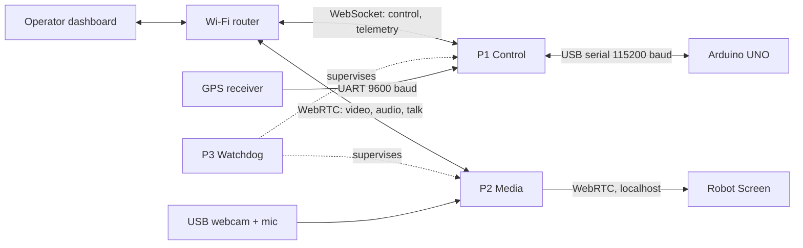
```mermaid
flowchart LR
  D["Operator dashboard"] <--> W["Wi-Fi router"]
  W <-- "WebSocket: control, telemetry" --> P1["P1 Control"]
  W <-- "WebRTC: video, audio, talk" --> P2["P2 Media"]
  P3["P3 Watchdog"] -. supervises .-> P1
  P3 -. supervises .-> P2
  G["GPS receiver"] -- "UART 9600 baud" --> P1
  C["USB webcam + mic"] --> P2
  P2 -- "WebRTC, localhost" --> K["Robot Screen"]
  P1 <-- "USB serial 115200 baud" --> A["Arduino UNO"]
```

**Figure 1.** Overall system architecture.

Figure 2 follows one drive command through every tier and the telemetry that returns. A held key sends one motion command; while it is held, heartbeats keep the dead-man armed, and releasing the key sends a stop.

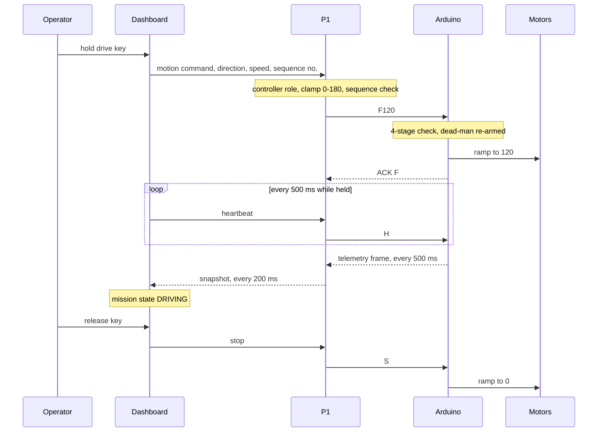
```mermaid
sequenceDiagram
  participant O as Operator
  participant D as Dashboard
  participant P as P1
  participant A as Arduino
  participant M as Motors
  O->>D: hold drive key
  D->>P: motion command, direction, speed, sequence no.
  Note over P: controller role, clamp 0-180, sequence check
  P->>A: F120
  Note over A: 4-stage check, dead-man re-armed
  A->>M: ramp to 120
  A-->>P: ACK F
  loop every 500 ms while held
    D->>P: heartbeat
    P->>A: H
  end
  A-->>P: telemetry frame, every 500 ms
  P-->>D: snapshot, every 200 ms
  Note over D: mission state DRIVING
  O->>D: release key
  D->>P: stop
  P->>A: S
  A->>M: ramp to 0
```

**Figure 2.** End-to-end control loop: command down, telemetry up.

On the Pi, systemd starts only the watchdog, which spawns the control and media servers as child processes (Figure 3). P1 holds every interface that can move the robot; P2 holds every media device; the Robot Screen kiosk runs in the desktop session.

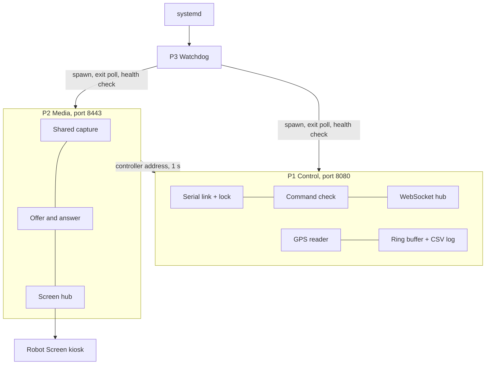
```mermaid
flowchart TB
  SD["systemd"] --> P3["P3 Watchdog"]
  P3 -- "spawn, exit poll, health check" --> P1
  P3 -- "spawn, exit poll, health check" --> P2
  subgraph P1["P1 Control, port 8080"]
    SB["Serial link + lock"] --- CV["Command check"] --- HUB["WebSocket hub"]
    GPS["GPS reader"] --- RB["Ring buffer + CSV log"]
  end
  subgraph P2["P2 Media, port 8443"]
    CAP["Shared capture"] --- SIG["Offer and answer"] --- SH["Screen hub"]
  end
  P2 -. "controller address, 1 s" .-> P1
  SH --> KI["Robot Screen kiosk"]
```

**Figure 3.** Raspberry Pi software architecture and process supervision.

## 3.3 Network Configuration

The two transports in Figure 1 run over one local network, which also makes the robot independent of the internet (R7). The Pi and the operator laptop join one Wi-Fi router, which reserves a fixed address for the Pi; the operator opens the dashboard from that address. Table 2 lists the services on the Pi.

**Table 2.** Network services on the Pi.

| Port | Process | Protocol | Carries |
|---|---|---|---|
| TCP 8080 | P1 | HTTP and WebSocket | Dashboard files, control and telemetry, session settings, GPS track, offline map tiles, health |
| TCP 8443 | P2 | HTTP (no TLS) | WebRTC offer and answer, Robot Screen page, health |
| UDP, negotiated by ICE | P2 | WebRTC | Audio, video and data channel |
| Localhost only | P1, P2 | HTTP | Controller address query; Robot Screen connection |

The control WebSocket uses keep-alive pings every 20 s with a 20 s timeout. Browsers allow microphone and camera capture only in a secure context, so the operator's browser must treat the Pi's address as secure for push-to-talk and camera; images and text work without it.

## 3.4 Hardware Platform

The hardware is chosen so that the lowest tier can stop the robot by itself: the Arduino drives the motor drivers directly and can disable them with one output. Table 3 lists the components, and Figure 4 shows how they connect and how power is distributed. The motor supply and the Pi supply are separate, so motor current surges cannot reset the Pi.

**Table 3.** Hardware components.

| Component | Part | Function |
|---|---|---|
| Edge computer | Raspberry Pi 4 Model B, 4 GB | Runs P1, P2, P3 and the Robot Screen |
| Microcontroller | Arduino UNO (ATmega328P, 16 MHz) | Real-time control and sensing |
| Motor drivers | 2 x BTS7960 | One driver per side |
| Drive motors | 4 x DC gear motor [VERIFY rating] | Differential (skid) steering, left and right pairs |
| Camera servos | 2 x hobby servo [VERIFY model] | Pan and tilt, 0-180 deg, home at 90 deg |
| Range sensor | HC-SR04 | Forward range, 0-400 cm |
| Temperature and humidity | DHT11 | degC and % RH |
| Gas sensor | MQ-136 | Raw 10-bit value 0-1023, uncalibrated |
| GPS receiver | NEO-6M | Position, fix, satellite count |
| Camera and microphone | USB webcam with built-in microphone | 640x480 video at 10 fps; 48 kHz audio |
| Robot display | 7-inch HDMI display, 1024x600 | Victim-facing Robot Screen |
| Speaker | Speaker | Operator voice to the victim |
| Battery | 4S pack, 14.8 V nominal, 16.8 V full [VERIFY chemistry, capacity] | Motor and logic power |
| Battery management | 4S 40 A BMS | Pack protection |
| Pi supply | USB power bank | Separate supply for the Pi |

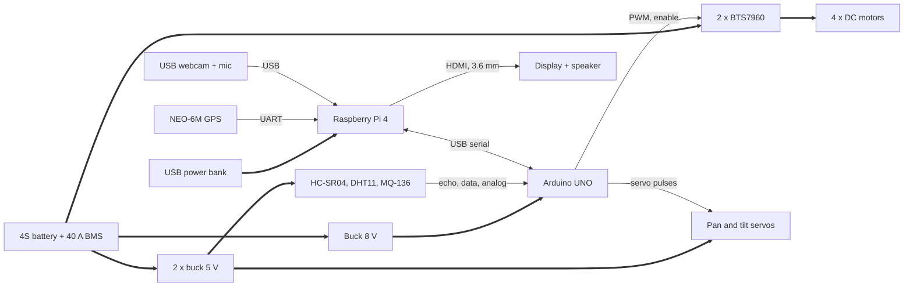
```mermaid
flowchart LR
  BAT["4S battery + 40 A BMS"] ==> DRV["2 x BTS7960"] ==> MOT["4 x DC motors"]
  BAT ==> B5["2 x buck 5 V"] ==> SV["Pan and tilt servos"]
  B5 ==> SEN["HC-SR04, DHT11, MQ-136"]
  BAT ==> B8["Buck 8 V"] ==> UNO["Arduino UNO"]
  PB["USB power bank"] ==> PI["Raspberry Pi 4"]
  UNO -- "PWM, enable" --> DRV
  UNO -- "servo pulses" --> SV
  SEN -- "echo, data, analog" --> UNO
  PI <-- "USB serial" --> UNO
  GPS["NEO-6M GPS"] -- "UART" --> PI
  CAM["USB webcam + mic"] -- "USB" --> PI
  PI -- "HDMI, 3.6 mm" --> SCR["Display + speaker"]
```

**Figure 4.** Hardware interconnection and power distribution. Thick lines carry power; thin lines carry signals.

Figure 5 is the full wiring diagram of the robot.

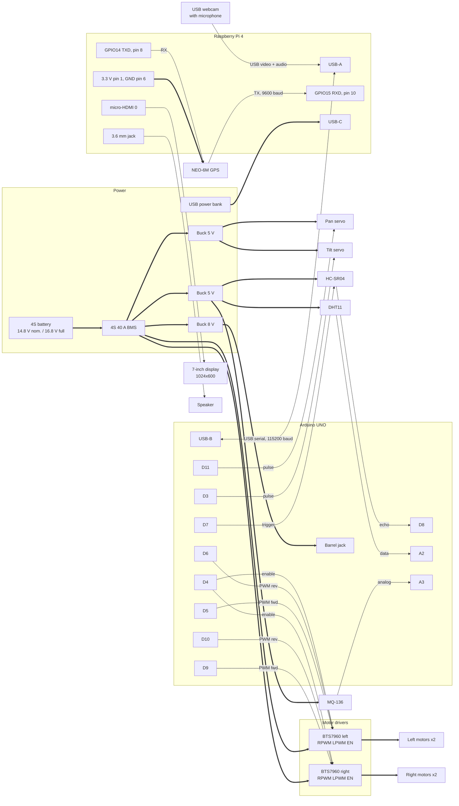
```mermaid
flowchart LR
  subgraph PWR["Power"]
    BAT["4S battery<br/>14.8 V nom. / 16.8 V full"]
    BMS["4S 40 A BMS"]
    BK1["Buck 5 V"]
    BK2["Buck 5 V"]
    BK3["Buck 8 V"]
    PB["USB power bank"]
  end
  subgraph UNO["Arduino UNO"]
    D3["D3"]
    D4["D4"]
    D5["D5"]
    D6["D6"]
    D7["D7"]
    D8["D8"]
    D9["D9"]
    D10["D10"]
    D11["D11"]
    A2["A2"]
    A3["A3"]
    JACK["Barrel jack"]
    UUSB["USB-B"]
  end
  subgraph DRV["Motor drivers"]
    BL["BTS7960 left<br/>RPWM LPWM EN"]
    BR["BTS7960 right<br/>RPWM LPWM EN"]
  end
  ML["Left motors x2"]
  MR["Right motors x2"]
  SP["Pan servo"]
  ST["Tilt servo"]
  US["HC-SR04"]
  DHT["DHT11"]
  MQ["MQ-136"]
  subgraph PI["Raspberry Pi 4"]
    PUSB["USB-A"]
    G14["GPIO14 TXD, pin 8"]
    G15["GPIO15 RXD, pin 10"]
    P33["3.3 V pin 1, GND pin 6"]
    HDMI["micro-HDMI 0"]
    AJ["3.6 mm jack"]
    PIN["USB-C"]
  end
  GPS["NEO-6M GPS"]
  CAM["USB webcam<br/>with microphone"]
  LCD["7-inch display<br/>1024x600"]
  SPK["Speaker"]

  BAT ==> BMS
  BMS ==> BL
  BMS ==> BR
  BMS ==> BK1
  BMS ==> BK2
  BMS ==> BK3
  BK1 ==> SP
  BK1 ==> ST
  BK2 ==> US
  BK2 ==> DHT
  BK2 ==> MQ
  BK3 ==> JACK
  PB ==> PIN
  P33 ==> GPS

  D5 -- "PWM fwd" --> BL
  D6 -- "PWM rev" --> BL
  D9 -- "PWM fwd" --> BR
  D10 -- "PWM rev" --> BR
  D4 -- "enable" --> BL
  D4 -- "enable" --> BR
  BL ==> ML
  BR ==> MR
  D11 -- "pulse" --> SP
  D3 -- "pulse" --> ST
  D7 -- "trigger" --> US
  US -- "echo" --> D8
  DHT -- "data" --> A2
  MQ -- "analog" --> A3

  UUSB <-- "USB serial, 115200 baud" --> PUSB
  CAM -- "USB video + audio" --> PUSB
  GPS -- "TX, 9600 baud" --> G15
  G14 -- "RX" --> GPS
  HDMI --> LCD
  AJ --> SPK
```

**Figure 5.** Detailed hardware wiring diagram. Thick lines carry power; thin lines carry signals. All grounds are common; the Pi shares ground with the Arduino through the USB cable.

The Arduino pins used by the firmware are shown in Figure 6 and detailed in Table 4. Each BTS7960 drives forward on one PWM input and reverse on the other, with only one active at a time; both drivers share one enable line, so one output disables all propulsion.

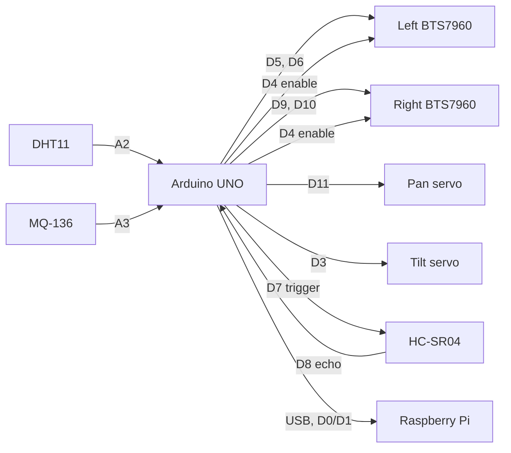
```mermaid
flowchart LR
  UNO["Arduino UNO"]
  UNO -- "D5, D6" --> LD["Left BTS7960"]
  UNO -- "D9, D10" --> RD["Right BTS7960"]
  UNO -- "D4 enable" --> LD
  UNO -- "D4 enable" --> RD
  UNO -- "D11" --> PAN["Pan servo"]
  UNO -- "D3" --> TILT["Tilt servo"]
  UNO -- "D7 trigger" --> US["HC-SR04"]
  US -- "D8 echo" --> UNO
  DHT["DHT11"] -- "A2" --> UNO
  MQ["MQ-136"] -- "A3" --> UNO
  UNO -- "USB, D0/D1" --> PI["Raspberry Pi"]
```

**Figure 6.** Arduino UNO pin diagram.

**Table 4.** Arduino UNO pin map.

| Pin | Mode | Signal | Notes |
|---|---|---|---|
| D0, D1 | UART over USB | Serial link to the Pi | 115200 baud, newline-terminated ASCII |
| D3 | Output | Tilt servo pulse | Servo library on Timer2, 0-180 deg |
| D4 | Digital output | Enable for both BTS7960 drivers | Low at boot and on emergency stop |
| D5 | PWM output | Left driver, forward | 0-255 |
| D6 | PWM output | Left driver, reverse | 0-255 |
| D7 | Digital output | HC-SR04 trigger | 10 us pulse every 50 ms |
| D8 | Digital input | HC-SR04 echo | 25 ms timeout; distance = pulse width / 58 |
| D9 | PWM output | Right driver, forward | 0-255; Timer1 left free for these pins |
| D10 | PWM output | Right driver, reverse | 0-255 |
| D11 | Output | Pan servo pulse | Servo library on Timer2, 0-180 deg |
| D13 | Digital output | On-board status LED | Toggles every 1000 ms |
| A2 | Digital I/O, pull-up | DHT11 single-wire data | Read every 2000 ms, checksum verified |
| A3 | Analog input | MQ-136 output | 10-bit ADC; gas stop at >= 1000 |
| Barrel jack | Power input | 8 V from buck converter | - |

The Pi connections are listed in Table 5. The GPS uses the Pi's primary UART with the serial login console disabled.

**Table 5.** Raspberry Pi 4 connections.

| Pi interface | Connected to | Use |
|---|---|---|
| USB-A | Arduino UNO | USB serial, 115200 baud |
| USB-A | USB webcam with microphone | Video capture and audio capture |
| Header pin 1 (3.3 V) | GPS VCC | GPS supply |
| Header pin 6 (GND) | GPS GND | Ground |
| Header pin 8 (GPIO 14, TXD) | GPS RX | UART, 9600 baud |
| Header pin 10 (GPIO 15, RXD) | GPS TX | UART, 9600 baud |
| Micro-HDMI 0 | Robot display | Robot Screen |
| 3.6 mm jack | Speaker | Default audio output |
| USB-C | USB power bank | Pi supply |
| On-board Wi-Fi | Wi-Fi router | Dashboard, control and media traffic |

The control server caps the motor PWM duty at 180 of 255, which limits the average motor voltage:

$$V_{avg} = V_{bat} \cdot \frac{u_{max}}{255} = 16.8 \cdot \frac{180}{255} \approx 11.9\ \text{V}$$

where $V_{bat}$ is the full-charge pack voltage and $u_{max}$ is the PWM cap. P1 enforces the cap before a command is sent (Section 3.5.1), so the firmware never receives a higher speed from the dashboard.

## 3.5 Real-Time Firmware and Fail-Safe Control

The firmware holds the stop authority defined in Section 3.1, so it must stop the motors without help from the Pi or the network. The firmware has four operating modes (Figure 7). Motion is accepted only in READY and ACTIVE with no fault set; telemetry reports READY as 1, ACTIVE as 2 and all other modes as 3.

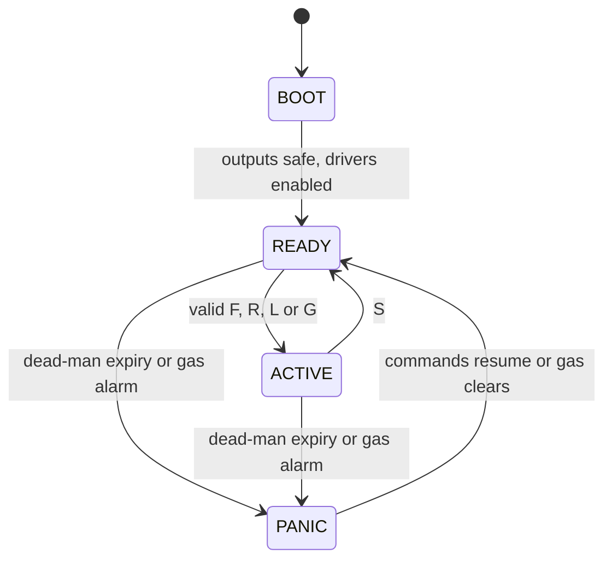
```mermaid
stateDiagram-v2
  [*] --> BOOT
  BOOT --> READY: outputs safe, drivers enabled
  READY --> ACTIVE: valid F, R, L or G
  ACTIVE --> READY: S
  READY --> PANIC: dead-man expiry or gas alarm
  ACTIVE --> PANIC: dead-man expiry or gas alarm
  PANIC --> READY: commands resume or gas clears
```

**Figure 7.** Firmware operating modes.

### 3.5.1 Task Scheduling and Command Validation

A cooperative scheduler runs the periodic tasks in Table 6 from the main loop, with timing based on unsigned millisecond differences so that counter rollover does not break it. The command parser is polled on every loop pass and checks each command in four stages before it acts (Figure 8).

**Table 6.** Firmware tasks.

| Task | Period | Work |
|---|---|---|
| Motor service | 10 ms | Ramp PWM toward target by 15 units per tick |
| Safety supervisor | 10 ms | Dead-man and gas checks, fault recovery |
| Fast sensors | 50 ms | HC-SR04 range (25 ms echo timeout) |
| Slow sensors | 2000 ms | DHT11 and MQ-136 |
| Telemetry | 500 ms | One 8-field CSV line |
| Heartbeat | 1000 ms | Mode line and status LED toggle |

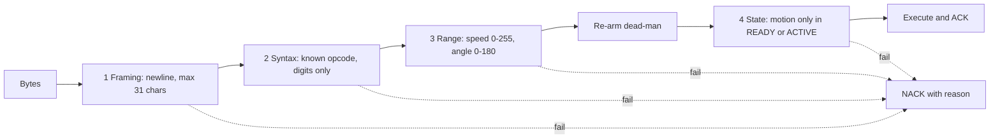
```mermaid
flowchart LR
  RX["Bytes"] --> S1["1 Framing: newline, max 31 chars"]
  S1 --> S2["2 Syntax: known opcode, digits only"]
  S2 --> S3["3 Range: speed 0-255, angle 0-180"]
  S3 --> DM["Re-arm dead-man"]
  DM --> S4["4 State: motion only in READY or ACTIVE"]
  S4 --> EX["Execute and ACK"]
  S1 & S2 & S3 & S4 -. fail .-> NK["NACK with reason"]
```

**Figure 8.** Four-stage command validation. The nine opcodes are F, R, L, G (speed), P, T (angle), S, H and ?.

The control server repeats a lighter check before sending: it clamps speed to 0-180 and angles to 0-180, and rejects motion and servo commands whose sequence number is not higher than the last one from that client.

### 3.5.2 Dead-Man Timer and Stop-Time Guarantee

Every command that passes stages 1 to 3 re-arms the dead-man timer, including heartbeats. When the timer expires, the supervisor sets the PWM outputs to zero and pulls the shared enable line low at once, without ramping (Figure 9). The worst-case stop time after the last command is:

$$t_{stop} \le T_{DM} + T_{S} + J$$

where $T_{DM} = 2000$ ms is the dead-man window, $T_{S} = 10$ ms is the supervisor period, and $J$ is the longest single loop pass, set mainly by the 25 ms echo timeout and the 20 ms DHT11 start pulse.

An ordinary stop command ramps the motors down instead:

$$t_{ramp} = \left\lceil \frac{u}{\Delta u} \right\rceil T_{M}$$

where $u$ is the current PWM value, $\Delta u = 15$ is the ramp step and $T_{M} = 10$ ms is the motor service period; this gives 120 ms from the 180 cap and 170 ms from 255.

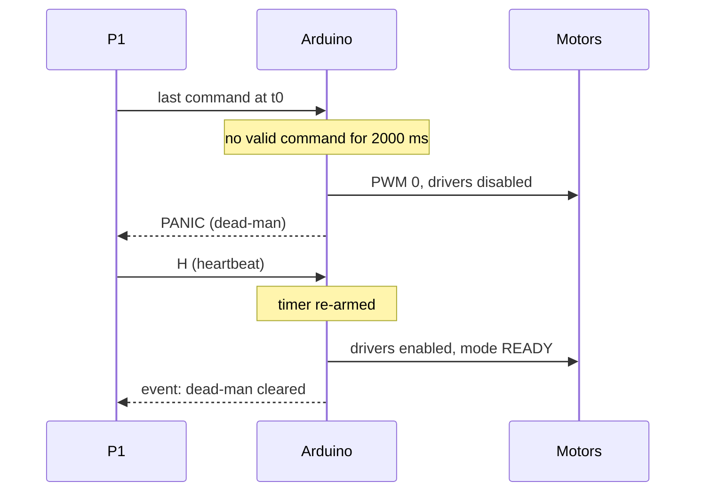
```mermaid
sequenceDiagram
  participant P as P1
  participant A as Arduino
  participant M as Motors
  P->>A: last command at t0
  Note over A: no valid command for 2000 ms
  A->>M: PWM 0, drivers disabled
  A-->>P: PANIC (dead-man)
  P->>A: H (heartbeat)
  Note over A: timer re-armed
  A->>M: drivers enabled, mode READY
  A-->>P: event: dead-man cleared
```

**Figure 9.** Dead-man trip and recovery.

### 3.5.3 Redundant Stop Paths and Gas-Triggered Stop

Table 7 lists every path that stops the motors. The gas stop fires when the raw MQ-136 value reaches 1000; motion stays rejected until a later reading falls below it, and the dashboard warns earlier, at 450 (warning) and 600 (critical).

**Table 7.** Stop paths.

| Trigger | Origin | Action | Bound |
|---|---|---|---|
| Drive key or button released | Dashboard via P1 | S, ramped stop | One network trip |
| Emergency stop button | Dashboard via P1 | S, sent without the sequence check | One network trip |
| Controller connection closes | P1 | S | On socket close |
| Another dashboard takes control | P1 | S | On takeover |
| P1 start-up | P1 | 3 x S, 200 ms apart | Before any other command |
| P1 shutdown | P1 | S | Before the port closes |
| Command flow stops | Firmware | PWM 0, drivers disabled | $t_{stop}$ above |
| Gas value >= 1000 | Firmware | PWM 0, drivers disabled, motion rejected | Gas sampled every 2000 ms |

## 3.6 Edge Control Server and Telemetry

The firmware stops the robot when commands cease, but it assumes that the commands it does receive come from one source and arrive in order. P1 provides that assumption and returns the robot's state to the operator. P1 owns the serial link, the GPS receiver and the control WebSocket.

### 3.6.1 Safe Startup and Single-Writer Serial Link

P1 takes an exclusive, non-blocking lock on a file in a memory-backed directory before it opens any hardware; the kernel releases the lock when the process exits for any reason. The serial port is then opened in exclusive mode, and one asynchronous lock serialises all writes. Figure 10 shows the start-up handshake.

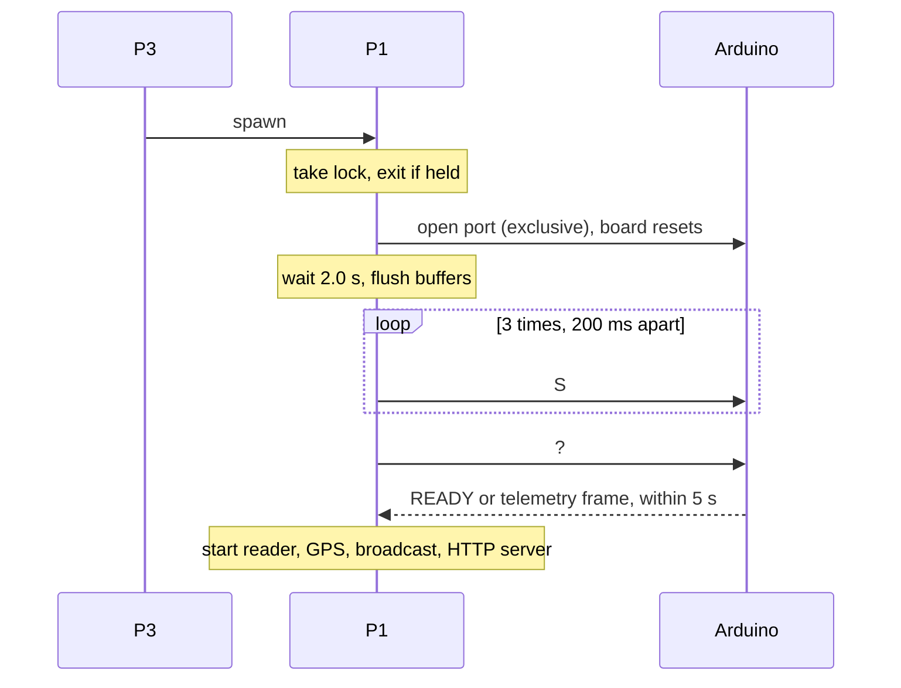
```mermaid
sequenceDiagram
  participant W as P3
  participant P as P1
  participant A as Arduino
  W->>P: spawn
  Note over P: take lock, exit if held
  P->>A: open port (exclusive), board resets
  Note over P: wait 2.0 s, flush buffers
  loop 3 times, 200 ms apart
    P->>A: S
  end
  P->>A: ?
  A-->>P: READY or telemetry frame, within 5 s
  Note over P: start reader, GPS, broadcast, HTTP server
```

**Figure 10.** P1 start-up handshake. A timeout ends P1 with a handshake-failure exit code.

### 3.6.2 Telemetry Pipeline and Session Resume

The firmware sends a frame every 500 ms; P1 broadcasts a snapshot of the latest valid frame every 200 ms on an absolute schedule, merged with GPS and link status (Figure 11). A frame is dropped if any field fails the checks in Table 8; there is no retransmission.

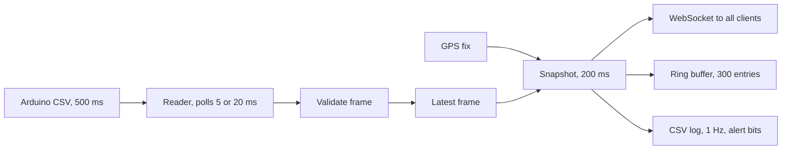
```mermaid
flowchart LR
  A["Arduino CSV, 500 ms"] --> R["Reader, polls 5 or 20 ms"]
  R --> V["Validate frame"]
  V --> L["Latest frame"]
  G["GPS fix"] --> S["Snapshot, 200 ms"]
  L --> S
  S --> WS["WebSocket to all clients"]
  S --> RB["Ring buffer, 300 entries"]
  S --> LOG["CSV log, 1 Hz, alert bits"]
```

**Figure 11.** Telemetry pipeline.

**Table 8.** Telemetry frame fields and accepted ranges (frame at most 80 characters).

| Field | Unit | Accepted range |
|---|---|---|
| Temperature | degC | -40 to 125 |
| Humidity | % | 0 to 100 |
| Gas | raw ADC | 0 to 10000 |
| Range | cm | 0 to 500 |
| Pan angle | deg | 0 to 180 |
| Tilt angle | deg | 0 to 180 |
| Firmware state | - | 1 to 3 |
| Uptime | ms | 0 to 2^32 - 1 |

On reconnect, the dashboard sends the server timestamp of the last snapshot it received; P1 replies with every newer snapshot in the buffer and the size of any gap. The buffer depth and the gap are:

$$D = N \cdot T_{b} = 300 \times 200\ \text{ms} = 60\ \text{s}, \qquad g = \max(0,\ t_{oldest} - t_{last})$$

where $N$ is the buffer size, $T_{b}$ the broadcast period, $t_{oldest}$ the oldest buffered timestamp and $t_{last}$ the client's last timestamp. The buffer is held in memory, so it does not survive a P1 restart.

## 3.7 Fault Tolerance and Supervision

Sections 3.5 and 3.6 make each tier fail into a stop; this section describes how failures are detected and how the system returns to service. Fault tolerance is layered (Figure 12). Each layer acts on its own, and a failure that passes every layer above ends at the firmware, which stops the motors.

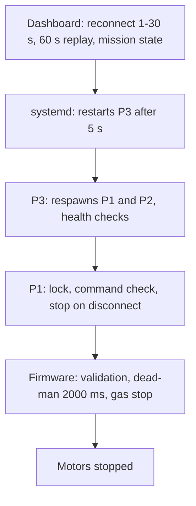
```mermaid
flowchart TB
  L5["Dashboard: reconnect 1-30 s, 60 s replay, mission state"]
  L4["systemd: restarts P3 after 5 s"]
  L3["P3: respawns P1 and P2, health checks"]
  L2["P1: lock, command check, stop on disconnect"]
  L1["Firmware: validation, dead-man 2000 ms, gas stop"]
  M["Motors stopped"]
  L5 --> L4 --> L3 --> L2 --> L1 --> M
```

**Figure 12.** Layered fault tolerance, from the operator side down to the motors.

### 3.7.1 Process Isolation and Watchdog Supervision

P3 is the only systemd service (restart on failure after 5 s); it spawns P1 and P2 as separate processes with no shared memory and supervises each one with the state machine in Figure 13. The only link between P1 and P2 is a once-per-second localhost query from P2 for the controller's address.

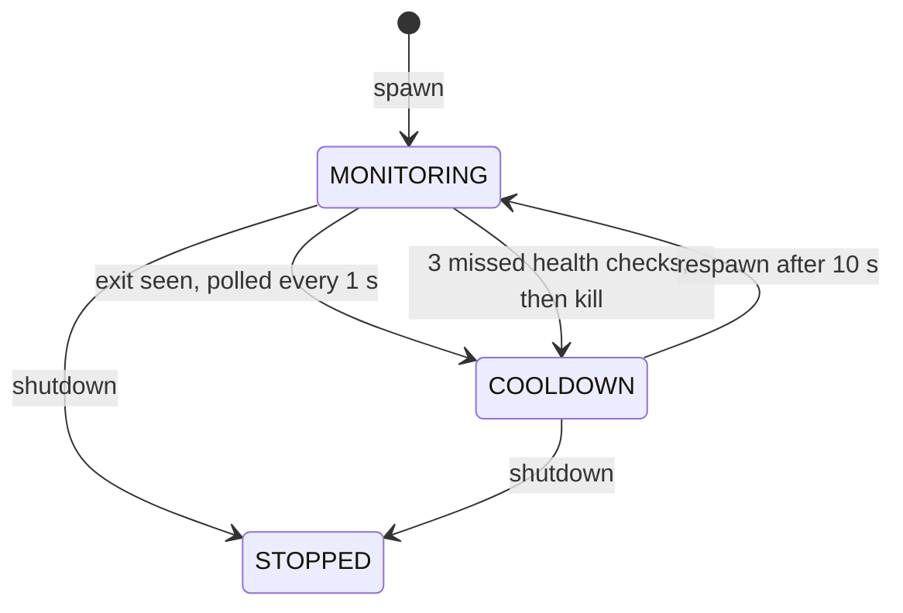
```mermaid
stateDiagram-v2
  [*] --> MONITORING: spawn
  MONITORING --> COOLDOWN: exit seen, polled every 1 s
  MONITORING --> COOLDOWN: 3 missed health checks, then kill
  COOLDOWN --> MONITORING: respawn after 10 s
  MONITORING --> STOPPED: shutdown
  COOLDOWN --> STOPPED: shutdown
```

**Figure 13.** Per-process supervision. Health checks run every 10 s with a 5 s timeout.

### 3.7.2 Recovery Time Model and Graceful Degradation

The time from a failure to a working process is:

$$T_{rec} = T_{det} + T_{p} + T_{c} + T_{init}$$

where $T_{det}$ is the detection time (at most 1 s for a crash, at most $3 \times 10 + 5 = 35$ s for a hang), $T_{p} = 1$ s is the poll before cooldown, $T_{c} = 10$ s is the cooldown, and $T_{init}$ is start-up time, which for P1 is 2.0 s + 3 x 0.2 s plus up to 5 s for the handshake. A P1 crash therefore recovers in 13.6 s to 19.6 s plus interpreter start-up; the dashboard adds up to one reconnect back-off step. Table 9 shows how each failure degrades the mission.

**Table 9.** Failure effects and recovery.

| Failure | Detected by | Effect | Recovery |
|---|---|---|---|
| Operator link lost | Dead-man; socket close | Robot stops; mission STOP | Reconnect with back-off, telemetry replay |
| P1 crash or hang | P3 | No control or telemetry; dead-man stops robot | Respawn; buffered history lost |
| P2 crash | P3 | Video and talk lost; control unaffected; mission DRIVING LIMITED | Respawn; operator retries video |
| Arduino link error | Serial read or write error | Serial flag false; mission STOP | Reads retried every 0.5 s; port reopened when P1 restarts |
| Camera fails to open | Media server | Synthetic test pattern sent | Next session |
| Microphone lost | Media server | Silence sent | Reopen tried every 2 s |
| GPS port error | P1 | No fix; GPS-lost alert bit set | Port reopened after 2 s |
| Robot Screen browser exits | Kiosk launcher | Victim screen blank | Relaunch after 3 s |
| P3 crash | systemd | P1 and P2 stop with it; dead-man stops robot | Restart after 5 s, then P1 and P2 respawn |

Figure 14 shows how one failure, a Wi-Fi drop, passes through the tiers and how the system returns to service without operator action beyond reconnecting.

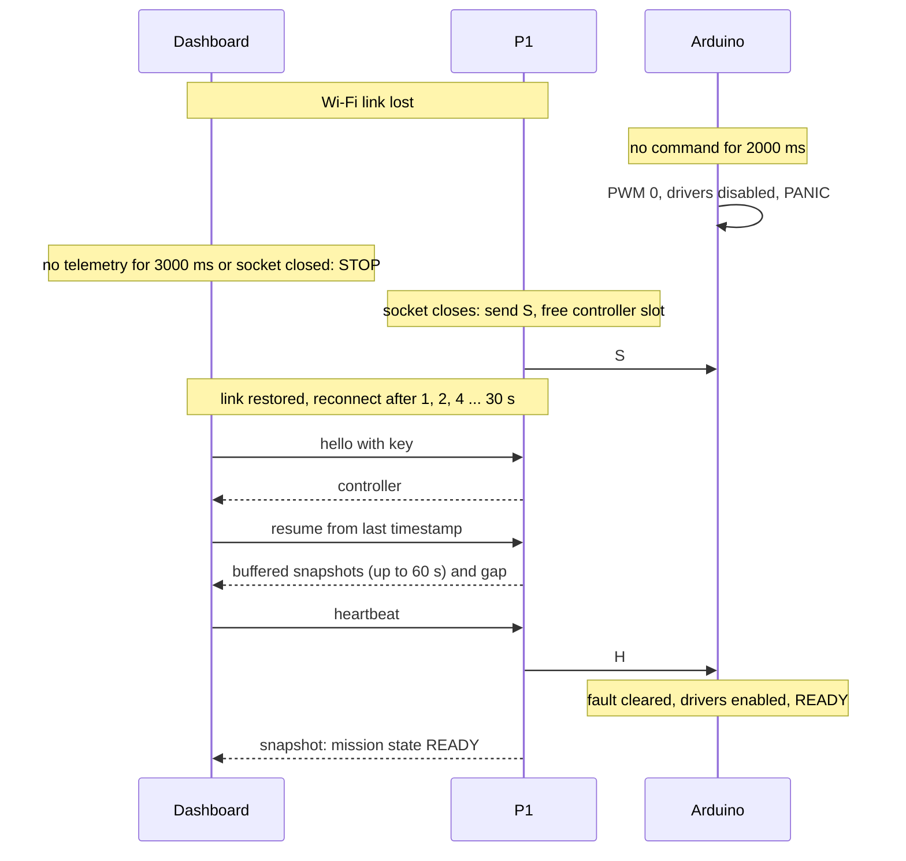
```mermaid
sequenceDiagram
  participant D as Dashboard
  participant P as P1
  participant A as Arduino
  Note over D,P: Wi-Fi link lost
  Note over A: no command for 2000 ms
  A->>A: PWM 0, drivers disabled, PANIC
  Note over D: no telemetry for 3000 ms or socket closed: STOP
  Note over P: socket closes: send S, free controller slot
  P->>A: S
  Note over D,P: link restored, reconnect after 1, 2, 4 ... 30 s
  D->>P: hello with key
  P-->>D: controller
  D->>P: resume from last timestamp
  P-->>D: buffered snapshots (up to 60 s) and gap
  D->>P: heartbeat
  P->>A: H
  Note over A: fault cleared, drivers enabled, READY
  P-->>D: snapshot: mission state READY
```

**Figure 14.** Failure chain for a Wi-Fi drop: stop, reconnect, replay, resume.

### 3.7.3 Mission State for Operator Awareness

The dashboard reduces link and firmware status to one of four mission states, evaluated in the priority order of Table 10.

**Table 10.** Mission state rules (first match wins).

| Priority | State | Condition |
|---|---|---|
| 1 | STOP | Control socket down, or serial link down, or no telemetry for more than 3000 ms |
| 2 | DRIVING LIMITED | Video link down |
| 3 | DRIVING | Firmware reports driving |
| 4 | READY | Otherwise |

## 3.8 Access Control and Multi-Operator Arbitration

Because any dashboard may reconnect after a failure (Section 3.7), the system must also decide which of several connected dashboards may drive. The decision is made once, in P1, and Section 3.9 reuses it for victim interaction. A dashboard becomes controller only by presenting the robot's controller key; all others are observers, whose commands, including stop, are rejected. The most recent dashboard with the right key takes the controller slot; the previous holder is demoted and the robot is stopped (Figure 15). P1 and P2 check the key in the same way (Table 11), and P2 grants talk only to a keyed session from the host P1 reports as controller.

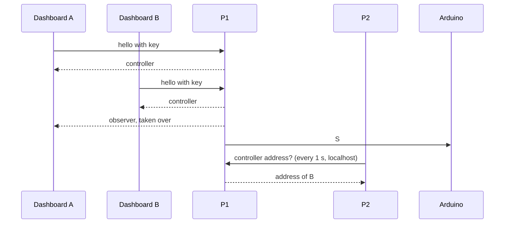
```mermaid
sequenceDiagram
  participant A as Dashboard A
  participant B as Dashboard B
  participant P as P1
  participant M as P2
  participant U as Arduino
  A->>P: hello with key
  P-->>A: controller
  B->>P: hello with key
  P-->>B: controller
  P-->>A: observer, taken over
  P->>U: S
  M->>P: controller address? (every 1 s, localhost)
  P-->>M: address of B
```

**Figure 15.** Controller takeover.

**Table 11.** Key check results.

| Result | Condition | Role |
|---|---|---|
| OK | Key matches (constant-time comparison) | Controller |
| No key | No key presented; not counted as a failure | Observer |
| Bad key | Wrong key; failure counted for that host | Observer |
| Locked | 5 failures within 300 s; host refused for 300 s, even with the right key | Observer |
| Disabled | No key configured on the robot | Observer for everyone |

Failure counters are kept in memory per process. The dashboard discards a refused key so that reconnects do not add to the count. The key travels over plain HTTP and WebSocket.

## 3.9 Two-Way Victim Interaction

With one controller established (Section 3.8), the same operator can see, hear and talk to the victim. This path must meet R6: it must never delay a stop. The robot carries a display and speaker facing the victim, driven by a kiosk browser (the Robot Screen) on the Pi. All two-way communication between the operator and the victim runs through P2, the media process. Here "P2" names the second of the three Pi processes (Section 3.2), not a peer-to-peer protocol, although every WebRTC link that ends at P2 is itself a direct peer connection with no media server in between.

Media is kept out of P1 for three reasons. First, video encoding is the heaviest load on the Pi, and a stall or crash in a native codec library must not delay a stop command. Second, the camera and microphone are separate devices from the serial port, so the two processes share no hardware. Third, P2 can be restarted by the watchdog while P1 keeps driving (Table 9). The only link between them is P2's once-per-second query for the controller's address (Section 3.7.1); P2 never sends anything to P1 or to the Arduino.

### 3.9.1 The P2 Media Process

P2 is a single Python process built on aiortc, a WebRTC implementation for Python's asyncio, with PyAV (FFmpeg) for capture, decoding and encoding. It serves HTTP on TCP port 8443 through FastAPI and uvicorn, and runs every peer connection on one event loop. It has four parts (Figure 3):

- **Shared capture.** The webcam (V4L2) and the microphone (ALSA) can each be opened only once, so P2 opens each device once, on first use, and fans its frames out to every session through a relay. Video is unbuffered, since a viewer needs only the newest frame; audio is buffered per session, since every audio frame matters. The device is closed again when the last session ends. If the camera cannot be opened, the session receives a synthetic test pattern instead of failing; if the microphone is missing or drops off USB, the session receives silence and P2 retries the device every 2 s.
- **Per-session tracks.** Each dashboard session gets its own outbound video and audio track. The video track converts every shared camera frame into a private YUV 4:2:0 copy on the event loop before the session's encoder sees it. Without this step, two encoder threads converted the same shared frame at once and P2 crashed with a segmentation fault.
- **Signalling.** Two HTTP endpoints accept an SDP offer and return the SDP answer: one for dashboards and one, accepted only from localhost, for the Robot Screen (Section 3.9.2).
- **Screen hub.** The hub receives the operator's media and data-channel messages, applies floor control (Section 3.9.5) and feeds the Robot Screen's connection (Section 3.9.4).

Each dashboard opens one peer connection to P2 that carries both directions at once: P2 sends the robot's camera and microphone to the operator, and the operator can send voice, video and text back over the same connection (Figure 16). Any number of dashboards may connect; all receive the robot's media, but only the controller can send to the Robot Screen. Table 12 lists the video parameters.

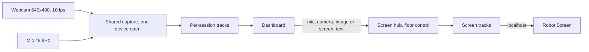
```mermaid
flowchart LR
  CAM["Webcam 640x480, 10 fps"] --> SH["Shared capture, one device open"]
  MIC["Mic 48 kHz"] --> SH
  SH --> SES["Per-session tracks"]
  SES --> D["Dashboard"]
  D -- "mic, camera, image or screen, text" --> HUB["Screen hub, floor control"]
  HUB --> ST["Screen tracks"]
  ST -- "localhost" --> K["Robot Screen"]
```

**Figure 16.** Two-way media path (WebRTC). Video is encoded per session as VP8 or H.264, as negotiated with the browser; each session gets its own copy of every camera frame.

**Table 12.** Video parameters.

| Parameter | Robot to operator | Operator to robot |
|---|---|---|
| Source | USB webcam, V4L2 | Laptop camera, still image or shared screen |
| Resolution and rate | 640x480, 10 fps | Camera 640x480 at 10 fps; image 1024x576 at 2 fps; screen at 5 fps |
| Codec | VP8 or H.264, negotiated per session | Decoded by P2, re-encoded for the Robot Screen |
| Encoders | One per dashboard session | One, for the Robot Screen connection |
| Bitrate | Adapted by the WebRTC congestion control | Adapted by the WebRTC congestion control |
| Source loss | Synthetic test pattern | Last frame repeated after 1 s; black frame when no operator video |

### 3.9.2 Signalling and Session Lifecycle

WebRTC needs a signalling step in which the two peers exchange session descriptions (SDP) before media can flow. P2 uses the simplest form: the dashboard sends its offer in one HTTP POST, together with its controller key if it has one, and the answer comes back in the HTTP response (Figure 17). There is no separate signalling server, no WebSocket for signalling and no trickle ICE. P2 finishes gathering its own network candidates before it replies, so the answer is complete when it arrives; the browser then runs connectivity checks against P2's address, and P2 learns the browser's address from those checks. Because both peers are on the same local network, a direct host-to-host path is always available and no TURN relay is needed. The response also reports the key check result (Section 3.8), so the dashboard knows at once whether the session can talk or only watch.

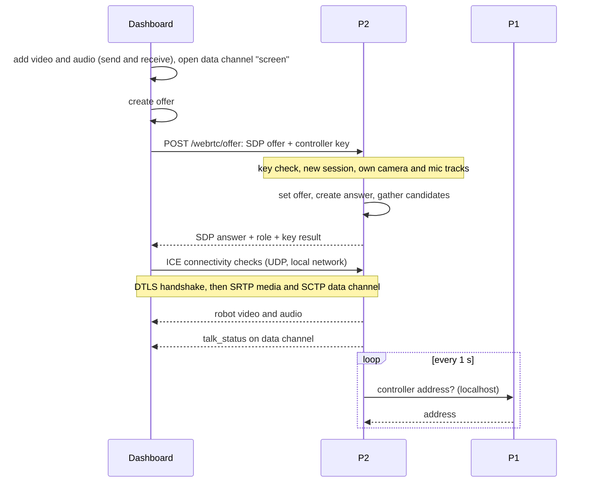
```mermaid
sequenceDiagram
  participant D as Dashboard
  participant M as P2
  participant P as P1
  D->>D: add video and audio (send and receive), open data channel "screen"
  D->>D: create offer
  D->>M: POST /webrtc/offer: SDP offer + controller key
  Note over M: key check, new session, own camera and mic tracks
  M->>M: set offer, create answer, gather candidates
  M-->>D: SDP answer + role + key result
  D->>M: ICE connectivity checks (UDP, local network)
  Note over D,M: DTLS handshake, then SRTP media and SCTP data channel
  M-->>D: robot video and audio
  M-->>D: talk_status on data channel
  loop every 1 s
    M->>P: controller address? (localhost)
    P-->>M: address
  end
```

**Figure 17.** WebRTC signalling and session set-up between a dashboard and P2.

The dashboard offers its audio and video in both directions from the start, but sends nothing until the operator chooses to talk or show video; it then attaches the chosen source to the existing sender. Starting or stopping talk or video therefore never needs a second offer and answer.

Each session has a short lifecycle:

1. **Creation.** P2 gives the session an identifier, checks the key and, if the key is valid, records the session and its host as allowed to control.
2. **Active.** The session receives the robot's media; its inbound tracks are drained continuously by the screen hub, and its frames are forwarded only while it holds the floor.
3. **Close.** When the connection fails or closes, P2 closes the peer connection, removes the session, releases the floor if this session held it, and stops its tracks; when no session is left, the camera and microphone are closed.

Reconnection is driven by the client, since P2 keeps no state that survives a restart. While P2 is still starting (for example just after the Pi boots, as P2 starts several seconds after P1), the dashboard retries every 3 s without operator action. Once video has connected, a later loss is shown to the operator as an error with a retry button rather than being hidden by silent reconnects, so the operator knows that the video was interrupted. A new key, or a retry, creates a new session from scratch. The Robot Screen kiosk reconnects on its own after any failure, and a new kiosk connection replaces the old one.

### 3.9.3 Data Channel Protocol

Each dashboard connection carries one reliable, ordered data channel named "screen", which uses SCTP over the same DTLS connection as the media. It carries short JSON messages for control of the Robot Screen (Table 13). Media never travels on the data channel, and drive commands never travel on it either: those use P1's WebSocket (Section 3.6). Every message from a dashboard is validated by P2 before use. Malformed or unknown messages are logged and dropped, text is trimmed and cut to 280 characters rather than rejected, and messages from a session that is not the current controller are refused with a view-only reply.

**Table 13.** Data channel messages.

| Message | Direction | Purpose |
|---|---|---|
| media_state | Dashboard to P2 to Robot Screen | Operator is talking or not; which video source is shown |
| screen_text | Dashboard to P2 to Robot Screen | Text message for the victim (at most 280 characters, with a timestamp) |
| screen_clear | Dashboard to P2 to Robot Screen | Remove the text from the screen |
| floor_release | Dashboard to P2 | Give up the Robot Screen |
| display_mode | Dashboard to P2 | Switch the robot display between the kiosk and the Pi desktop |
| talk_status | P2 to dashboard | Screen online, floor state (free, you, other), display mode, can control |
| screen_state | P2 to Robot Screen | Whether an operator is present, talking or showing video |
| screen_ack | Robot Screen to P2 to dashboard | The text with this timestamp is now shown |
| floor_denied, view_only | P2 to dashboard | Request refused: another operator holds the screen, or no controller key |

The acknowledgement closes the loop for text: the dashboard marks a message as delivered only when the Robot Screen confirms it, not when it was sent. P2 sends talk_status to every dashboard whenever the floor, the controller or the screen connection changes, so all operators see the same state.

### 3.9.4 Operator-to-Robot Relay

The operator's media does not go from the dashboard to the Robot Screen directly. The kiosk browser connects only to P2, over localhost, and P2 relays the operator's media to it. This design has three advantages. Floor control and the controller check are enforced in one place, so a remote browser cannot reach the victim's screen or speaker without passing them. The kiosk keeps a single long-lived connection that does not change when operators connect, disconnect or take over. And the robot's own address is the only one the kiosk ever contacts, so no remote host can connect to it (the screen endpoint refuses any address other than localhost).

The cost is one decode and one re-encode on the Pi. P2 decodes each inbound operator track as it arrives. The Robot Screen connection has two fixed outbound tracks that always read from the current floor holder:

- **Video.** The track sends the holder's newest frame. If no new frame arrives within 1 s, as with a still image or an idle shared screen, it repeats the last one, so the encoder keeps running; with no operator video it sends a black frame. Every frame is restamped on one monotonic clock, since operator frames carry the sender's clock and repeated frames carry none.
- **Audio.** The track resamples the holder's voice to 48 kHz mono and re-encodes it as 60 ms Opus packets (Section 3.9.6). When the operator is silent it sends silence.

Because these tracks never change, the operator can start or stop talking, switch video sources, or hand the floor to another operator without the Robot Screen connection being renegotiated. On floor release, P2 drops any queued operator media, clears the text and tells the screen that no operator is present.

### 3.9.5 Robot Screen, Floor Control and Push-to-Talk

Only one session may use the Robot Screen at a time (Figure 18). Talking follows driving: P2 accepts talk, video and text only from a session that presented the controller key and comes from the address P1 reports as its controller, which P2 reads once per second (Section 3.8, Figure 15). A takeover therefore moves the talk path to the new driver within about one second, and the old floor holder loses the screen. Push-to-talk switches an already attached microphone track on and off, so talking starts without renegotiation; text messages are limited to 280 characters, and the screen confirms each one back to the operator.

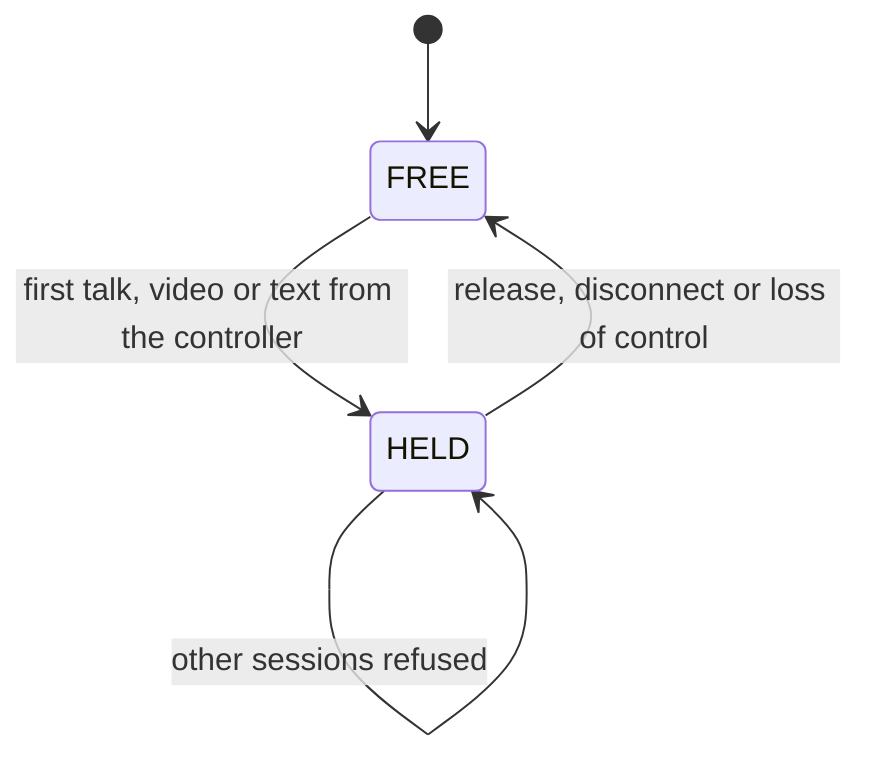
```mermaid
stateDiagram-v2
  [*] --> FREE
  FREE --> HELD: first talk, video or text from the controller
  HELD --> FREE: release, disconnect or loss of control
  HELD --> HELD: other sessions refused
```

**Figure 18.** Robot Screen floor control. A release clears the screen text and media.

### 3.9.6 Low-Latency Audio on a Constrained CPU

P2 encodes its own 60 ms Opus packets in both directions, which cuts the per-packet work on the event loop to a third, and captures the microphone through a shared ALSA device with a fixed 20 ms period (Table 14). The packet rate and the capture read rate are:

$$R_{pkt} = \frac{1000}{T_{pkt}}, \qquad R_{read} = \frac{f_{s}}{N_{period}}$$

where $T_{pkt}$ is the packet length in ms (20 ms gives 50 packets/s, 60 ms gives 16.7 packets/s), $f_{s} = 48000$ Hz is the sample rate and $N_{period}$ is the capture period in frames (960 frames gives 50 reads/s, against about 511 reads/s for the device's smallest period of 94 frames).

**Table 14.** Audio parameters.

| Parameter | Robot to operator | Operator to robot |
|---|---|---|
| Format | 48 kHz, mono, 16-bit | 48 kHz, mono, 16-bit |
| Codec | Opus, voice mode, 32 kbps | Opus, voice mode, 32 kbps |
| Packet length | 60 ms | 60 ms |
| Capture period and buffer | 960 frames (20 ms), 7680 frames (160 ms) | - |
| Buffering | One queue per session | Inbound queue of 10 frames (about 200 ms); 120 ms start cushion; 400 ms cap |
| Lateness | Paced by the device | Clock reset when more than 100 ms late, no catch-up burst |
| Source loss | Silence, reopen every 2 s | Silence until the cushion refills |

## 3.10 GPS Localisation and Offline Mapping

The operator also needs to know where the robot is, both to guide it and to report the victim's position to the rescue team, without depending on the internet (R7). P1 reads NMEA sentences from the receiver on a separate thread, merges the latest fix into each telemetry snapshot (Section 3.6.2) and adds a track point only after the robot moves at least 10 m, so drift around a stopped robot adds no points (Figure 19). Distance uses the equirectangular approximation:

$$d = R \sqrt{(\Delta\varphi)^2 + (\Delta\lambda \cos\bar{\varphi})^2}$$

where $R = 6371000$ m, $\Delta\varphi$ and $\Delta\lambda$ are the latitude and longitude differences in radians, and $\bar{\varphi}$ is their mean latitude.

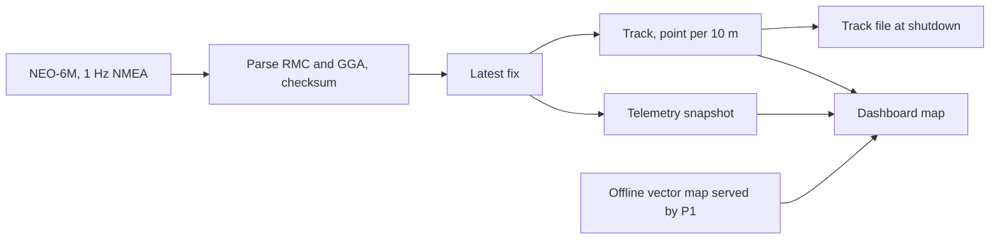
```mermaid
flowchart LR
  G["NEO-6M, 1 Hz NMEA"] --> NP["Parse RMC and GGA, checksum"]
  NP --> FX["Latest fix"]
  FX --> SN["Telemetry snapshot"]
  FX --> TR["Track, point per 10 m"]
  TR --> GJ["Track file at shutdown"]
  TR --> MAP["Dashboard map"]
  SN --> MAP
  OM["Offline vector map served by P1"] --> MAP
```

**Figure 19.** GPS and map data flow. Online map tiles, when reachable, show outside the offline map area.
