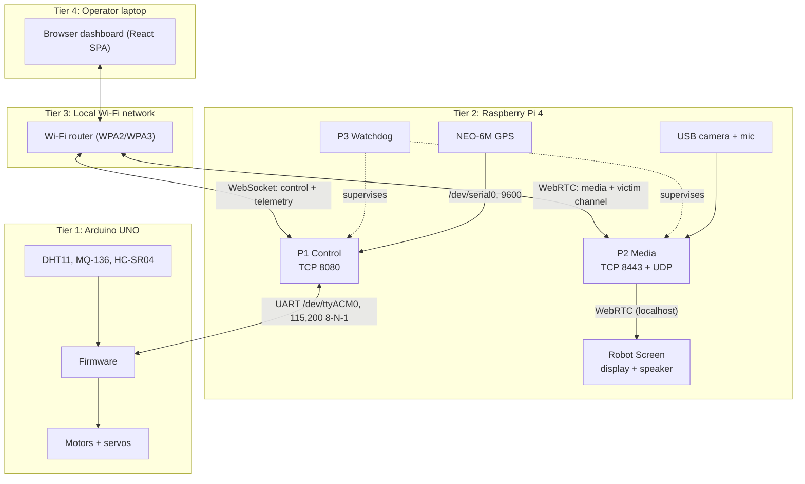
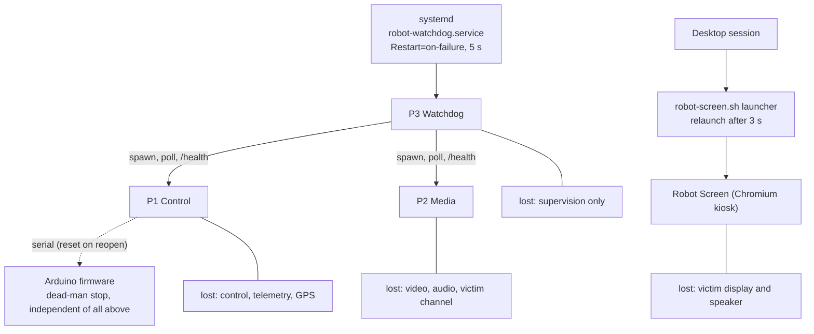
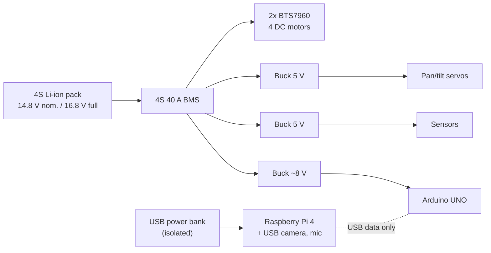
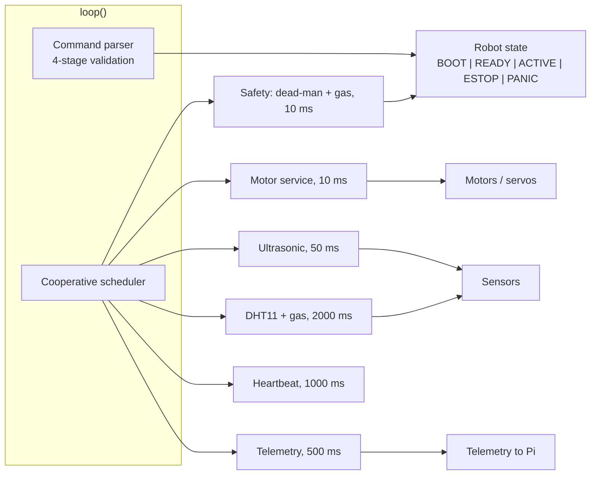

# 3. System Architecture

This section describes what the rescue robot is: its requirements, its tiers and transports, its hardware, its software stack and its network. The mechanisms behind the safety, fault-tolerance and interaction properties named here are detailed in Section 4.

## 3.1 Design Requirements and Architectural Invariants

The system serves a single rescue operator who sends a small ground robot into a confined or collapsed space to locate and interact with a trapped person. It must support teleoperated driving (FR1), camera pan/tilt independent of the chassis (FR2), live video and audio from the robot (FR3), and two-way victim interaction (FR4), in which the operator's voice plays through the robot's speaker and the operator's face, an image, a shared screen or a text message appears on a display facing the victim. It must also provide environmental sensing with threshold alerts (FR5), GPS position and path tracking (FR6), and full operation without internet access (FR7).

Six non-functional requirements constrain the design: a bounded stop time whenever command flow ceases (NFR1); fault tolerance, so that one failed component neither disables unrelated functions nor needs manual recovery (NFR2); single-operator authority, with exactly one authenticated operator commanding the robot or addressing the victim at a time (NFR3); low cost (NFR4); commodity hardware (NFR5); and testability of the full software stack without the physical robot (NFR6). These requirements are realised as the seven architectural invariants in Table 1.

**Table 1.** Architectural invariants and their enforcement.

| No. | Invariant | Enforcement mechanism | Req. | Detail |
|---|---|---|---|---|
| I | Motor safety is independent of the network and the edge computer | Firmware dead-man timer: no valid command for 2000 ms disables the drivers and sets PWM to zero | NFR1 | Section 4.3.4 |
| II | Control, media and supervision are decoupled | P1, P2, P3 are separate processes; P1 and P2 share no memory or IPC; P3 sees them only through process status and HTTP `/health` | NFR2 | Section 4.5.2 |
| III | Every process is supervised | systemd -> P3 -> P1, P2; a launcher script supervises the Robot Screen | NFR2 | Section 4.5.1 |
| IV | Control and media use independent transports | WebSocket to P1 (TCP 8080); WebRTC to P2 (TCP 8443 signalling, UDP media) | NFR2 | Section 4.1.4 |
| V | Operator state is always simple | One pure function derives a four-valued mission state | NFR3 | Section 4.6.1 |
| VI | Only one writer commands the microcontroller | File lock on P1, exclusive serial open, single controller role gated by a controller key | NFR3 | Section 4.4.3, Section 4.8 |
| VII | Primary operation needs no internet | Dashboard, control, telemetry, media and the operating-area map are served by the edge computer | FR7 | Section 3.5, Section 4.9.4 |

## 3.2 Overall System Architecture: Four Tiers and Two Independent Transports

The system has four tiers (Figure 1): an Arduino UNO for real-time control; a Raspberry Pi 4 edge computer running the control server P1, the media server P2 and the watchdog P3, and driving the victim-facing Robot Screen; a local Wi-Fi network; and a browser dashboard on the operator's laptop. Safety authority sits at the lowest tier: the microcontroller re-validates every command and stops the motors on its own when commands cease (Invariant I), so failures in the upper tiers cannot leave the robot moving. The upper tiers add perception, convenience and supervision, but none of them is trusted for the stop guarantee. The GPS receiver is attached to the Pi rather than the microcontroller, so position data never competes with commands on the serial link.

The Pi and the Arduino communicate over a UART link carried on the UNO's USB-serial interface (`/dev/ttyACM0`, 115,200 baud, 8-N-1) using newline-terminated ASCII lines (Section 4.1.3, Appendix B). Between the dashboard and the Pi there are two independent transports (Invariant IV). A WebSocket on TCP 8080 to P1 carries commands, heartbeats and emergency stops, with telemetry in return. A WebRTC session with P2, signalled on TCP 8443 with media over UDP, carries the robot's camera and microphone to the operator and the operator's voice, video and text to the Robot Screen. Because the two transports end in different processes and share no state, a media failure, whether a P2 crash, a camera fault or failed negotiation, leaves driving, telemetry and stopping intact (Section 4.6.2). The converse also holds: losing the control connection does not interrupt the victim's view of the operator. The dashboard reports such partial failures through the mission state (Section 4.6.1).

**Figure 1.** Overall architecture: four tiers, two independent transports, ports, and the victim-facing Robot Screen.



Each deployable unit is a separate failure domain with its own restart authority (Table 2). The supervision hierarchy is deliberately linear, so every process has exactly one supervisor and no process supervises itself. The resulting supervision chain is shown in Figure 2; the restart policies are described in Section 4.5.

**Table 2.** Container inventory.

| Container | Runtime | Ports / devices | Failure domain (lost while down) | Restart authority |
|---|---|---|---|---|
| Firmware | C++, Arduino core, no OS | Motor, servo and sensor pins | All motion and on-board sensing | Hardware reset (power-up, or P1 reopening the port) |
| P3 Watchdog | Python 3.11, asyncio, aiohttp | None | Supervision of P1/P2 | systemd |
| P1 Control | Python 3.11, FastAPI, uvicorn | TCP 8080; `/dev/ttyACM0`; `/dev/serial0` | Driving, telemetry, GPS, dashboard delivery | P3 |
| P2 Media | Python 3.11, aiortc, PyAV, FastAPI | TCP 8443; UDP; `/dev/video0`; USB mic | Video, audio, victim channel | P3 |
| Robot Screen | Chromium kiosk | HDMI display; 3.5 mm speaker | Victim-side display and audio | Launcher script |
| Dashboard | React SPA in browser | Laptop camera/mic (optional) | Operator interface | Operator reload; auto-reconnect |

**Figure 2.** Supervision chain and failure domains. Solid arrows show who starts and restarts whom; the note under each unit states what is lost while it is down.



## 3.3 Hardware Platform

The platform uses commodity components. Every part is an off-the-shelf module or board connected by wiring, as shown in Figure 3.

### 3.3.1 Locomotion and Actuation

A four-wheel-drive chassis carries four DC gear motors, wired as left and right pairs, each pair driven by one BTS7960 dual half-bridge driver (PWM on D5/D6 and D9/D10). Both drivers share one enable line on D4, so a single output can disable all propulsion. Steering is differential (skid) steering. The firmware accepts PWM 0-255 and ramps it by 15 units per 10 ms tick (Section 4.2.5); P1 caps commanded speed at 180 (Section 4.3.3). Two hobby servos on D11 (pan) and D3 (tilt) orient the camera over 0-180 deg, homing to 90 deg at boot (Section 4.2.2).

### 3.3.2 Sensing Suite

Table 3 summarises the sensors. A DHT11 on A2 reports temperature and humidity. An MQ-136 H2S-sensitive gas sensor on A3 is reported as a raw 10-bit ADC count (0-1023); it is uncalibrated, so the value indicates relative gas presence, not a concentration in ppm, despite the historical field name `gas_ppm`. The firmware also uses it for an autonomous gas stop (Section 4.3.7). An HC-SR04 on D7/D8 measures forward range, capped at 400 cm, and is advisory only (Section 4.3.8). A NEO-6M GPS receiver connects to the Pi's UART (`/dev/serial0`, 9600 baud) and is read by P1 (Section 4.9.1).

**Table 3.** Sensing suite.

| Model | Interface | Quantity measured | Sampling period |
|---|---|---|---|
| DHT11 | Arduino A2, single-wire | Temperature (degC), humidity (%) | 2000 ms |
| MQ-136 | Arduino A3, 10-bit ADC | Raw ADC 0-1023, uncalibrated | 2000 ms |
| HC-SR04 | Arduino D7/D8 | Forward range <= 400 cm, advisory | 50 ms |
| NEO-6M | Pi `/dev/serial0`, 9600 baud, NMEA | Position, fix, satellites | 1 s (receiver default) |

### 3.3.3 Audio-Visual Interaction Hardware

A Logitech C270 USB webcam on the pan/tilt head is captured at 640x480 and 10 fps, and a USB microphone picks up sound at the robot. Toward the victim, a speaker on the Pi's 3.5 mm jack plays the operator's voice, and a forward-facing 7-inch HDMI display (1024x600) shows the Robot Screen: a reassurance message when idle, otherwise the operator's video or image with text overlaid (Section 4.7.8). The camera, microphone and display are standard USB and HDMI devices supported by the operating system's stock drivers, so each can be replaced with an equivalent unit without software changes.

### 3.3.4 Power Architecture

Figure 4 shows the power distribution. A 4S Li-ion pack (14.8 V nominal, 16.8 V full) with a 40 A BMS feeds the motor drivers directly; buck converters supply 5 V rails for the servos and sensors and about 8 V to the Arduino's barrel jack. The PWM cap of 180 limits the average motor voltage to about 12 V. The Pi runs from a separate USB power bank, so motor current surges cannot brown it out; if it does lose power, Invariant I still stops the motors.

**Figure 3.** Electrical wiring of the robot (`hardware diagram.drawio.png`).

> [AUTHOR NOTE: the drawing includes modules firmware 1.0.0 does not use (IR obstacle modules, fans, LEDs, a transistor stage). Remove them or say so in the caption. [VERIFY]]

**Figure 4.** Power distribution. The edge computer is electrically isolated from the motor supply.



## 3.4 Software Stack Overview

The three computing tiers share no code; they are coupled only through a protocol contract mirrored in each code base (Section 4.1.3). Table 5 lists the technology per tier. For NFR6, the edge processes can run against an emulated microcontroller and GPS, so the whole control path, including the dead-man, can be tested without hardware (Section 4.1.5).

### 3.4.1 Microcontroller Firmware

The firmware, RESCUE-UNO 1.0.0, runs on the ATmega328P (16 MHz, 32 KB flash, 2 KB SRAM). It is written in C++ on the Arduino core and has no operating system. Figure 5 shows its structure: the main loop polls the command parser and runs a cooperative scheduler with six periodic tasks (Section 4.2.1). Each command passes four validation stages before reaching an actuator (Section 4.2.3). The robot-state module holds one of five modes, BOOT, READY, ACTIVE, ESTOP or PANIC; motion is allowed only in READY and ACTIVE (Section 4.2.4). PANIC is entered on dead-man expiry after 2000 ms or a raw gas reading >= 1000.

**Figure 5.** Firmware structure: main loop, scheduled tasks with periods, modules and operating modes.



### 3.4.2 Edge Processes

The Pi 4 Model B (4 GB) runs Debian 12 and Python 3.11 (Table 4). P1 (FastAPI/uvicorn) exclusively owns the serial and GPS ports (Section 4.4.3); it validates commands (Section 4.3.2), broadcasts telemetry every 200 ms (Section 4.4.5), keeps a short history for reconnecting clients (Section 4.4.7), and serves the dashboard and offline map on port 8080. P2 (aiortc/PyAV) captures the camera and microphone once for all viewers (Section 4.7.3) and relays operator media to the Robot Screen (Section 4.7.8). P3 (asyncio) spawns and supervises P1 and P2 (Section 4.5). Only P3 is a systemd unit, so the operating system starts a single service and P3 brings up the rest of the application. The Robot Screen is a Chromium kiosk opened from P2 on localhost. Operator access to P1 and P2 is gated by a controller key (Section 4.8).

**Table 4.** Edge processes.

| Process | Framework | Port | Owned resources | Supervisor |
|---|---|---|---|---|
| P1 Control | FastAPI + uvicorn, pyserial | TCP 8080 | `/dev/ttyACM0`, `/dev/serial0`, `/run/robot/p1.lock` | P3 |
| P2 Media | aiortc + PyAV, FastAPI | TCP 8443, UDP | `/dev/video0`, USB mic, Robot Screen session | P3 |
| P3 Watchdog | asyncio + aiohttp | None | Child processes P1, P2 | systemd |
| Robot Screen | Chromium kiosk | Client of localhost:8443 | HDMI display, speaker | Launcher |

### 3.4.3 Operator Dashboard

The dashboard is a React 19 single-page application in TypeScript, built with Vite and styled with Tailwind, with Leaflet maps; P1 serves it as static files. Its layout is shown in Figure 6. Two transport hooks mirror the transport split of Section 3.2: `useControlSocket` owns the WebSocket to P1, and `useWebrtcVideo` with `useTalkback` owns the WebRTC session to P2. The control hook performs the session handshake, sends commands and a heartbeat every 500 ms, receives telemetry, and reconnects with exponential backoff; the media hooks negotiate the peer connection and attach the operator's microphone, camera, image or screen when the operator chooses to send them. Because the media hooks never send commands, a media failure in the browser cannot interrupt control. Drive controls are enabled only while the control connection is up and the dashboard holds the controller role.

**Figure 6.** Dashboard layout: controls | video + map | sensors + alerts.

```
+----------------------------------------------------------------------+
| Status bar: WS connection | role | serial | GPS | controller key     |
+---------------+----------------------------------+-------------------+
| Mission state |                                  | Sensor cards      |
| Drive control |        Live robot video          | (temp, humidity,  |
| Pan / tilt    |                                  |  gas, range)      |
| EMERGENCY     |                                  | GPS card          |
|   STOP        |                                  | Alert log         |
| Talk panel    +----------------------------------+-------------------+
| (voice, video,|  Map: position, live path, session track (Leaflet)   |
|  image, text) |                                                      |
+---------------+------------------------------------------------------+
     22 %                      52 %                         26 %
```

**Table 5.** Technology stack per tier.

| Tier | Hardware | Environment | Languages and libraries |
|---|---|---|---|
| Real-time control | Arduino UNO | Bare metal | C++, Arduino core, ServoTimer2Plus |
| Edge | Raspberry Pi 4, 4 GB | Debian 12, systemd | Python 3.11: FastAPI, uvicorn, pyserial, aiortc, PyAV, aiohttp; Chromium |
| Network | Wi-Fi router | 802.11, WPA2/WPA3, DHCP | WebSocket/TCP, WebRTC (RTP/UDP, SCTP), HTTP |
| Operator | Laptop | Chromium-based browser | TypeScript, React 19, Vite, Tailwind, Leaflet, PMTiles |

## 3.5 Network Configuration: Local-Network-Only Operation

One ordinary WPA2/WPA3 Wi-Fi router forms the network. The Pi and the operator's laptop join it, the Pi's address is fixed by a DHCP reservation, and the operator opens `http://<pi-ip>:8080`. Control, telemetry and media stay on the local network, and the map is drawn from an offline PMTiles file served by P1 (Section 4.9.4), so no function depends on the internet. Because both hosts share one subnet, WebRTC connects with host candidates alone, with no STUN or TURN server (Section 4.7.2).

An earlier design connected the robot through an OpenWrt 802.11s mesh. According to the revision history (commit e5e8d6f), the mesh was planned but never used, and it was replaced by the single-router network described here. No further rationale is recorded, and the mesh is not part of the evaluated system. Coverage is therefore bounded by one router (Section 7.3). Table 6 gives the bandwidth budget, which is a design estimate and has not been measured; measured values appear in Section 6.2. Each additional viewing dashboard adds another video and audio stream from the robot, whereas the relay from P2 to the Robot Screen runs on the Pi's loopback interface and uses no network bandwidth.

**Table 6.** Bandwidth per viewing dashboard (design estimates, not measured).

| Stream | Basis | Estimate |
|---|---|---|
| Telemetry | ~400 B JSON x 5/s | ~ 16 kbit/s |
| Video | 640x480, 10 fps, VP8 | ~ 0.5-1.5 Mbit/s |
| Robot audio | Mono Opus | 32 kbit/s |
| Operator media (when used) | Voice; video <= 640x480 | Browser-dependent |
| **Total** | | **~ 1-2 Mbit/s** |

---

## Author notes (remove before submission)

1. TOC Section 4.9.2 says "Haversine", but `gps_reader.py` uses an equirectangular approximation.
2. `CAPSTONE_METHODOLOGY_FINAL.md` Section 40.3 still says "No authentication"; the code has a controller key. This section follows the code.
3. `robot-watchdog.service` waits for `dev-ttyUSB0.device`; the UNO is `/dev/ttyACM0`.
4. The firmware ESTOP mode exists but no command enters it; say so in Section 4.2.4.
5. Confirm on the robot: the C270 model, 40 A BMS, ~8 V rail, three buck converters and power bank.
