# 4. Methodology

This section explains how the properties stated in Section 3 are achieved. Each mechanism is introduced briefly and specified by a figure or table; all values are configured or design values taken from the source code unless marked otherwise. Measured performance is reported in Section 6.

## 4.1 Methodology Overview

### 4.1.1 Design Philosophy: Independent Failure Domains and Lowest-Tier Safety Authority

Each tier is a separate failure domain, and the authority to stop the robot sits at the lowest tier that can still act when everything above it has failed (Figure 7).

**Figure 7.** Failure domains and the lowest tier that still stops the robot when each one fails.

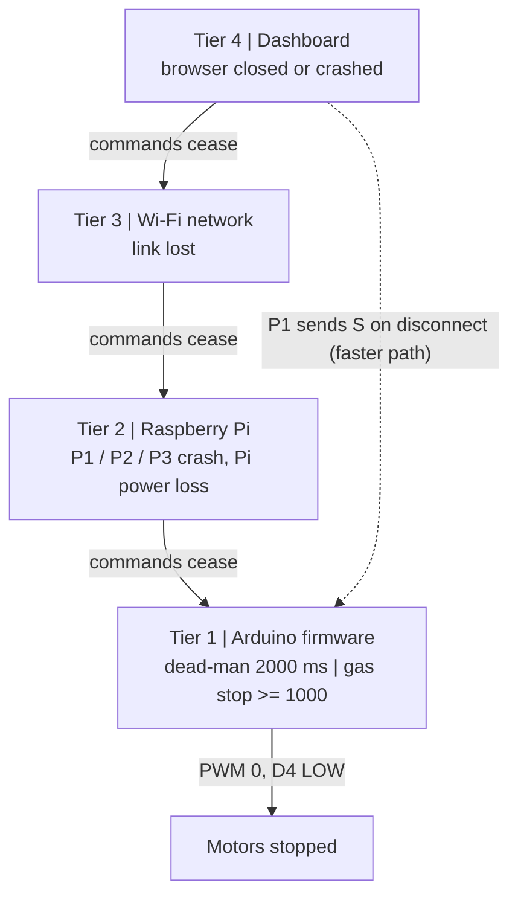
```mermaid
flowchart TB
  D["Tier 4 | Dashboard<br/>browser closed or crashed"]
  W["Tier 3 | Wi-Fi network<br/>link lost"]
  P["Tier 2 | Raspberry Pi<br/>P1 / P2 / P3 crash, Pi power loss"]
  A["Tier 1 | Arduino firmware<br/>dead-man 2000 ms | gas stop >= 1000"]
  M["Motors stopped"]
  D -- "commands cease" --> W
  W -- "commands cease" --> P
  P -- "commands cease" --> A
  A -- "PWM 0, D4 LOW" --> M
  D -. "P1 sends S on disconnect (faster path)" .-> A
```

### 4.1.2 Architectural Drivers and Their Structural Consequences

Six drivers shaped the structure; each maps to one primary mechanism (Table 7).

**Table 7.** Architectural drivers, structural consequences and implementing mechanisms.

| Driver | Structural consequence | Mechanism | Detail |
|---|---|---|---|
| D1 Bounded stop time on untrusted hardware | Motor authority on the microcontroller | Firmware dead-man in `taskSafety` | Section 4.3.4 |
| D2 Unreliable radio link | History buffering and replay | Ring buffer, `resume_from`, mission state | Section 4.4.7, Section 4.6 |
| D3 Fallible general-purpose OS | External supervision with cause discrimination | P3, `/health`, exit-code contract | Section 4.5 |
| D4 Exactly one writer on the UART | Dual-mechanism exclusion | `flock` + `O_EXCL` serial open | Section 4.4.3 |
| D5 Development without hardware | Protocol re-implementation, not stubs | `MockArduino`, `MockGPS` | Section 4.1.5 |
| D6 One operator, no ambiguity | Explicit role arbitration | Controller key, single controller slot | Section 4.8 |

### 4.1.3 Protocol Contract as the Sole Inter-Tier Coupling

The tiers share no code; they share one contract, defined in `pi/common/protocol.py` and mirrored by hand in `arduino/protocol.h` and `dashboard/src/lib/protocol.ts`. Commands travel as newline-terminated ASCII on the UART (Table 8) and as JSON on the WebSocket.

**Table 8.** Arduino command set.

| Opcode | Argument | Firmware range | Action | Refreshes dead-man |
|---|---|---|---|---|
| `F` / `R` | speed | 0-255 | Both sides forward / reverse | Yes |
| `L` / `G` | speed | 0-255 | Pivot left / right | Yes |
| `S` | - | - | Ramp to zero; ACTIVE -> READY | Yes |
| `H` | - | - | Keep-alive | Yes |
| `P` / `T` | angle | 0-180 | Pan / tilt servo | Yes |
| `?` | - | - | Reply with `STATUS` line | Yes |

### 4.1.4 End-to-End Command, Telemetry and Media Flows

A drive command crosses two validators before it moves a motor (Figure 8); telemetry returns through P1 and media through P2 on separate transports.

**Figure 8.** End-to-end command flow, from key press to motor.

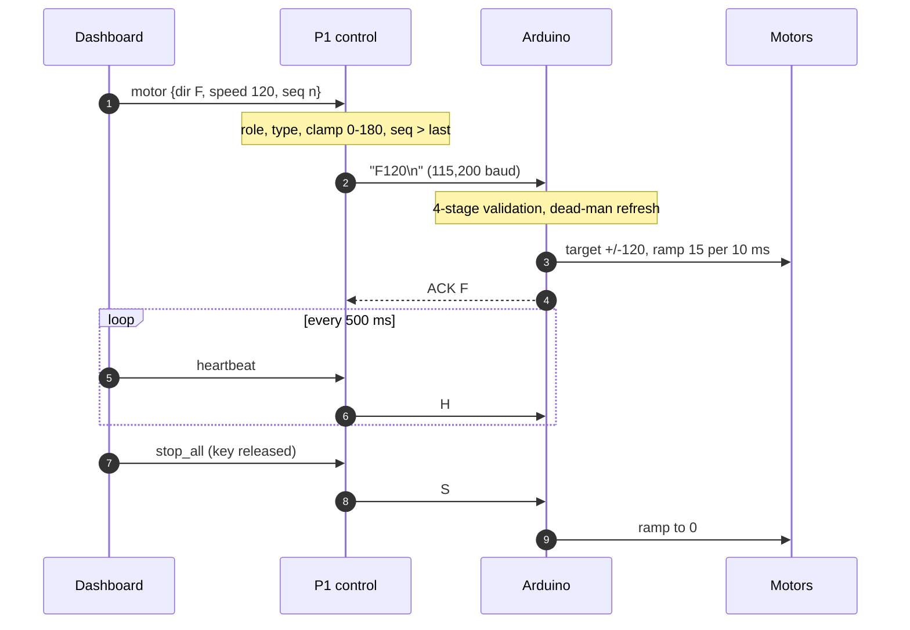
```mermaid
sequenceDiagram
  autonumber
  participant D as Dashboard
  participant P as P1 control
  participant A as Arduino
  participant M as Motors
  D->>P: motor {dir F, speed 120, seq n}
  Note over P: role, type, clamp 0-180, seq > last
  P->>A: "F120\n" (115,200 baud)
  Note over A: 4-stage validation, dead-man refresh
  A->>M: target +/-120, ramp 15 per 10 ms
  A-->>P: ACK F
  loop every 500 ms
    D->>P: heartbeat
    P->>A: H
  end
  D->>P: stop_all (key released)
  P->>A: S
  A->>M: ramp to 0
```

### 4.1.5 Emulation-Based Development and Verification Without Hardware

With `MOCK_HARDWARE=1`, P1 opens `MockSerial` instead of the UART and `MockGPS` replaces the receiver, so the unchanged edge stack runs on any laptop (Figure 9). Table 9 lists the automated suites; results are in Section 6.

**Figure 9.** Hardware emulation boundary.

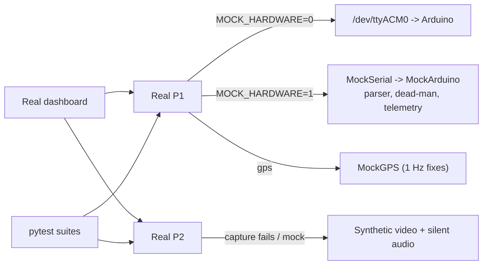
```mermaid
flowchart LR
  DB["Real dashboard"] --> P1["Real P1"]
  P1 -- "MOCK_HARDWARE=0" --> UART["/dev/ttyACM0 -> Arduino"]
  P1 -- "MOCK_HARDWARE=1" --> MS["MockSerial -> MockArduino<br/>parser, dead-man, telemetry"]
  P1 -- "gps" --> MG["MockGPS (1 Hz fixes)"]
  DB --> P2["Real P2"]
  P2 -- "capture fails / mock" --> SY["Synthetic video + silent audio"]
  T["pytest suites"] --> P1
  T --> P2
```

**Table 9.** Automated test suites run against emulated hardware (111 tests).

| Suite | Tests | Mechanism under test |
|---|---|---|
| `test_command_validator` | 13 | Edge validation, clamping, sequence check (Section 4.3.2) |
| `test_mission_state` | 9 | First-match mission state (Section 4.6.1) |
| `test_mock_deadman` | 10 | Dead-man trip and re-arm (Section 4.3.4) |
| `test_ring_buffer` | 9 | Ring buffer, resume, gap (Section 4.4.7) |
| `test_telemetry_parser` | 8 | Frame discard rules (Section 4.4.4) |
| `test_talkback` | 22 | Floor control, display mode, view-only (Section 4.7.8-4.7.9) |
| `test_controller_access` | 25 | Key, takeover, lockout (Section 4.8) |
| `test_shared_capture` | 5 | Device sharing, private frames (Section 4.7.3-4.7.4) |
| `test_resilient_audio` | 4 | Mic recovery, 60 ms packets (Section 4.7.5, Section 4.7.7) |
| `test_offline_map` | 2 | `/maps` route (Section 4.9.4) |
| `test_gps_track` | 4 | Distance and drift filter (Section 4.9.2-4.9.3) |

## 4.2 Real-Time Embedded Control

### 4.2.1 Cooperative Task Scheduler and Bounded Blocking

The firmware has no operating system: `loop()` polls the serial parser, then runs every task whose period has elapsed, using overflow-safe unsigned `millis()` subtraction (Figure 10, Table 10). Only the sonar and DHT11 reads block, each for at most ~ 25 ms.

**Figure 10.** Main loop and scheduled tasks.

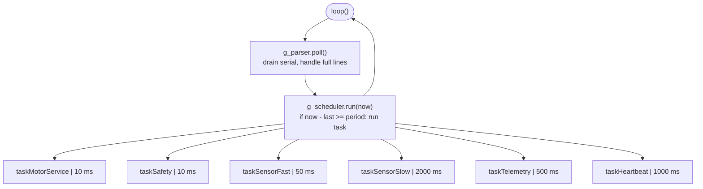
```mermaid
flowchart TB
  L(["loop()"]) --> PP["g_parser.poll()<br/>drain serial, handle full lines"]
  PP --> SR["g_scheduler.run(now)<br/>if now - last >= period: run task"]
  SR --> L
  SR --> T1["taskMotorService | 10 ms"]
  SR --> T2["taskSafety | 10 ms"]
  SR --> T3["taskSensorFast | 50 ms"]
  SR --> T4["taskSensorSlow | 2000 ms"]
  SR --> T5["taskTelemetry | 500 ms"]
  SR --> T6["taskHeartbeat | 1000 ms"]
```

**Table 10.** Scheduled firmware tasks (registration order = run order).

| Task | Period | Work | Max blocking |
|---|---|---|---|
| `taskMotorService` | 10 ms | Ramp PWM 15 units toward target, write pins | - |
| `taskSafety` | 10 ms | Gas panic, dead-man check, fault recovery | - |
| `taskSensorFast` | 50 ms | HC-SR04 `pulseIn` | 25 ms timeout |
| `taskSensorSlow` | 2000 ms | DHT11 bit-bang + MQ-136 ADC | ~ 25 ms (20 ms start pulse + 40 bits) |
| `taskTelemetry` | 500 ms | 8-field CSV line | ~ 2.4 ms on the wire |
| `taskHeartbeat` | 1000 ms | `HB <mode> <ms>`, toggle LED D13 | - |

### 4.2.2 Timer Allocation for Motor PWM and Servo Control

Motor PWM uses Timer 0 (D5/D6) and Timer 1 (D9/D10). The servos therefore use `ServoTimer2Plus` on Timer 2 (D11 pan, D3 tilt), because the standard Servo library claims Timer 1 and would disable PWM on D9/D10. D4 enables both drivers.

### 4.2.3 Four-Stage Command Validation in Firmware

Every received line passes framing, syntax, range and state checks; failure at any stage returns `NACK <op> <reason>` and nothing is actuated (Figure 11). The dead-man is refreshed after stage 3, so a well-formed command proves the link is alive even if stage 4 rejects it.

**Figure 11.** Firmware validation pipeline (`command_parser.cpp`).

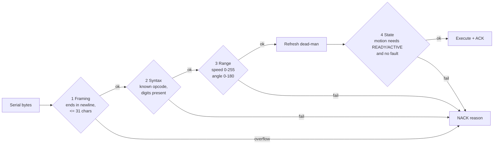
```mermaid
flowchart LR
  IN["Serial bytes"] --> S1{"1 Framing<br/>ends in newline,<br/><= 31 chars"}
  S1 -- ok --> S2{"2 Syntax<br/>known opcode,<br/>digits present"}
  S2 -- ok --> S3{"3 Range<br/>speed 0-255<br/>angle 0-180"}
  S3 -- ok --> DM["Refresh dead-man"]
  DM --> S4{"4 State<br/>motion needs READY/ACTIVE<br/>and no fault"}
  S4 -- ok --> EX["Execute + ACK"]
  S1 -- overflow --> N["NACK reason"]
  S2 -- fail --> N
  S3 -- fail --> N
  S4 -- fail --> N
```

### 4.2.4 Firmware Operating Modes and Fault Handling

The robot-state module holds five modes and one fault reason (Figure 12, Table 11). PANIC is entered by the dead-man or the gas alarm and clears automatically when the cause disappears; ESTOP exists in the code but no command currently enters it.

**Figure 12.** Firmware mode state machine.

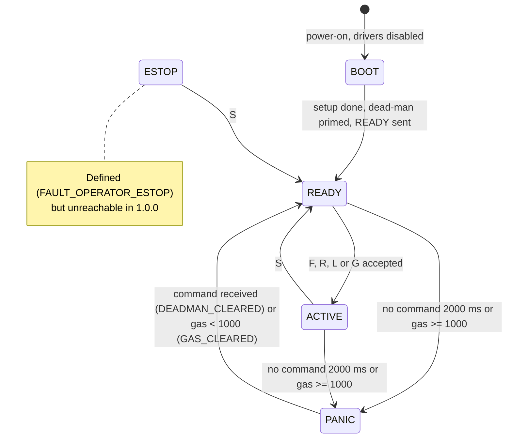
```mermaid
stateDiagram-v2
  [*] --> BOOT: power-on, drivers disabled
  BOOT --> READY: setup done, dead-man primed, READY sent
  READY --> ACTIVE: F, R, L or G accepted
  ACTIVE --> READY: S
  READY --> PANIC: no command 2000 ms or gas >= 1000
  ACTIVE --> PANIC: no command 2000 ms or gas >= 1000
  PANIC --> READY: command received (DEADMAN_CLEARED) or gas < 1000 (GAS_CLEARED)
  ESTOP --> READY: S
  note right of ESTOP
    Defined (FAULT_OPERATOR_ESTOP)
    but unreachable in 1.0.0
  end note
```

**Table 11.** Mode semantics.

| Mode | `fw_state` | Motion allowed | Drivers (D4) | Entered by | Left by |
|---|---|---|---|---|---|
| BOOT | 3 | No | LOW | Reset | End of `setup()` |
| READY | 1 | Yes | HIGH | Boot, `S`, fault cleared | Motion command, fault |
| ACTIVE | 2 | Yes | HIGH | `F/R/L/G` | `S`, fault |
| PANIC | 3 | No | LOW | Dead-man or gas fault | Cause removed |
| ESTOP | 3 | No | - | (none in 1.0.0) | `S` |

### 4.2.5 Differential-Drive Control and PWM Ramping

Each direction sets signed left and right targets; only one of RPWM/LPWM is driven per side, preventing shoot-through (Table 12). The 10 ms motor task moves the output 15 units per tick, while an emergency stop bypasses the ramp (Figure 13).

$$
t_{\text{ramp}} = \left\lceil \frac{|u_{\text{target}} - u_{\text{current}}|}{\Delta u} \right\rceil \cdot T_{m}, \qquad \Delta u = 15,\; T_m = 10\ \text{ms}
$$

| Symbol | Meaning |
|---|---|
| $u$ | Signed PWM duty (-255...255) |
| $\Delta u$, $T_m$ | Ramp step and motor-task period |

**Table 12.** Differential-drive mixing.

| Command | Left target | Right target | Pins active | Ramp 0 -> 180 |
|---|---|---|---|---|
| `F` | +s | +s | D5, D9 | 120 ms |
| `R` | -s | -s | D6, D10 | 120 ms |
| `L` (pivot) | -s | +s | D6, D9 | 120 ms |
| `G` (pivot) | +s | -s | D5, D10 | 120 ms |
| `S` | 0 | 0 | ramp down | 120 ms from 180 |
| Reversal F180 -> R180 | - | - | through zero | 240 ms |
| Emergency stop | 0 | 0 | all 0, D4 LOW | 0 ms (no ramp) |

**Figure 13.** PWM profile for `F180` at t = 0 followed by a stop at t = 130 ms: ramped `S` (first series) versus dead-man / gas cut (second series).

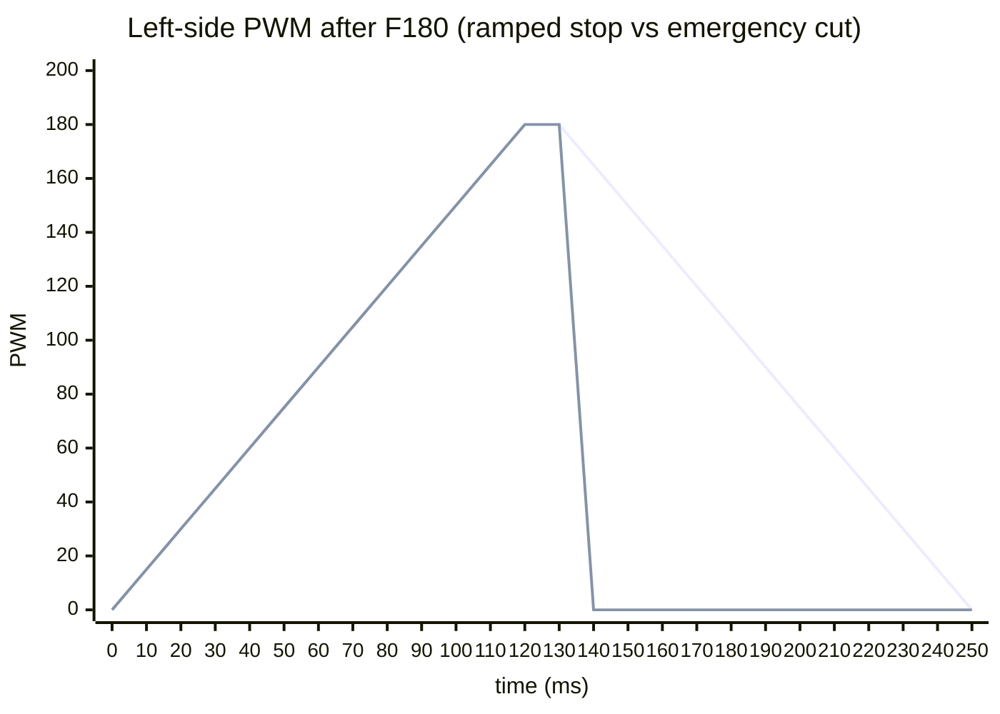
```mermaid
xychart-beta
  title "Left-side PWM after F180 (ramped stop vs emergency cut)"
  x-axis "time (ms)" ["0","10","20","30","40","50","60","70","80","90","100","110","120","130","140","150","160","170","180","190","200","210","220","230","240","250"]
  y-axis "PWM" 0 --> 200
  line [0,15,30,45,60,75,90,105,120,135,150,165,180,180,165,150,135,120,105,90,75,60,45,30,15,0]
  line [0,15,30,45,60,75,90,105,120,135,150,165,180,180,0,0,0,0,0,0,0,0,0,0,0,0]
```

## 4.3 Layered Fail-Safe Command Pipeline

### 4.3.1 Overview of Defense-in-Depth Command Validation

Bounds are enforced three times with different purposes: the dashboard for convenience, P1 for early rejection with a readable reason, and the firmware as the only authoritative check (Figure 14, Table 13).

**Figure 14.** Defense-in-depth layers and the backstops beneath them.

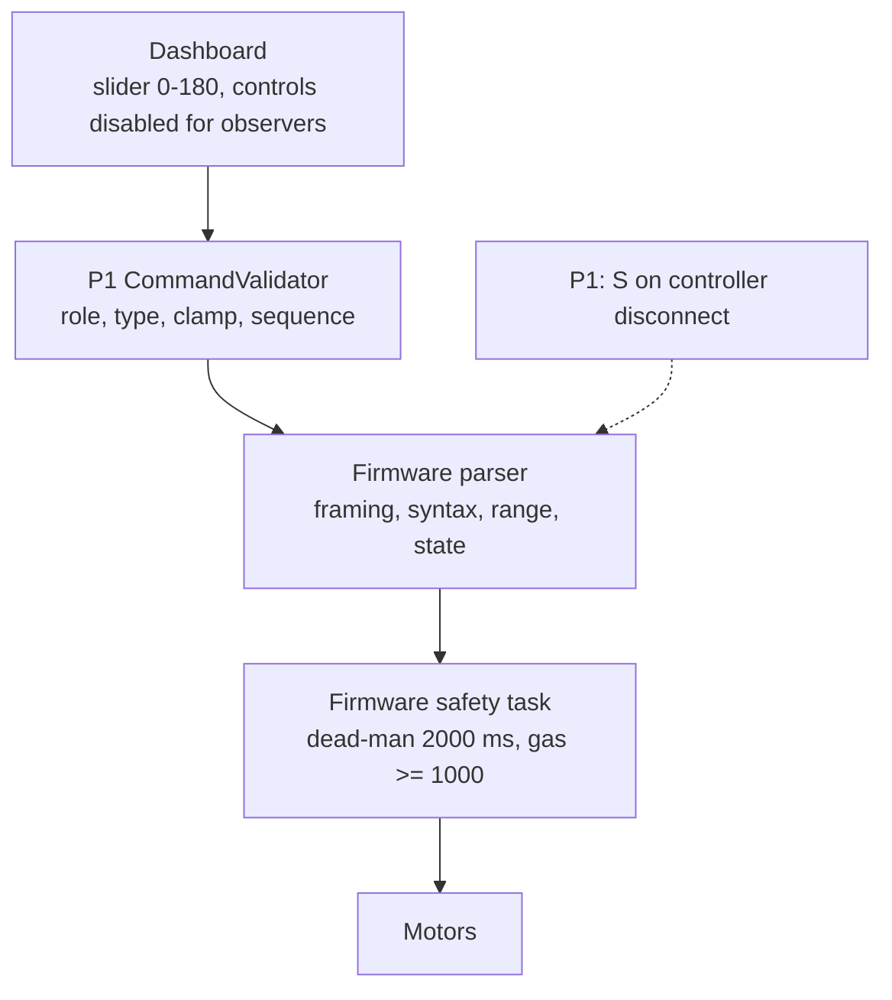
```mermaid
flowchart TB
  L1["Dashboard<br/>slider 0-180, controls disabled for observers"]
  L2["P1 CommandValidator<br/>role, type, clamp, sequence"]
  L3["Firmware parser<br/>framing, syntax, range, state"]
  L4["Firmware safety task<br/>dead-man 2000 ms, gas >= 1000"]
  L1 --> L2 --> L3 --> L4 --> MOT["Motors"]
  X["P1: S on controller disconnect"] -.-> L3
```

**Table 13.** Role of each layer.

| Layer | Purpose | Can be bypassed by a fault above it? |
|---|---|---|
| Dashboard | Usability | Yes |
| P1 validator | Early rejection, operator feedback | Yes (P1 defect) |
| Firmware parser | Authoritative input check | No |
| Firmware safety task | Stop without any upper tier | No |

### 4.3.2 Edge-Side Validation: Role Check, Clamping and Sequence Monotonicity

P1 lowers each JSON message to one wire command only after the checks in Figure 15; every rejection returns an `error` message with a readable reason.

**Figure 15.** P1 validation pipeline (`main.py`, `safety.py`).

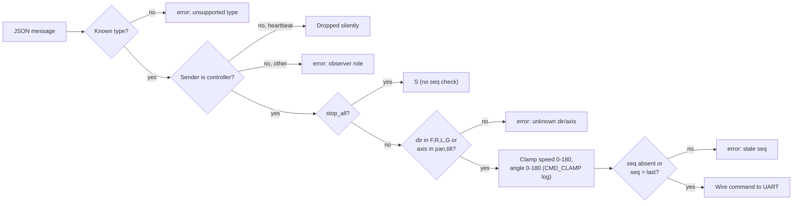
```mermaid
flowchart LR
  M["JSON message"] --> K{"Known type?"}
  K -- no --> E["error: unsupported type"]
  K -- yes --> R{"Sender is controller?"}
  R -- "no, heartbeat" --> DROP["Dropped silently"]
  R -- "no, other" --> E2["error: observer role"]
  R -- yes --> T{"stop_all?"}
  T -- yes --> S["S (no seq check)"]
  T -- no --> V{"dir in F,R,L,G or<br/>axis in pan,tilt?"}
  V -- no --> E3["error: unknown dir/axis"]
  V -- yes --> C["Clamp speed 0-180,<br/>angle 0-180 (CMD_CLAMP log)"]
  C --> Q{"seq absent or<br/>seq > last?"}
  Q -- no --> E4["error: stale seq"]
  Q -- yes --> W["Wire command to UART"]
```

### 4.3.3 Speed Limiting and the PWM-Voltage Relationship

P1 caps speed at 180 of 255, which bounds the mean motor voltage to 10.4 V at the nominal 14.8 V and 11.9 V at a full 16.8 V.

$$
\bar V_{m} = \frac{u}{255}\, V_{\text{bat}}
$$

| Symbol | Meaning |
|---|---|
| $u$ | PWM duty after clamping (0-180) |
| $V_{\text{bat}}$ | Pack voltage: 14.8 V nominal, 16.8 V full |

### 4.3.4 Heartbeat Keep-Alive and Dead-Man Timeout: Stop-Time Guarantee

The controller's dashboard sends `heartbeat` every 500 ms, which P1 forwards as `H`; the firmware stops the motors when no well-formed command has arrived for 2000 ms (Figure 16). The stop-time bound follows from the scheduler periods (Table 14).

$$
T_{\text{stop}} \le T_{DM} + T_{s} + T_{b,\max} \approx 2000 + 10 + 50 = 2060\ \text{ms}
$$

**Table 14.** Terms of the stop-time bound (design values).

| Symbol | Meaning | Value |
|---|---|---|
| $T_{DM}$ | Dead-man window `DEADMAN_TIMEOUT_MS` | 2000 ms |
| $T_s$ | Safety-task period | 10 ms |
| $T_{b,\max}$ | Worst blocking in one loop (sonar + DHT11) | ~ 50 ms |
| $T_{hb}$ | Heartbeat period | 500 ms (4 per window) |
| - | PWM after trip | 0 at once, D4 LOW (no ramp) |

**Figure 16.** Keep-alive and dead-man trip after the link is lost.

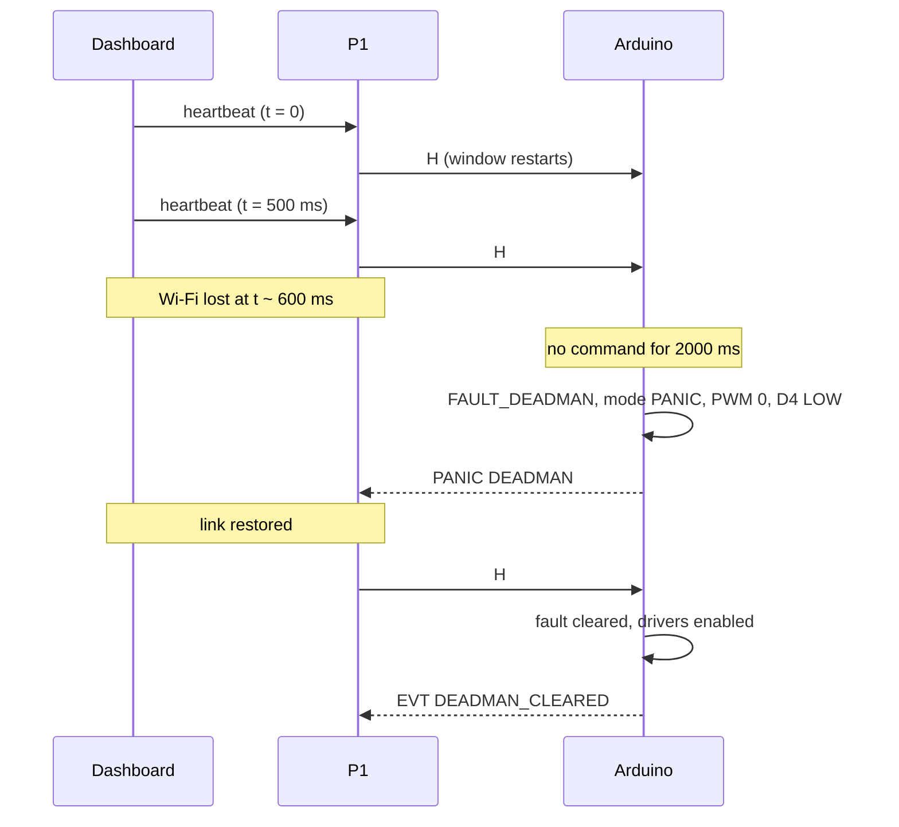
```mermaid
sequenceDiagram
  participant D as Dashboard
  participant P as P1
  participant A as Arduino
  D->>P: heartbeat (t = 0)
  P->>A: H (window restarts)
  D->>P: heartbeat (t = 500 ms)
  P->>A: H
  Note over D,P: Wi-Fi lost at t ~ 600 ms
  Note over A: no command for 2000 ms
  A->>A: FAULT_DEADMAN, mode PANIC, PWM 0, D4 LOW
  A-->>P: PANIC DEADMAN
  Note over D,P: link restored
  P->>A: H
  A->>A: fault cleared, drivers enabled
  A-->>P: EVT DEADMAN_CLEARED
```

### 4.3.5 Redundant Stop on Controller Disconnect

When the controller's WebSocket closes, P1 immediately writes `S`, stopping the robot within the 120 ms ramp; if P1 itself is down, the dead-man stops it within ~ 2 s.

### 4.3.6 Emergency-Stop Path and Priority Handling

The emergency stop is an ordinary `stop_all` with two privileges: P1 skips the sequence check and the firmware accepts `S` in every mode. Table 15 compares all stop types.

**Table 15.** Comparison of stop mechanisms.

| Stop | Trigger | Ramp | D4 enable | Mode after | Clears |
|---|---|---|---|---|---|
| Operator `S` | Button / key release | Yes, <= 120 ms | HIGH | READY | - |
| Disconnect `S` | Controller socket closed | Yes | HIGH | READY | - |
| Handshake `S` x3 | P1 start | Yes | HIGH | READY | - |
| Dead-man | 2000 ms silence | No | LOW | PANIC | Next valid command |
| Gas panic | ADC >= 1000 | No | LOW | PANIC | ADC < 1000 |

### 4.3.7 Gas-Triggered Autonomous Panic Stop

The firmware checks the MQ-136 alarm before the dead-man in every safety pass, so a gas stop needs no Pi or network (Figure 17). Dashboard alerts use lower thresholds on the same raw ADC scale: warning at 450, critical at 600, firmware stop at 1000.

**Figure 17.** Gas panic logic in `taskSafety`.

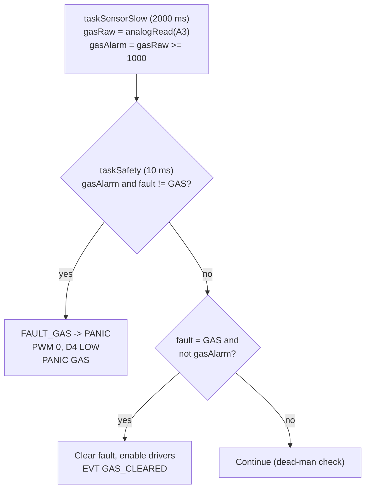
```mermaid
flowchart TB
  R["taskSensorSlow (2000 ms)<br/>gasRaw = analogRead(A3)<br/>gasAlarm = gasRaw >= 1000"] --> S{"taskSafety (10 ms)<br/>gasAlarm and fault != GAS?"}
  S -- yes --> P["FAULT_GAS -> PANIC<br/>PWM 0, D4 LOW<br/>PANIC GAS"]
  S -- no --> C{"fault = GAS and<br/>not gasAlarm?"}
  C -- yes --> CL["Clear fault, enable drivers<br/>EVT GAS_CLEARED"]
  C -- no --> N["Continue (dead-man check)"]
```

### 4.3.8 Advisory Obstacle Ranging

The ultrasonic range (every 50 ms, capped at 400 cm) is reported in telemetry and coloured on the dashboard at <= 30 cm and <= 20 cm, but it never gates a motor command; the operator decides.

## 4.4 Edge Control Server and Telemetry Pipeline

### 4.4.1 Overview of the Telemetry Pipeline

P1 runs three asyncio tasks and one thread, connected only through last-value slots (Figure 18).

**Figure 18.** P1 concurrency structure.

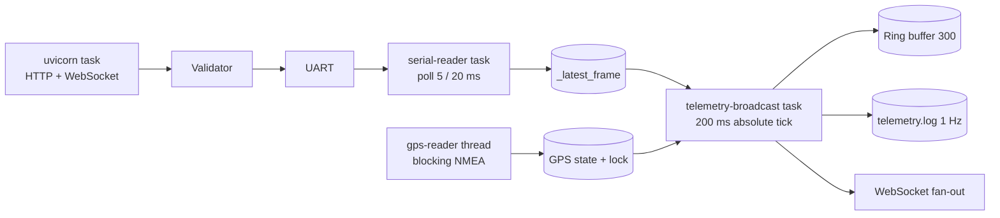
```mermaid
flowchart LR
  UART["UART"] --> SRT["serial-reader task<br/>poll 5 / 20 ms"]
  SRT --> LF[("_latest_frame")]
  GT["gps-reader thread<br/>blocking NMEA"] --> GS[("GPS state + lock")]
  LF --> BT["telemetry-broadcast task<br/>200 ms absolute tick"]
  GS --> BT
  BT --> RB[("Ring buffer 300")]
  BT --> TL[("telemetry.log 1 Hz")]
  BT --> WS["WebSocket fan-out"]
  UV["uvicorn task<br/>HTTP + WebSocket"] --> VAL["Validator"] --> UART
```

### 4.4.2 Serial Bridge and Safe Startup Handshake

Opening the port resets the UNO through DTR, so P1 waits 2 s, flushes, halts the board with three `S` 200 ms apart and then requires `READY` or a valid frame within 5 s, otherwise exiting with code 2 (Figure 19).

**Figure 19.** Start-up sequence.

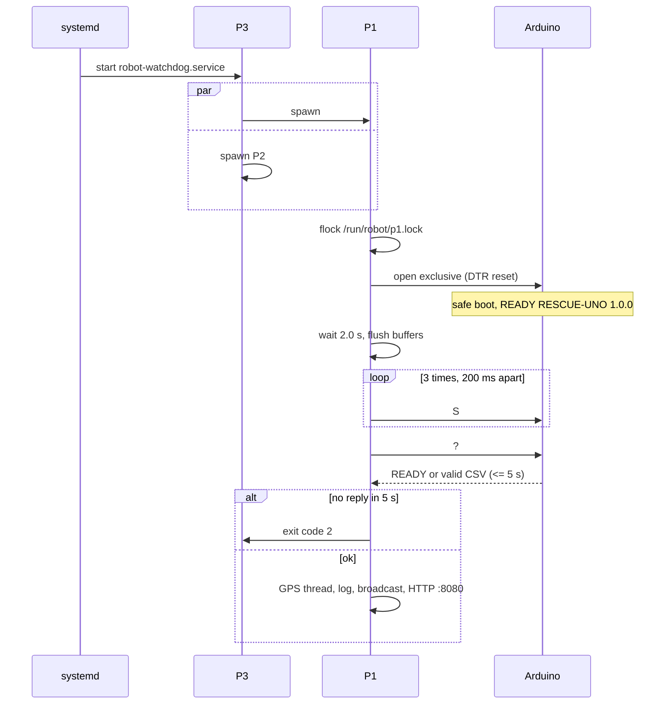
```mermaid
sequenceDiagram
  participant SD as systemd
  participant P3 as P3
  participant P1 as P1
  participant A as Arduino
  SD->>P3: start robot-watchdog.service
  par
    P3->>P1: spawn
  and
    P3->>P3: spawn P2
  end
  P1->>P1: flock /run/robot/p1.lock
  P1->>A: open exclusive (DTR reset)
  Note over A: safe boot, READY RESCUE-UNO 1.0.0
  P1->>P1: wait 2.0 s, flush buffers
  loop 3 times, 200 ms apart
    P1->>A: S
  end
  P1->>A: ?
  A-->>P1: READY or valid CSV (<= 5 s)
  alt no reply in 5 s
    P1->>P3: exit code 2
  else ok
    P1->>P1: GPS thread, log, broadcast, HTTP :8080
  end
```

### 4.4.3 Single-Writer Enforcement on the Serial Link

Two interleaved writers would create commands nobody sent, so exclusion is enforced at independent levels (Table 16).

**Table 16.** Exclusion mechanisms.

| Mechanism | Scope | Prevents | Released when |
|---|---|---|---|
| `flock` on `/run/robot/p1.lock` (tmpfs) | Process | Second P1 (exits code 0) | Holder exits, even on SIGKILL; reboot |
| `exclusive=True` (`O_EXCL`) | File handle | Any other opener of the port | Port closed |
| `asyncio.Lock` in `send()` | Coroutine | Interleaved writes inside P1 | After each line |
| Single controller slot | Client | Two operators commanding | Disconnect or takeover |

### 4.4.4 Telemetry Framing and the Discard-Don't-Retransmit Policy

Each CSV frame is accepted only if it has at most 80 characters, exactly 8 fields, and every field casts and lies in its plausible range; any failure drops the whole frame without retransmission, because a fresh frame follows within 500 ms.

### 4.4.5 Rate Decoupling and Drift-Free Periodic Broadcast

The reader and broadcaster share one last-value-wins slot and no queue, so a serial stall cannot block the broadcast and a slow client cannot back up the UART (Figure 20, Table 17). Broadcast ticks are scheduled on absolute times.

$$
t_k = t_0 + k\,T_b, \qquad T_b = 200\ \text{ms}; \quad \text{if } t_k < t_{\text{now}}: t_k \leftarrow t_{\text{now}}
$$

**Figure 20.** Firmware frames (500 ms) versus P1 broadcasts (200 ms) over one second; each broadcast re-uses the newest frame.

```mermaid
gantt
  dateFormat x
  axisFormat %L
  title Frames in, snapshots out (ms)
  section Arduino CSV
  Frame A : 0, 20
  Frame B : 500, 520
  section P1 broadcast
  A (seq 1) : 0, 10
  A (seq 2) : 200, 210
  A (seq 3) : 400, 410
  B (seq 4) : 600, 610
  B (seq 5) : 800, 810
```

**Table 17.** Cadences in the control path (configured values).

| Producer | Period | Consumer |
|---|---|---|
| Firmware CSV telemetry | 500 ms | P1 reader |
| Firmware `HB` line | 1000 ms | P1 event log |
| P1 serial poll | 5 ms (data) / 20 ms (idle) | `_latest_frame` |
| P1 snapshot broadcast | 200 ms | All dashboards, ring buffer |
| P1 disk log | 1000 ms | `telemetry.log` |
| GPS fixes | ~ 1000 ms | GPS state |
| Dashboard heartbeat | 500 ms | P1 -> `H` |
| uvicorn WebSocket ping | 20 s (20 s timeout) | Dead-socket detection |

### 4.4.6 Telemetry Snapshot Construction and Protection of Server-Owned Fields

`build_snapshot()` merges defaults, the latest Arduino frame and the GPS state, then writes the P1-owned fields (`seq`, `server_ts`, `serial_ok`, `ws_clients`, `type`) last, so no frame can overwrite the server's view of its own health.

### 4.4.7 Ring Buffer and Session-Resume Protocol

Every snapshot also enters a 300-slot circular buffer; a reconnecting dashboard replays what it missed and is told how much history was lost (Figure 21).

$$
T_{\text{span}} = N\,T_b = 300 \times 0.2\ \text{s} = 60\ \text{s}, \qquad
\text{gap} = \max\!\left(0,\; ts_{\text{oldest}} - ts_{\text{last}}\right)
$$

| Symbol | Meaning |
|---|---|
| $N$ | `RING_BUFFER_SIZE` = 300 |
| $ts_{\text{last}}$ | Last `server_ts` the dashboard saw |

**Figure 21.** Reconnect and replay.

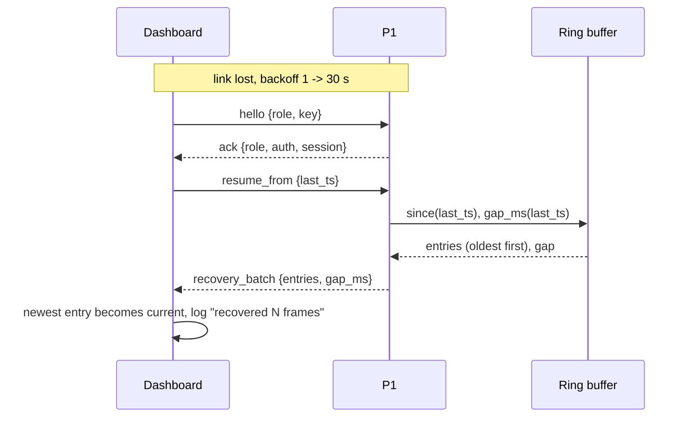
```mermaid
sequenceDiagram
  participant D as Dashboard
  participant P as P1
  participant B as Ring buffer
  Note over D,P: link lost, backoff 1 -> 30 s
  D->>P: hello {role, key}
  P-->>D: ack {role, auth, session}
  D->>P: resume_from {last_ts}
  P->>B: since(last_ts), gap_ms(last_ts)
  B-->>P: entries (oldest first), gap
  P-->>D: recovery_batch {entries, gap_ms}
  D->>D: newest entry becomes current, log "recovered N frames"
```

### 4.4.8 Alert Classification, Thresholds and Bit-Packed Logging

Thresholds load from `thresholds.json` over built-in defaults (Table 18); each 1 Hz log row packs the active alerts into one integer bitfield.

**Table 18.** Alert thresholds (configured defaults).

| Quantity | Warning | Critical | Direction | Firmware action |
|---|---|---|---|---|
| Temperature | 50 degC | 70 degC | Above | None |
| Gas (raw ADC) | 450 | 600 | Above | PANIC at >= 1000 |
| Range | 30 cm | 20 cm | Below | None |
| Humidity | - | - | Display only | None |
| GPS | `gps_fix = false` | - | - | None |

## 4.5 Fault-Tolerant Supervision and Recovery

### 4.5.1 Overview of the Three-Tier Supervision Hierarchy

Supervision is a linear chain in which each process has exactly one supervisor, with the firmware outside the chain (Figure 22).

**Figure 22.** Supervision hierarchy.

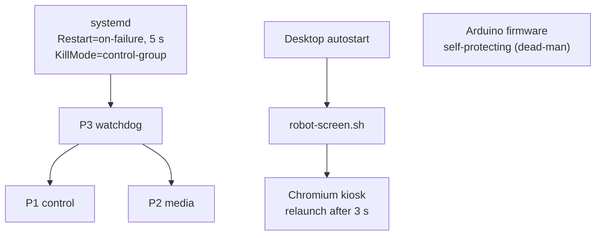
```mermaid
flowchart TB
  SD["systemd<br/>Restart=on-failure, 5 s<br/>KillMode=control-group"] --> P3["P3 watchdog"]
  P3 --> P1["P1 control"]
  P3 --> P2["P2 media"]
  DS["Desktop autostart"] --> LS["robot-screen.sh"] --> RS["Chromium kiosk<br/>relaunch after 3 s"]
  FW["Arduino firmware<br/>self-protecting (dead-man)"]
```

### 4.5.2 Process Isolation of Control and Media

P1 and P2 own disjoint resources and share no memory; their only interactions are P3's health polls and P2's localhost query of the current controller (Section 4.8.4). The effect of losing each process is given in Table 20.

### 4.5.3 Two-Level Liveness Detection: Process Polling and HTTP Health Checks

A crash is seen by `poll()` every 1 s; a process that is alive but wedged is seen only by `GET /health` every 10 s (5 s timeout), killed after three consecutive misses (Figure 23).

**Figure 23.** Per-child supervision state machine (`supervisor.py`).

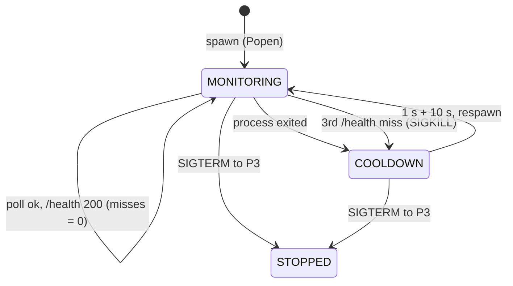
```mermaid
stateDiagram-v2
  [*] --> MONITORING: spawn (Popen)
  MONITORING --> MONITORING: poll ok, /health 200 (misses = 0)
  MONITORING --> COOLDOWN: process exited
  MONITORING --> COOLDOWN: 3rd /health miss (SIGKILL)
  COOLDOWN --> MONITORING: 1 s + 10 s, respawn
  MONITORING --> STOPPED: SIGTERM to P3
  COOLDOWN --> STOPPED: SIGTERM to P3
```

### 4.5.4 Exit-Code Discrimination and Restart Policy

P1 reports why it exited, and P3 logs each cause distinctly; all are retried after the cooldown, but only real crashes increase the restart counter (Table 19).

**Table 19.** P1 exit-code contract.

| Code | Meaning | P3 event | Restart counter |
|---|---|---|---|
| 0 | Lock held by a healthy peer, or clean exit | `PROC_LOCK_HELD` | Not incremented |
| 1 | Lock error | `PROC_CRASH` | +1 |
| 2 | Arduino handshake failed | `PROC_CRASH` | +1 |
| 3 | Invalid configuration | `PROC_CONFIG_INVALID` | Not incremented |
| -11 etc. | Signal (e.g. segfault) | `PROC_CRASH` | +1 |
| None | Killed after 3 health misses | `PROC_KILL`, `PROC_CRASH` | +1 |

### 4.5.5 Fault Detection and Recovery Time Model

Recovery time is the sum of detection, the supervisor's cooldown and the child's start-up (Figure 24). Values are design estimates; measured times are in Section 6.4.

$$
T_{\text{rec}} = T_{\text{det}} + T_{\text{poll}} + T_{\text{cool}} + T_{\text{start}}
$$
$$
T_{\text{det}}^{\text{crash}} \le 1\ \text{s}, \qquad
20\ \text{s} < T_{\text{det}}^{\text{hang}} \le 3 T_h + T_{to} = 35\ \text{s}, \qquad
T_{\text{start}}^{P1} \approx t_{\text{import}} + 2.0 + 0.6 + t_{\text{ready}}
$$

| Symbol | Meaning |
|---|---|
| $T_{\text{poll}}$, $T_{\text{cool}}$ | Loop sleep 1 s, cooldown 10 s |
| $T_h$, $T_{to}$ | Health period 10 s, timeout 5 s |
| $T_{\text{start}}^{P1}$ | Import, 2 s boot wait, three stops, READY |

**Figure 24.** P1 crash-recovery timeline (design estimate, seconds).

```mermaid
gantt
  dateFormat X
  axisFormat %S s
  title P1 crash to serving again
  section P3
  Detect via poll()     : 0, 1
  Loop sleep            : 1, 2
  Cooldown              : 2, 12
  section P1
  Import + lock + open  : 12, 13
  Arduino boot wait     : 13, 15
  Three S + READY       : 15, 16
  Serving               : 16, 17
  section Firmware
  Dead-man stop (if driving) : 0, 2
```

### 4.5.6 Graceful Degradation and Operational Modes

Each fault removes a defined capability and leaves the rest running; the dashboard shows the result as a mission state (Table 20).

**Table 20.** Operational modes.

| Mode | Trigger | Drive | Telemetry | Video / talk | Mission state |
|---|---|---|---|---|---|
| Nominal | - | Yes | Yes | Yes | READY / DRIVING |
| Media down | P2 crash, WebRTC loss | Yes | Yes | No | DRIVING_LIMITED |
| Camera/mic fault | Device error | Yes | Yes | Synthetic / silence | READY / DRIVING |
| Control down | WebSocket, P1, link | No (dead-man) | No | Yes if P2 up | STOP |
| Serial down | Arduino unplugged | No | Stale | Yes | STOP |
| Pi offline | Power, freeze | No (dead-man) | No | No | STOP |
| GPS lost | No fix | Yes | Yes (no position) | Yes | Unchanged |

## 4.6 Mission State Derivation and Operator Awareness

### 4.6.1 First-Match Mission State Function

One pure function, implemented identically in Python and TypeScript, reduces the system to four states (Figure 25, Table 21). The state is advisory; motor safety remains in the firmware.

**Figure 25.** `deriveMissionState`, first matching rule wins.

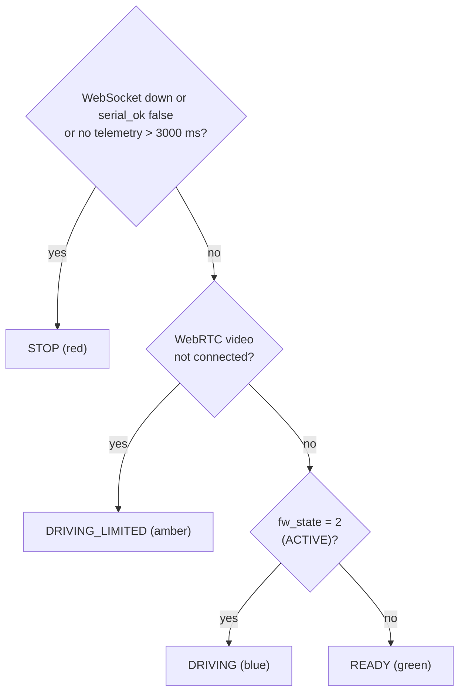
```mermaid
flowchart TD
  A{"WebSocket down or serial_ok false<br/>or no telemetry > 3000 ms?"} -- yes --> S["STOP (red)"]
  A -- no --> B{"WebRTC video<br/>not connected?"}
  B -- yes --> L["DRIVING_LIMITED (amber)"]
  B -- no --> C{"fw_state = 2<br/>(ACTIVE)?"}
  C -- yes --> D["DRIVING (blue)"]
  C -- no --> R["READY (green)"]
```

**Table 21.** Truth table ( -  = don't care).

| WS up | `serial_ok` | Telemetry age <= 3 s | Video up | `fw_state` = 2 | State |
|---|---|---|---|---|---|
| No | - | - | - | - | STOP |
| Yes | No | - | - | - | STOP |
| Yes | Yes | No | - | - | STOP |
| Yes | Yes | Yes | No | - | DRIVING_LIMITED |
| Yes | Yes | Yes | Yes | Yes | DRIVING |
| Yes | Yes | Yes | Yes | No | READY |

The age counter grows by 500 ms per heartbeat and resets on each telemetry message, so STOP is shown after the seventh silent heartbeat (~ 3.5 s).

### 4.6.2 Asymmetric Reconnection Policy for Control and Media

Control reconnects automatically because the robot is unsafe without it; video, once connected, is restored only by the operator, so its loss is surfaced as a decision (Table 22).

**Table 22.** Reconnection policies (configured values).

| Path | Before first connection | After loss | Backoff | After reconnect |
|---|---|---|---|---|
| Control (WebSocket) | Retry | Automatic, unlimited | 1 s doubling to 30 s | `hello`, then `resume_from` |
| Media (WebRTC) | Retry every 3 s | Manual **Retry video** | - | New offer, new session |

## 4.7 Two-Way Victim Interaction Channel

### 4.7.1 Overview of the Bidirectional WebRTC Architecture

One operator peer connection carries four tracks and a data channel; P2 relays operator media to a second, localhost-only peer connection that feeds the Robot Screen (Figure 26, Table 23).

**Figure 26.** Two peer connections joined by P2.

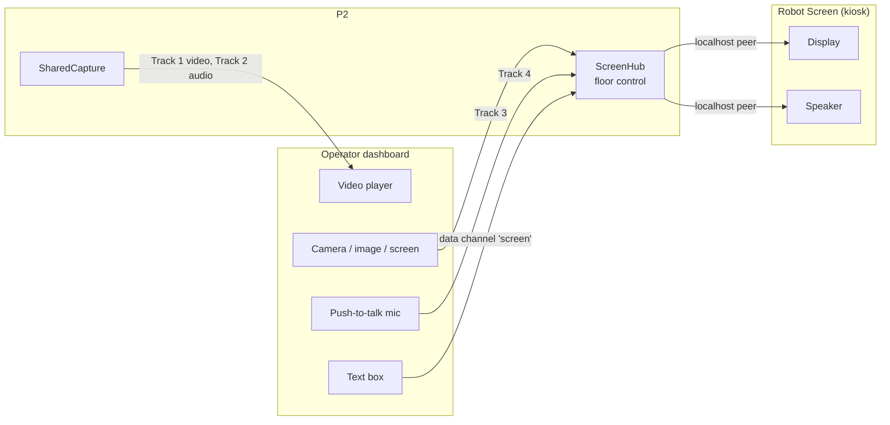
```mermaid
flowchart LR
  subgraph OP["Operator dashboard"]
    V["Video player"]
    T3["Camera / image / screen"]
    T4["Push-to-talk mic"]
    TX["Text box"]
  end
  subgraph P2["P2"]
    SC["SharedCapture"]
    HUB["ScreenHub<br/>floor control"]
  end
  subgraph RS["Robot Screen (kiosk)"]
    DSP["Display"]
    SPK["Speaker"]
  end
  SC -- "Track 1 video, Track 2 audio" --> V
  T3 -- "Track 3" --> HUB
  T4 -- "Track 4" --> HUB
  TX -- "data channel 'screen'" --> HUB
  HUB -- "localhost peer" --> DSP
  HUB -- "localhost peer" --> SPK
```

**Table 23.** Media tracks.

| Track | Direction | Content | Format |
|---|---|---|---|
| 1 | Robot -> operator | Camera | VP8 or H.264, 640x480, 10 fps |
| 2 | Robot -> operator | Microphone | Mono Opus, 32 kbit/s, 60 ms packets |
| 3 | Operator -> robot | Laptop camera (640x480, 10 fps), image (canvas 1024x600), screen (5 fps) | Browser choice |
| 4 | Operator -> robot | Push-to-talk voice (echo cancellation on) | Opus |
| DC | Both | `screen` data channel | JSON, ordered, reliable |

### 4.7.2 Single-Shot Signalling on a Local Network

Both peers obtain their answer in one HTTP request with no trickle ICE and no STUN or TURN, which suffices on a single subnet (Figure 27).

**Figure 27.** Signalling for the operator and the Robot Screen.

```mermaid
sequenceDiagram
  participant K as Robot Screen
  participant P as P2 :8443
  participant D as Dashboard
  K->>P: POST /webrtc/screen-offer (recv-only + DC)
  Note over P: 403 unless from localhost
  P-->>K: SDP answer
  D->>D: sendrecv video + audio, createDataChannel screen
  D->>P: POST /webrtc/offer {sdp, key}
  P->>P: KeyGate check, add Tracks 1-2
  P-->>D: SDP answer {role, auth}
  Note over D,P: host candidates only, media over UDP
  D->>P: Tracks 3-4 via replaceTrack (no renegotiation)
```

### 4.7.3 Shared Device Capture and Multi-Session Fan-Out

A V4L2 camera or ALSA microphone can be opened only once, so P2 opens each device on first use and fans it out to every session through `MediaRelay`: newest frame only for video, buffered for audio. The device closes after the last session ends.

### 4.7.4 Per-Session Frame Isolation to Prevent Concurrent-Encoder Faults

Sharing the camera also shared each frame object, and two encoder threads converting the same frame corrupted memory. Each session therefore receives its own converted copy (Figure 28).

**Figure 28.** Shared frame (fault) versus private copy (`PrivateVideoTrack`).

```mermaid
flowchart LR
  subgraph Before["Before: one frame, two encoders"]
    F1["YUYV frame"] --> E1["Encoder 1<br/>frame.reformat()"]
    F1 --> E2["Encoder 2<br/>frame.reformat()"]
    E1 -. "shared cached converter,<br/>GIL released -> segfault" .- E2
  end
  subgraph After["After: private yuv420p copy per session"]
    F2["YUYV frame"] --> C1["Convert on event loop,<br/>own converter"] --> G1["Encoder 1"]
    F2 --> C2["Convert on event loop,<br/>own converter"] --> G2["Encoder 2"]
  end
```

### 4.7.5 Application-Level Opus Packetisation for Real-Time Audio on a Constrained CPU

P2 encodes robot and operator audio itself as mono Opus at 32 kbit/s in 60 ms packets, instead of leaving 20 ms frames to aiortc, which cuts encoder and event-loop trips per second by a factor of three.

### 4.7.6 Playout Cushion and Bounded Latency for Victim-Side Audio

Operator voice is collected in a FIFO that must hold 120 ms before playback resumes and is trimmed above 400 ms, so speech resumes whole while delay stays bounded (Figure 29).

$$
d_{\text{added}} \le 400\ \text{ms}; \qquad \text{resume if } n_{\text{FIFO}} \ge 0.12 \times 48\,000 = 5760 \text{ samples}
$$

**Figure 29.** FIFO playout states in `ScreenAudioTrack`.

```mermaid
stateDiagram-v2
  [*] --> Refilling
  Refilling --> Refilling: < 120 ms buffered, send silence
  Refilling --> Playing: >= 120 ms buffered
  Playing --> Playing: >= 60 ms buffered, send 60 ms voice
  Playing --> Refilling: < 60 ms buffered, send silence
  note right of Playing
    Above 400 ms the oldest
    samples are discarded
  end note
```

### 4.7.7 Resilient Capture: Synthetic Fallback and Microphone Recovery

Any camera failure substitutes a synthetic test pattern, and each session's microphone track sends silence while retrying every 2 s, so a session never has to be reloaded.

### 4.7.8 Robot-Screen Relay, Floor Control and Push-to-Talk Echo Avoidance

Only one controller session may address the victim at a time: the first to send anything holds the floor until it releases or disconnects (Figure 30). Voice is sent only while Talk is held, so the robot's speaker does not feed back into its own microphone. Table 24 lists the data-channel messages.

**Figure 30.** Floor control in `ScreenHub`.

```mermaid
stateDiagram-v2
  [*] --> Free
  Free --> Held: controller session sends media or text
  Held --> Held: holder sends (others get floor_denied)
  Held --> Free: floor_release, disconnect, or holder loses controller role
  note right of Free
    Release clears the screen
    to the idle message
  end note
```

**Table 24.** `screen` data-channel messages.

| Message | Direction | Effect |
|---|---|---|
| `media_state {talking, video}` | Dashboard -> P2 -> screen | Hides idle overlay while video is active |
| `screen_text {text, ts}` / `screen_clear` | Dashboard -> P2 -> screen | Banner, trimmed, <= 280 chars |
| `screen_ack {ts}` | Screen -> P2 -> holder | Confirms text is displayed |
| `floor_release` | Dashboard -> P2 | Frees the robot screen |
| `talk_status` | P2 -> all dashboards | `screen_online`, `floor`, `display_mode`, `can_control` |
| `floor_denied` / `view_only` | P2 -> dashboard | Refusal reason |
| `display_mode {robot / vnc}` | Dashboard -> P2 | Switch display; no floor needed |

### 4.7.9 Display-Mode Arbitration and Protection Against Accidental Input

The robot display is shared with VNC maintenance, so P2 holds a display mode (`robot` or `vnc`, reset to `robot` at every start) that the kiosk launcher polls every 1 s. The kiosk's switch needs a 3 s press and ignores keys, because a VNC viewer mirrors its clicks into the kiosk.

## 4.8 Access Control and Multi-Operator Arbitration

### 4.8.1 Controller and Observer Roles

Any dashboard may watch; only one that presented the controller key and currently holds the single controller slot may act (Table 25).

**Table 25.** Permission matrix.

| Action | Controller | Observer |
|---|---|---|
| Receive telemetry, video, audio, map | Yes | Yes |
| Drive, pan/tilt | Yes | No (`error`) |
| Emergency stop (`stop_all`) | Yes | No (`error`) |
| Heartbeat counted | Yes | No (dropped) |
| Talk, show video/image/text | Yes (with floor) | No (`view_only`) |
| Switch display mode | Yes | No |

### 4.8.2 Controller-Key Authentication and Takeover

An authorised `hello` always wins the slot: the previous controller is demoted and told, and the robot is stopped so the new operator starts from standstill (Figure 31).

**Figure 31.** Controller takeover.

```mermaid
sequenceDiagram
  participant A as Dashboard A (controller)
  participant B as Dashboard B
  participant P as P1
  participant U as Arduino
  B->>P: hello {role controller, key}
  P->>P: KeyGate ok, claim_role
  P-->>B: ack {role controller, auth ok}
  P-->>A: role {observer, reason taken_over}
  P->>U: S
  Note over A: controls greyed out
```

### 4.8.3 Brute-Force Lockout

Keys compare in constant time, and five wrong keys from one host within 5 minutes lock that host out for 5 minutes, even for the right key. For a three-digit key this gives:

$$
T_{\text{exhaust}} = \frac{K}{f}\, T_{L} = \frac{1000}{5} \times 300\ \text{s} \approx 16.7\ \text{h}\quad(\text{3-digit key, one host})
$$

### 4.8.4 Cross-Process Role Consistency Between Control and Media

P2 cannot see P1's state directly, so it polls P1's localhost-only `/api/controller` every second and lets a session act only if it presented the key and comes from that host (Figure 32).

**Figure 32.** Talk permission follows P1's controller slot.

```mermaid
sequenceDiagram
  participant P2 as P2 ScreenHub
  participant P1 as P1
  participant D as Dashboard session
  loop every 1 s
    P2->>P1: GET /api/controller (localhost only)
    P1-->>P2: {host}
    P2->>P2: set_controller_host(host)
  end
  D->>P2: screen_text
  alt key presented and host = controller host
    P2->>P2: claim floor, forward
  else otherwise
    P2-->>D: view_only
  end
  Note over P2: host changed -> holder loses floor
```

## 4.9 GPS Localisation and Path Tracking

### 4.9.1 NMEA Acquisition with Checksum Verification

A dedicated thread reads the NEO-6M at 9600 baud and accepts RMC and GGA sentences from any talker only after the XOR checksum matches; RMC supplies position and validity, GGA fix quality and satellite count.

### 4.9.2 Ground-Distance Computation (Haversine Formula)

The haversine distance is the reference; over track steps of a few metres the code uses its equirectangular approximation, which avoids trigonometric inverses.

$$
d_{\text{hav}} = 2R \arcsin\sqrt{\sin^2\tfrac{\Delta\varphi}{2} + \cos\varphi_1 \cos\varphi_2 \sin^2\tfrac{\Delta\lambda}{2}}
\;\approx\;
d_{\text{eq}} = R\sqrt{\Delta\varphi^2 + \left(\Delta\lambda \cos\bar\varphi\right)^2}
$$

| Symbol | Meaning |
|---|---|
| $R$ | 6,371,000 m |
| $\Delta\varphi$, $\Delta\lambda$ | Latitude, longitude differences (rad) |
| $\bar\varphi$ | Mean latitude of the two points |

### 4.9.3 Drift-Suppression Algorithm

A stationary receiver wanders by about 10 m, so a new track point is stored only when the robot is at least 10 m from the last stored point; P1 and the dashboard apply the same rule (Figure 33).

$$
p_k \text{ appended} \iff \text{fix} \wedge \left(\text{track empty} \vee d(p_{\text{last}}, p_k) \ge 10\ \text{m}\right)
$$

**Figure 33.** Track-point filter.

```mermaid
flowchart LR
  F["New fix p"] --> A{"gps_fix and<br/>lat/lon present?"}
  A -- no --> N["No point"]
  A -- yes --> B{"Track empty?"}
  B -- yes --> Y["Append p"]
  B -- no --> C{"d(last, p) >= 10 m?"}
  C -- yes --> Y
  C -- no --> N
  Y --> G["Session track -> /api/gps-track,<br/>GeoJSON on P1 stop"]
```

### 4.9.4 Offline Vector-Map Serving with HTTP Range Requests

The operating area is stored on the Pi as one PMTiles file served at `/maps`; the browser fetches only the byte ranges of the tiles it draws (HTTP 206), so the map needs no internet inside the area, and online OpenStreetMap tiles are used only outside it.

---

## Author notes (remove before submission)

The code was treated as authoritative. Contradictions found while writing this section:

1. **Firmware state model.** `ARCHITECTURE.md` Section 5, `SOFTWARE_ARCHITECTURE.md` Section A.5.1/A.8 and the high-level diagram describe three states (ARMED/DRIVING/STOPPED), a `checkInvariants()` call and a STOPPED latch cleared only by reset. The code has five modes (`robot_state.h`), no `checkInvariants()`, and PANIC clears automatically. Section 4.2.4 follows the code.
2. **Firmware scheduler.** `ARCHITECTURE.md` Section 4 and `SOFTWARE_ARCHITECTURE.md` Section A.5.1 describe three categories, a sonar ISR, sonar 100 ms, gas 500 ms, telemetry 200 ms and LED 500 ms. `arduino.ino` has six `millis()` tasks (10/10/50/2000/500/1000 ms) and reads the sonar with `pulseIn`, with no ISR.
3. **Telemetry period.** The firmware sends CSV every 500 ms (`TELEMETRY_PERIOD_MS` in `config.h`). `protocol.py` sets `TELEMETRY_PERIOD_MS = 200` and its comment says "Arduino TX and P1 broadcast". `MockArduino` emits at 200 ms, and `ARCHITECTURE.md` Section 8/Section 10 and `SOFTWARE_ARCHITECTURE.md` Section A.6 say 200 ms.
4. **Firmware validation.** `SOFTWARE_ARCHITECTURE.md` Section A.5.1 says 1-8 characters, `ERR_LEN`/`ERR_TOK`/`WARN_CLAMP` and "clamp, don't discard". The firmware accepts up to 31 characters, replies `NACK <op> <reason>` and rejects out-of-range values (`ARG_RANGE`). `MockArduino` follows the old design, not the firmware.
5. **P1 misses real firmware rejections.** `serial_bridge.py` logs `FW_REJECT` only for lines that start with `ERR_`/`WARN_`. Real `NACK` lines are logged only as `DEBUG_RX`.
6. **Dead-man refresh set.** The firmware refreshes the dead-man for every command that passes stages 1-3 (including `P`, `T` and `?`), even if stage 4 then rejects it. `DEADMAN_ARMING_COMMANDS` in `protocol.py`, the mock and `SOFTWARE_ARCHITECTURE.md` Section A.5.1 exclude `P`/`T`/`?`.
7. **Boot state of the dead-man.** `SOFTWARE_ARCHITECTURE.md` says the board boots with the window already expired. `setup()` instead primes the timer, enables the drivers and enters READY. Only the mock boots expired.
8. **Snapshot size.** The docs say a "20-key `TelemetrySnapshot`"; the code has 17 fields plus `type`. `SOFTWARE_ARCHITECTURE.md` says `telemetry.log` has 19 columns; `telemetry_log.py` writes 18 (`CAPSTONE_METHODOLOGY_FINAL.md` Section 28.1 is correct).
9. **Start-up order.** `ARCHITECTURE.md` Section 7 and `SOFTWARE_ARCHITECTURE.md` Section A.7.1 show P3 spawning P2 after P1's `/health` succeeds. `p3_watchdog/main.py` starts both at once.
10. **`adopt()` is never called.** `SOFTWARE_ARCHITECTURE.md` Section A.5.4 describes orphan adoption, but no code path uses it, and `KillMode=control-group` kills the children with P3 anyway.
11. **Exit code 3.** `SOFTWARE_ARCHITECTURE.md` Section A.8 says a configuration fault is "not looped". `supervisor.py` still respawns after the cooldown; it only leaves the restart counter unchanged.
12. **Invariant II (Section 3, Table 1)** says P1 and P2 share "no memory or IPC". P2 polls P1's localhost `GET /api/controller` every 1 s (Section 4.8.4), so the wording should be "no shared memory; one read-only localhost query".
13. **Haversine.** The Section 4.9.2 heading follows the TOC, but `gps_reader.py` uses the equirectangular approximation (also Section 3 note 1). Consider renaming the subsection.
14. **PWM 180 ~ 12 V** (Section 3.3.4, `CAPSTONE_METHODOLOGY_FINAL.md` Section 5.1) holds only at full charge (11.9 V at 16.8 V). At 14.8 V nominal it is 10.4 V (Section 4.3.3).
15. **Stop-time bound.** `CAPSTONE_METHODOLOGY_FINAL.md` Section 23.1 gives <= 2010 ms. If the sonar (25 ms) and DHT11 (~ 25 ms) reads fall in the same loop pass, the design bound is ~ 2060 ms (Section 4.3.4). This should be measured (test H7).
16. **STOP threshold.** The docs say STOP after 3000 ms without telemetry. The dashboard counter rises in 500 ms steps and the test is "> 3000", so STOP appears at ~ 3.5 s.
17. **Test counts.** `TEST_REPORT.md` Section 3 says 111, its Section 10 summary says 106, `CAPSTONE_METHODOLOGY_FINAL.md` Section 39.3/Section 40.2 says 69 and `SOFTWARE_ARCHITECTURE.md` says 50. `pytest` collects 111.
18. **Roles.** `CAPSTONE_METHODOLOGY_FINAL.md` Section 15.1 ("first client to ask gets controller") and Section 40.3 item 6 ("No authentication") predate the controller key; Section 4.8 follows the code.
19. **High-level diagram** (`docs/high level software architure diagram.md`) says H.264 only, a "Pi camera", `pynmea2`, a sonar ISR and telemetry every 200 ms. The code negotiates VP8 or H.264, uses a USB camera, has its own NMEA parser, and sends telemetry every 500 ms.
20. **Gas fault comment.** `taskSafety` calls the gas panic "latching", but it clears as soon as the reading drops below 1000.
21. **Overflow reply.** An over-long line is answered with `NACK ? EMPTY`, which does not say that the line was too long.
22. **Default serial port.** `config.py` defaults to `/dev/ttyUSB0` and `p1.env` sets `/dev/ttyACM0`; this adds to Section 3 note 3.
