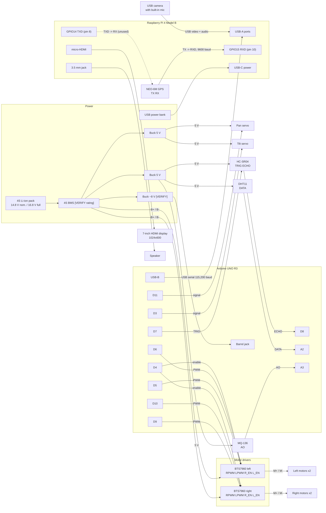

# Hardware Wiring

Sources: firmware pin map (`arduino/config.h`, `motors.cpp`), Pi configuration (`deploy/etc-robot/p1.env`, `p2.env`), and the devices detected on the robot's Pi (2026-10-04). Items marked [VERIFY] are not in the code and must be checked on the robot.

## Figure. Complete wiring diagram

All grounds (battery negative, buck outputs, BTS7960 logic, servos, sensors, Arduino) are common. The Pi shares ground with the Arduino through the USB cable only.

## Table. Arduino UNO pin map (from firmware)

| Pin | Connected to | Signal | Notes |
|---|---|---|---|
| D0 / D1 | USB-serial chip | UART RX / TX | Link to Pi, 115,200 baud; do not use |
| D3 | Tilt servo | Servo pulse | Timer 2 |
| D4 | Both BTS7960 R_EN and L_EN | Digital out | LOW = all motors disabled |
| D5 | Left BTS7960 RPWM | PWM | Left forward, Timer 0 |
| D6 | Left BTS7960 LPWM | PWM | Left reverse, Timer 0 |
| D7 | HC-SR04 TRIG | Digital out | 10 us trigger pulse |
| D8 | HC-SR04 ECHO | Digital in | Echo time |
| D9 | Right BTS7960 RPWM | PWM | Right forward, Timer 1 |
| D10 | Right BTS7960 LPWM | PWM | Right reverse, Timer 1 |
| D11 | Pan servo | Servo pulse | Timer 2 |
| D13 | On-board LED | Digital out | Blinks every 1 s |
| A2 | DHT11 DATA | Single-wire | Temperature, humidity |
| A3 | MQ-136 AO | Analog in | Raw 0-1023 |
| Free | D2, D12, A0, A1, A4, A5 | - | Not used by firmware 1.0.0 |

## Table. Raspberry Pi connections (detected on the robot)

| Pi port | Device | Appears as | Notes |
|---|---|---|---|
| USB-A (via hub) | Arduino UNO R3 | `/dev/ttyACM0` | 115,200 baud, 8-N-1 |
| USB-A (via hub) | USB camera with built-in microphone | `/dev/video0` + audio card "U20" | One device for video and audio |
| GPIO15 RXD (pin 10) | NEO-6M TX | `/dev/serial0` (ttyS0) | 9600 baud, NMEA; Pi only reads |
| GPIO14 TXD (pin 8) | NEO-6M RX | `/dev/serial0` | Not used by the software |
| 5 V / GND header pins | NEO-6M VCC / GND | - | [VERIFY which supply powers the GPS] |
| micro-HDMI | 7-inch display, 1024x600 | HDMI-A-1 | Robot Screen |
| 3.5 mm jack | Speaker | Audio card "Headphones" | Operator voice to victim |
| USB-C | USB power bank | - | Isolated from motor battery |

## Table. BTS7960 driver wiring (per side)

| BTS7960 pin | Left driver | Right driver |
|---|---|---|
| RPWM | D5 | D9 |
| LPWM | D6 | D10 |
| R_EN, L_EN | D4 | D4 |
| R_IS, L_IS | Not used by firmware | Not used by firmware |
| VCC | 5 V [VERIFY source] | 5 V [VERIFY source] |
| GND | Common ground | Common ground |
| B+ / B- | Battery via BMS | Battery via BMS |
| M+ / M- | Two left motors in parallel | Two right motors in parallel |

## Table. Power rails

| Rail | Source | Loads | Status |
|---|---|---|---|
| 14.8 V (16.8 V full) | 4S Li-ion via BMS | Both BTS7960 drivers | From docs; BMS rating [VERIFY] |
| 5 V | Buck converter | Pan and tilt servos | From docs |
| 5 V | Buck converter | HC-SR04, DHT11, MQ-136 | From docs |
| ~8 V | Buck converter | Arduino barrel jack | From docs; voltage [VERIFY] |
| 5 V USB | Power bank | Raspberry Pi, USB camera | From docs |

## Differences from the old drawing (`hardware diagram.drawio.png`)

| Old drawing | Actual robot |
|---|---|
| IR obstacle modules, fans, LEDs, transistor stage | Not used by firmware 1.0.0; remove |
| Logitech C270 camera and a separate USB mic (in docs) | One generic USB camera with a built-in microphone |
| GPS on the Arduino (in old docs) | GPS on the Pi's GPIO UART |
